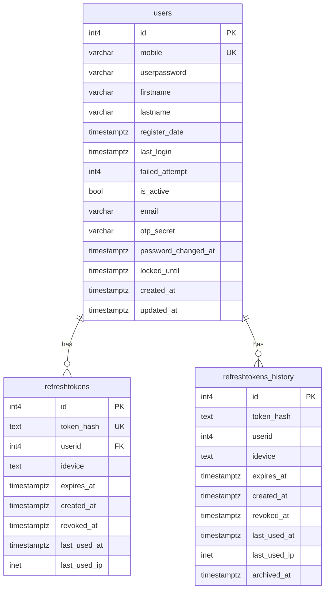
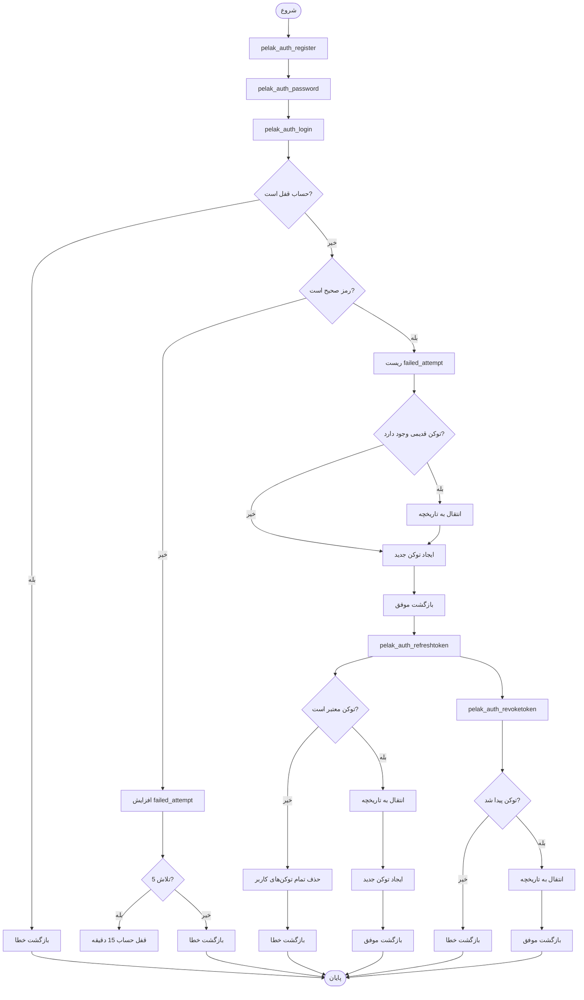

# مستندات پایگاه داده - سیستم احراز هویت

این مستندات شامل توضیحات کامل جداول، توابع و نحوه کار با پایگاه داده سیستم احراز هویت است.

## ساختار فایل‌های دیتابیس

فایل‌های دیتابیس بر اساس کارکرد به فایل‌های جداگانه تقسیم شده‌اند:

### Schema Files (جداول)
- `schema/00_create_schema.sql` - ایجاد schema های pelak و project
- `schema/01_sequences.sql` - Sequences مشترک
- `schema/02_base_tables.sql` - جداول پایه (userrole, userprofile, language, pagesection, pagetype)
- `schema/03_auth_tables.sql` - جداول احراز هویت (user, refreshtoken, refreshtokenhistory)
- `schema/04_content_tables.sql` - جداول محتوا (page)
- `schema/05_comments_tables.sql` - جداول نظرات (comments, commentlike)
- `schema/06_project_tables.sql` - جداول پروژه (selectortype, selector, useradditionalinfo)

### Functions Files (توابع)
- `functions/01_auth_functions.sql` - توابع احراز هویت
- `functions/02_content_functions.sql` - توابع محتوا و سلکتور
- `functions/03_comments_functions.sql` - توابع نظرات
- `functions/04_user_functions.sql` - توابع کاربر و اطلاعات تکمیلی

### Master File
- `master.sql` - فایل master برای اجرای همه فایل‌ها به ترتیب

### نحوه اجرا
```bash
# اجرای فایل master (پیشنهادی)
psql -U htni_admin -d your_database -f core/database/migrations/database_migration.sql

# یا اجرای جداگانه فایل‌ها:
# Schema (جداول)
psql -U htni_admin -d your_database -f core/database/schema/00_create_schema.sql
psql -U htni_admin -d your_database -f core/database/schema/01_sequences.sql
psql -U htni_admin -d your_database -f core/database/schema/02_base_tables.sql
psql -U htni_admin -d your_database -f core/database/schema/03_auth_tables.sql
psql -U htni_admin -d your_database -f core/database/schema/04_content_tables.sql
psql -U htni_admin -d your_database -f core/database/schema/05_comments_tables.sql
psql -U htni_admin -d your_database -f core/database/schema/06_project_tables.sql

# Functions (توابع)
psql -U htni_admin -d your_database -f core/database/functions/01_auth_functions.sql
psql -U htni_admin -d your_database -f core/database/functions/02_content_functions.sql
psql -U htni_admin -d your_database -f core/database/functions/03_comments_functions.sql
psql -U htni_admin -d your_database -f core/database/functions/04_user_functions.sql
```

## فهرست مطالب

1. [ساختار جداول](#ساختار-جداول)
2. [توابع دیتابیس](#توابع-دیتابیس)
3. [Migration و نگهداری](#migration-و-نگهداری)
4. [نکات امنیتی و بهینه‌سازی](#نکات-امنیتی-و-بهینه‌سازی)

---

## ساختار جداول

### نمودار روابط جداول (ERD)



### جدول `pelak.user`

جدول اصلی برای ذخیره اطلاعات کاربران سیستم.

#### ساختار فیلدها

| فیلد | نوع داده | محدودیت | توضیحات |
|------|----------|----------|---------|
| `userid` | `int4` | PRIMARY KEY, AUTO INCREMENT | شناسه یکتای کاربر |
| `mobile` | `varchar(20)` | UNIQUE, NOT NULL | شماره موبایل کاربر (منحصر به فرد) |
| `userpassword` | `varchar(255)` | NOT NULL | رمز عبور hash شده با bcrypt یا 'hasNoPassword' |
| `firstname` | `varchar(50)` | NULL | نام کاربر |
| `lastname` | `varchar(50)` | NULL | نام خانوادگی کاربر |
| `register` | `timestamptz(6)` | DEFAULT now() | تاریخ ثبت‌نام |
| `lastlogin` | `timestamptz(6)` | NULL | آخرین زمان ورود |
| `failedattempt` | `int4` | DEFAULT 0 | تعداد تلاش‌های ناموفق برای ورود |
| `active` | `bool` | DEFAULT true | وضعیت فعال/غیرفعال بودن حساب |
| `email` | `varchar(100)` | NULL | آدرس ایمیل کاربر |
| `otpsecret` | `varchar(32)` | NULL | کلید مخفی برای OTP (موقت) |
| `passwordchanged` | `timestamptz(6)` | DEFAULT now() | زمان آخرین تغییر رمز عبور |
| `lockeduntil` | `timestamptz(6)` | NULL | زمان قفل شدن حساب (NULL = قفل نیست) |
| `created` | `timestamptz(6)` | DEFAULT now() | زمان ایجاد رکورد |
| `updated` | `timestamptz(6)` | DEFAULT now() | زمان آخرین به‌روزرسانی |
| `profileimageid` | `int4` | FOREIGN KEY → pelak.userprofile.profileid | شناسه تصویر پروفایل از لیست پیش‌فرض |
| `profileimageurl` | `text` | NULL | URL تصویر پروفایل از سیستم خارجی |
| `roleid` | `int4` | FOREIGN KEY → pelak.userrole.roleid | شناسه نقش کاربر |

#### Indexes

- `idx_user_active` - برای جستجوی سریع کاربران فعال
- `idx_user_mobile` (UNIQUE) - برای جستجوی سریع بر اساس شماره موبایل
- `idx_user_profileimageid` - برای جستجوی سریع بر اساس تصویر پروفایل
- `idx_user_roleid` - برای جستجوی سریع بر اساس نقش کاربر

#### نکات مهم

- رمز عبور با استفاده از `crypt()` و الگوریتم `bf` (bcrypt) hash می‌شود
- مقدار `'hasNoPassword'` برای کاربرانی که هنوز رمز عبور تنظیم نکرده‌اند استفاده می‌شود
- بعد از 5 تلاش ناموفق، حساب به مدت 15 دقیقه قفل می‌شود (`locked_until`)
- فیلد `otp_secret` فقط در فرآیند ثبت‌نام و تایید OTP استفاده می‌شود و بعد از تنظیم رمز عبور null می‌شود

---

### جدول `pelak.refreshtoken`

جدول نگهداری **فقط توکن‌های فعال** (expiresat > NOW() و revokedat IS NULL).

این جدول برای عملکرد بهتر فقط توکن‌های فعال را نگه می‌دارد و توکن‌های منقضی یا لغو شده به جدول تاریخچه منتقل می‌شوند.

#### ساختار فیلدها

| فیلد | نوع داده | محدودیت | توضیحات |
|------|----------|----------|---------|
| `refreshtokenid` | `int4` | PRIMARY KEY, AUTO INCREMENT | شناسه یکتای توکن |
| `tokenhash` | `text` | UNIQUE, NOT NULL | Hash شده توکن با SHA-256 |
| `userid` | `int4` | FOREIGN KEY → pelak.user.userid, NOT NULL | شناسه کاربر صاحب توکن |
| `idevice` | `text` | NOT NULL | شناسه یکتای دستگاه (مثل fingerprint مرورگر) |
| `expiresat` | `timestamptz(6)` | NOT NULL | زمان انقضای توکن (معمولاً 7 روز) |
| `created` | `timestamptz(6)` | DEFAULT now() | زمان ایجاد توکن |
| `revokedat` | `timestamptz(6)` | NULL | زمان لغو توکن (NULL = فعال است) |
| `lastusedat` | `timestamptz(6)` | NULL | آخرین زمان استفاده از توکن |
| `lastusedip` | `inet` | NULL | آخرین IP استفاده شده |

#### Indexes

- `idx_refreshtoken_expiresat` - برای جستجوی سریع توکن‌های منقضی شده
- `idx_refreshtoken_tokenhash` (UNIQUE) - برای جستجوی سریع بر اساس hash توکن
- `idx_refreshtoken_userid` - برای جستجوی توکن‌های یک کاربر

#### Foreign Key

- `refreshtoken_userid_fkey`: `userid` → `pelak.user.userid` (ON DELETE CASCADE)

#### نکات مهم

- این جدول **فقط توکن‌های فعال** را نگه می‌دارد
- توکن‌ها به صورت SHA-256 hash شده ذخیره می‌شوند (نه به صورت plain text)
- هر کاربر می‌تواند چندین توکن فعال برای دستگاه‌های مختلف داشته باشد
- توکن‌های منقضی یا لغو شده به `refreshtokens_history` منتقل می‌شوند
- Index جزئی `idx_refreshtokens_user_device` فقط برای توکن‌های فعال است (WHERE expires_at > NOW() AND revoked_at IS NULL)

---

### جدول `pelak.refreshtokenhistory`

جدول تاریخچه برای نگهداری تمام توکن‌های منقضی شده یا لغو شده.

این جدول برای audit، امنیت و نگهداری تاریخچه استفاده می‌شود.

#### ساختار فیلدها

| فیلد | نوع داده | محدودیت | توضیحات |
|------|----------|----------|---------|
| `refreshtokenhistoryid` | `int4` | PRIMARY KEY | شناسه یکتای توکن (از جدول اصلی) |
| `tokenhash` | `text` | NOT NULL | Hash شده توکن |
| `userid` | `int4` | NOT NULL | شناسه کاربر |
| `idevice` | `text` | NOT NULL | شناسه دستگاه |
| `expiresat` | `timestamptz(6)` | NOT NULL | زمان انقضای توکن |
| `created` | `timestamptz(6)` | NOT NULL | زمان ایجاد توکن |
| `revokedat` | `timestamptz(6)` | NULL | زمان لغو توکن (NULL = منقضی شده) |
| `lastusedat` | `timestamptz(6)` | NULL | آخرین زمان استفاده |
| `lastusedip` | `inet` | NULL | آخرین IP استفاده شده |
| `archivedat` | `timestamptz(6)` | DEFAULT now() | زمان انتقال به تاریخچه |

#### Indexes

- `idx_refreshtokenhistory_userid` - برای جستجوی تاریخچه یک کاربر
- `idx_refreshtokenhistory_archivedat` - برای جستجوی بر اساس زمان بایگانی
- `idx_refreshtokenhistory_expiresat` - برای جستجوی بر اساس زمان انقضا

#### نکات مهم

- این جدول برای audit و نگهداری تاریخچه استفاده می‌شود
- تفاوت بین `revoked_at` و `archived_at`:
  - `revoked_at`: زمان لغو توکن توسط کاربر (logout)
  - `archived_at`: زمان انتقال به تاریخچه (می‌تواند منقضی شده یا لغو شده باشد)
- می‌توانید برای پاکسازی قدیمی‌ها، رکوردهای قدیمی‌تر از یک سال را حذف کنید

---

## توابع دیتابیس

تمام توابع در schema `public` تعریف شده‌اند و با `SECURITY DEFINER` اجرا می‌شوند تا دسترسی به جداول `auth` داشته باشند.

### نمودار Flow توابع احراز هویت



---

### تابع `pelak_auth_register`

ثبت کاربر جدید یا به‌روزرسانی OTP secret برای کاربر موجود.

#### امضا

```sql
pelak_auth_register(p_mobile varchar, p_secret varchar)
RETURNS json
```

#### پارامترها

| پارامتر | نوع | توضیحات |
|---------|-----|---------|
| `p_mobile` | `varchar` | شماره موبایل کاربر |
| `p_secret` | `varchar` | کلید مخفی OTP برای تایید |

#### منطق کاری

1. بررسی وجود کاربر با شماره موبایل داده شده
2. اگر کاربر وجود دارد:
   - به‌روزرسانی `otp_secret`
   - بازگشت پیام "کاربر قبلاً ثبت شده است"
3. اگر کاربر وجود ندارد:
   - ایجاد کاربر جدید با:
     - `mobile` = شماره موبایل
     - `userpassword` = `'hasNoPassword'`
     - `otp_secret` = کلید OTP
     - `register_date` = زمان فعلی
   - بازگشت پیام موفقیت با `userid`

#### مثال استفاده

```sql
-- ثبت کاربر جدید
SELECT pelak_auth_register('09123456789', 'abc123xyz');

-- پاسخ موفق:
-- {
--   "success": true,
--   "title": "User Created",
--   "message": "کاربر با موفقیت ساخته شد.",
--   "userid": 1
-- }

-- اگر کاربر قبلاً وجود داشته باشد:
-- {
--   "success": true,
--   "title": "User Exists",
--   "message": "کاربر قبلاً ثبت شده است."
-- }
```

#### مقادیر بازگشتی

**موفق (کاربر جدید):**
```json
{
  "success": true,
  "title": "User Created",
  "message": "کاربر با موفقیت ساخته شد.",
  "userid": 1
}
```

**موفق (کاربر موجود):**
```json
{
  "success": true,
  "title": "User Exists",
  "message": "کاربر قبلاً ثبت شده است."
}
```

**خطا:**
```json
{
  "success": false,
  "title": "Registration Failed",
  "message": "خطا در ثبت کاربر. لطفاً دوباره تلاش کنید."
}
```

---

### تابع `pelak_auth_password`

تنظیم رمز عبور برای کاربری که OTP را تایید کرده است.

#### امضا

```sql
pelak_auth_password(p_mobile varchar, p_password varchar, p_secret varchar)
RETURNS json
```

#### پارامترها

| پارامتر | نوع | توضیحات |
|---------|-----|---------|
| `p_mobile` | `varchar` | شماره موبایل کاربر |
| `p_password` | `varchar` | رمز عبور جدید (plain text) |
| `p_secret` | `varchar` | کلید OTP برای تایید |

#### منطق کاری

1. بررسی وجود کاربر با `mobile` و `otp_secret` داده شده
2. اگر کاربر پیدا نشد، بازگشت خطا
3. Hash کردن رمز عبور با bcrypt (`crypt()`)
4. به‌روزرسانی:
   - `userpassword` = رمز hash شده
   - `otp_secret` = NULL (پاک کردن OTP secret)
   - `password_changed_at` = زمان فعلی

#### مثال استفاده

```sql
-- تنظیم رمز عبور
SELECT pelak_auth_password('09123456789', 'MySecurePassword123', 'abc123xyz');

-- پاسخ موفق:
-- {
--   "success": true,
--   "title": "Password Updated",
--   "message": "رمز عبور با موفقیت تغییر کرد."
-- }
```

#### مقادیر بازگشتی

**موفق:**
```json
{
  "success": true,
  "title": "Password Updated",
  "message": "رمز عبور با موفقیت تغییر کرد."
}
```

**خطا (کاربر پیدا نشد):**
```json
{
  "success": false,
  "title": "User Not Found",
  "message": "کاربری با این شماره موبایل یافت نشد."
}
```

**خطا (عمومی):**
```json
{
  "success": false,
  "title": "Password Update Failed",
  "message": "خطا در تغییر رمز عبور."
}
```

---

### تابع `pelak_auth_login`

ورود کاربر به سیستم و ایجاد refresh token جدید.

#### امضا

```sql
pelak_auth_login(p_mobile varchar, p_password varchar, p_idevice text)
RETURNS json
```

#### پارامترها

| پارامتر | نوع | توضیحات |
|---------|-----|---------|
| `p_mobile` | `varchar` | شماره موبایل کاربر |
| `p_password` | `varchar` | رمز عبور (plain text) |
| `p_idevice` | `text` | شناسه یکتای دستگاه |

#### منطق کاری

1. **بررسی قفل بودن حساب:**
   - اگر `lockeduntil > NOW()` باشد، بازگشت خطا

2. **بررسی اعتبارات:**
   - جستجوی کاربر با `mobile`، `active = true` و `userpassword != 'hasNoPassword'`
   - مقایسه رمز عبور با `crypt(p_password, userpassword)`

3. **اگر ورود ناموفق:**
   - افزایش `failedattempt`
   - اگر `failedattempt >= 5`، قفل کردن حساب به مدت 15 دقیقه (`lockeduntil = NOW() + INTERVAL '15 minutes'`)
   - بازگشت خطا

4. **اگر ورود موفق:**
   - ریست `failedattempt` و `lockeduntil`
   - به‌روزرسانی `lastlogin`
   - بررسی وجود توکن قدیمی برای همان `userid` و `idevice`
   - اگر توکن قدیمی وجود دارد:
     - انتقال به `pelak.refreshtokenhistory`
     - حذف از `pelak.refreshtoken`
   - ایجاد refresh token جدید (UUID)
   - Hash کردن توکن با SHA-256
   - ذخیره در `pelak.refreshtoken` با انقضای 7 روز
   - بازگشت اطلاعات کاربر (شامل roleid، profileimageid، profileimageurl) و refresh token

#### مثال استفاده

```sql
-- ورود کاربر
SELECT pelak_auth_login('09123456789', 'MySecurePassword123', 'device-fingerprint-123');

-- پاسخ موفق:
-- {
--   "success": true,
--   "title": "Login Successful",
--   "message": "ورود با موفقیت انجام شد.",
--   "userid": 1,
--   "mobile": "09123456789",
--   "firstname": "علی",
--   "lastname": "احمدی",
--   "refreshtoken": "550e8400-e29b-41d4-a716-446655440000"
-- }
```

#### مقادیر بازگشتی

**موفق:**
```json
{
  "success": true,
  "title": "Login Successful",
  "message": "Login successful.",
  "userid": 1,
  "mobile": "09123456789",
  "firstname": "علی",
  "lastname": "احمدی",
  "email": "user@example.com",
  "profileimage": 5,
  "profileurl": "https://example.com/image.jpg",
  "roleid": 1,
  "refreshtoken": "550e8400-e29b-41d4-a716-446655440000"
}
```

**خطا (حساب قفل):**
```json
{
  "success": false,
  "title": "Account Locked",
  "message": "حساب شما موقتاً قفل شده است. بعداً تلاش کنید."
}
```

**خطا (اعتبارات نامعتبر):**
```json
{
  "success": false,
  "title": "Login Failed",
  "message": "شماره موبایل یا رمز عبور اشتباه است."
}
```

#### نکات امنیتی

- بعد از 5 تلاش ناموفق، حساب به مدت 15 دقیقه قفل می‌شود
- توکن قدیمی برای همان دستگاه به تاریخچه منتقل می‌شود (Token Rotation)
- فقط کاربران فعال (`active = true`) می‌توانند وارد شوند
- پاسخ شامل `roleid`، `profileimageid` و `profileimageurl` است

---

### تابع `pelak_auth_refreshtoken`

تمدید refresh token و ایجاد توکن جدید (Token Rotation).

#### امضا

```sql
pelak_auth_refreshtoken(p_refreshtoken text, p_idevice text, p_ip text DEFAULT NULL)
RETURNS json
```

#### پارامترها

| پارامتر | نوع | توضیحات |
|---------|-----|---------|
| `p_refreshtoken` | `text` | Refresh token فعلی (UUID) |
| `p_idevice` | `text` | شناسه یکتای دستگاه |
| `p_ip` | `text` | IP آدرس کاربر (اختیاری، می‌تواند 'unknown' باشد) |

#### منطق کاری

1. **محاسبه hash توکن:**
   - تبدیل توکن به SHA-256 hash

2. **بررسی اعتبار توکن:**
   - جستجوی توکن در `refreshtokens` با:
     - `token_hash` = hash محاسبه شده
     - `idevice` = شناسه دستگاه
     - `expires_at > NOW()`
     - `revoked_at IS NULL`

3. **اگر توکن نامعتبر:**
   - تشخیص theft احتمالی
   - حذف تمام توکن‌های کاربر (امنیت)
   - بازگشت خطا

4. **اگر توکن معتبر:**
   - تبدیل IP به `inet` (اگر معتبر باشد)
   - انتقال توکن قدیمی به `pelak.refreshtokenhistory`:
     - `revokedat` = NULL (چون rotation است نه revoke)
     - `lastusedat` = زمان فعلی
     - `lastusedip` = IP کاربر
     - `archivedat` = زمان فعلی
   - حذف توکن قدیمی از `pelak.refreshtoken`
   - ایجاد توکن جدید (UUID)
   - Hash کردن و ذخیره در `pelak.refreshtoken`
   - بازگشت اطلاعات کاربر (شامل roleid، profileimageid، profileimageurl) و توکن جدید

#### مثال استفاده

```sql
-- تمدید توکن
SELECT pelak_auth_refreshtoken(
  '550e8400-e29b-41d4-a716-446655440000',
  'device-fingerprint-123',
  '192.168.1.100'
);

-- پاسخ موفق:
-- {
--   "success": true,
--   "title": "Token Refreshed",
--   "message": "توکن با موفقیت تمدید شد.",
--   "refreshtoken": "660e8400-e29b-41d4-a716-446655440001",
--   "userid": 1,
--   "mobile": "09123456789",
--   "firstname": "علی",
--   "lastname": "احمدی"
-- }
```

#### مقادیر بازگشتی

**موفق:**
```json
{
  "success": true,
  "title": "Token Refreshed",
  "message": "Token refreshed successfully.",
  "refreshtoken": "660e8400-e29b-41d4-a716-446655440001",
  "userid": 1,
  "mobile": "09123456789",
  "firstname": "علی",
  "lastname": "احمدی",
  "email": "user@example.com",
  "profileimage": 5,
  "profileurl": "https://example.com/image.jpg",
  "roleid": 1,
  "valid": true
}
```

**خطا (توکن نامعتبر):**
```json
{
  "success": false,
  "title": "Invalid Token",
  "message": "توکن نامعتبر یا منقضی شده است. لطفاً دوباره وارد شوید."
}
```

#### نکات امنیتی

- **Token Rotation:** هر بار refresh، توکن قدیمی حذف و جدید ساخته می‌شود
- **Theft Detection:** اگر توکن نامعتبر استفاده شود، تمام توکن‌های کاربر حذف می‌شوند
- **IP Tracking:** IP کاربر در هر refresh ذخیره می‌شود (برای audit)
- اگر `p_ip = 'unknown'` یا نامعتبر باشد، `lastusedip` به NULL تنظیم می‌شود
- پاسخ شامل `roleid`، `profileimageid` و `profileimageurl` است

---

### تابع `pelak_auth_revoketoken`

لغو refresh token یک دستگاه خاص (Logout).

#### امضا

```sql
pelak_auth_revoketoken(p_userid int4, p_idevice text)
RETURNS json
```

#### پارامترها

| پارامتر | نوع | توضیحات |
|---------|-----|---------|
| `p_userid` | `int4` | شناسه کاربر |
| `p_idevice` | `text` | شناسه یکتای دستگاه |

#### منطق کاری

1. جستجوی refresh token فعال برای `userid` و `idevice`
2. اگر توکن پیدا نشد، بازگشت خطا
3. انتقال توکن به `pelak.refreshtokenhistory`:
   - `revokedat` = زمان فعلی (مشخص می‌کند که توسط کاربر لغو شده)
   - `archivedat` = زمان فعلی
4. حذف توکن از `pelak.refreshtoken`

#### مثال استفاده

```sql
-- خروج از یک دستگاه
SELECT pelak_auth_revoketoken(1, 'device-fingerprint-123');

-- پاسخ موفق:
-- {
--   "success": true,
--   "title": "Token Revoked",
--   "message": "توکن با موفقیت لغو شد."
-- }
```

#### مقادیر بازگشتی

**موفق:**
```json
{
  "success": true,
  "title": "Token Revoked",
  "message": "توکن با موفقیت لغو شد."
}
```

**خطا (توکن پیدا نشد):**
```json
{
  "success": false,
  "title": "Token Not Found",
  "message": "توکن فعالی برای این دستگاه یافت نشد."
}
```

**خطا (عمومی):**
```json
{
  "success": false,
  "title": "Revoke Failed",
  "message": "خطا در لغو توکن. لطفاً دوباره تلاش کنید."
}
```

---

### تابع `pelak_auth_revokeall`

لغو تمام توکن‌های فعال یک کاربر (Logout از همه دستگاه‌ها).

#### امضا

```sql
pelak_auth_revokeall(p_mobile varchar)
RETURNS json
```

#### پارامترها

| پارامتر | نوع | توضیحات |
|---------|-----|---------|
| `p_mobile` | `varchar` | شماره موبایل کاربر |

#### منطق کاری

1. پیدا کردن `userid` بر اساس شماره موبایل
2. اگر کاربر پیدا نشد، بازگشت خطا
3. حذف تمام refresh tokenهای این کاربر از `pelak.refreshtoken`
   - **نکته:** این تابع توکن‌ها را به تاریخچه منتقل نمی‌کند، فقط حذف می‌کند
   - برای audit کامل، می‌توانید این تابع را تغییر دهید تا توکن‌ها را به تاریخچه منتقل کند

#### مثال استفاده

```sql
-- خروج از تمام دستگاه‌ها
SELECT pelak_auth_revokeall('09123456789');

-- پاسخ موفق:
-- {
--   "success": true,
--   "title": "Logged Out Everywhere",
--   "message": "از تمام دستگاه‌ها با موفقیت خارج شدید."
-- }
```

#### مقادیر بازگشتی

**موفق:**
```json
{
  "success": true,
  "title": "Logged Out Everywhere",
  "message": "از تمام دستگاه‌ها با موفقیت خارج شدید."
}
```

**خطا (کاربر پیدا نشد):**
```json
{
  "success": false,
  "title": "User Not Found",
  "message": "کاربری با این شماره موبایل یافت نشد."
}
```

**خطا (عمومی):**
```json
{
  "success": false,
  "title": "Revoke Failed",
  "message": "خطا در خروج از دستگاه‌ها. لطفاً دوباره تلاش کنید."
}
```

#### نکته

این تابع توکن‌ها را به تاریخچه منتقل نمی‌کند. اگر می‌خواهید audit کامل داشته باشید، می‌توانید تابع را تغییر دهید تا قبل از حذف، توکن‌ها را به `pelak.refreshtokenhistory` منتقل کند.

---

### تابع `pelak_auth_checkuser`

بررسی وجود کاربر بر اساس شماره موبایل و وضعیت رمز عبور.

#### امضا

```sql
pelak_auth_checkuser(p_mobile varchar)
RETURNS json
```

#### پارامترها

| پارامتر | نوع | توضیحات |
|---------|-----|---------|
| `p_mobile` | `varchar` | شماره موبایل کاربر |

#### منطق کاری

1. بررسی وجود کاربر با شماره موبایل داده شده
2. بررسی اینکه آیا کاربر رمز عبور تنظیم کرده است یا خیر
3. بازگشت وضعیت وجود کاربر و وضعیت رمز عبور

#### مثال استفاده

```sql
-- بررسی کاربر
SELECT pelak_auth_checkuser('09123456789');

-- پاسخ موفق (کاربر با رمز عبور):
-- {
--   "success": true,
--   "exists": true,
--   "has_password": true
-- }

-- پاسخ موفق (کاربر بدون رمز عبور):
-- {
--   "success": true,
--   "exists": true,
--   "has_password": false
-- }

-- پاسخ موفق (کاربر وجود ندارد):
-- {
--   "success": true,
--   "exists": false,
--   "has_password": false
-- }
```

---

### تابع `pelak_auth_checkrefreshtoken`

بررسی وجود توکن refresh معتبر برای یک دستگاه.

#### امضا

```sql
pelak_auth_checkrefreshtoken(p_idevice text)
RETURNS json
```

#### پارامترها

| پارامتر | نوع | توضیحات |
|---------|-----|---------|
| `p_idevice` | `text` | شناسه یکتای دستگاه |

#### منطق کاری

1. بررسی وجود توکن refresh فعال برای این دستگاه
2. بازگشت وضعیت اعتبار

#### مثال استفاده

```sql
-- بررسی توکن
SELECT pelak_auth_checkrefreshtoken('device-fingerprint-123');

-- پاسخ موفق:
-- {
--   "success": true,
--   "valid": true,
--   "title": "Token Valid",
--   "message": "Token is valid."
-- }

-- پاسخ نامعتبر:
-- {
--   "success": false,
--   "valid": false,
--   "title": "Token Not Found",
--   "message": "No valid token found for this device."
-- }
```

---

### تابع `pelak_auth_checkrefreshtoken_mobile`

بررسی وجود توکن refresh معتبر برای یک کاربر بر اساس شماره موبایل.

#### امضا

```sql
pelak_auth_checkrefreshtoken_mobile(p_mobile varchar)
RETURNS json
```

#### پارامترها

| پارامتر | نوع | توضیحات |
|---------|-----|---------|
| `p_mobile` | `varchar` | شماره موبایل کاربر |

#### مثال استفاده

```sql
SELECT pelak_auth_checkrefreshtoken_mobile('09123456789');
```

---

### تابع `pelak_auth_checkrefreshtoken_device_mobile`

بررسی وجود توکن refresh معتبر برای یک کاربر و دستگاه خاص.

#### امضا

```sql
pelak_auth_checkrefreshtoken_device_mobile(p_idevice text, p_mobile varchar)
RETURNS json
```

#### پارامترها

| پارامتر | نوع | توضیحات |
|---------|-----|---------|
| `p_idevice` | `text` | شناسه یکتای دستگاه |
| `p_mobile` | `varchar` | شماره موبایل کاربر |

#### مثال استفاده

```sql
SELECT pelak_auth_checkrefreshtoken_device_mobile('device-fingerprint-123', '09123456789');
```

---

### تابع `pelak_auth_archive_inactive_tokens`

انتقال خودکار توکن‌های منقضی شده یا لغو شده به تاریخچه (برای اجرای دوره‌ای).

#### امضا

```sql
pelak_auth_archive_inactive_tokens()
RETURNS json
```

#### پارامترها

هیچ پارامتری ندارد.

#### منطق کاری

1. انتقال تمام توکن‌های منقضی شده (`expires_at < NOW()`) یا لغو شده (`revoked_at IS NOT NULL`) به `refreshtokens_history`
2. حذف توکن‌های منتقل شده از `refreshtokens`
3. بازگشت تعداد توکن‌های منتقل شده

#### مثال استفاده

```sql
-- آرشیو توکن‌های غیرفعال
SELECT pelak_auth_archive_inactive_tokens();

-- پاسخ موفق:
-- {
--   "success": true,
--   "title": "Tokens Archived",
--   "message": "Inactive tokens moved to history successfully.",
--   "archived_count": 15
-- }
```

#### تنظیم Cron Job

این تابع باید به صورت دوره‌ای اجرا شود. دو روش:

##### روش 1: با pg_cron (PostgreSQL Extension)

```sql
-- نصب pg_cron (اگر نصب نشده)
CREATE EXTENSION IF NOT EXISTS pg_cron;

-- تنظیم cron job برای اجرای هر ساعت
SELECT cron.schedule(
  'archive-inactive-tokens',
  '0 * * * *', -- هر ساعت در دقیقه 0
  $$SELECT pelak_auth_archive_inactive_tokens();$$
);

-- مشاهده cron jobs
SELECT * FROM cron.job;

-- حذف cron job
SELECT cron.unschedule('archive-inactive-tokens');
```

##### روش 2: با سیستم cron خارجی

```bash
# در crontab (crontab -e)
# اجرای هر ساعت
0 * * * * psql -U htni_admin -d your_database_name -c "SELECT pelak_auth_archive_inactive_tokens();"

# یا با استفاده از PGPASSWORD
0 * * * * PGPASSWORD=your_password psql -U htni_admin -d your_database_name -c "SELECT pelak_auth_archive_inactive_tokens();"
```

---

## Migration و نگهداری

### اسکریپت Migration

فایل `database_migration.sql` برای انتقال توکن‌های منقضی شده یا لغو شده از جدول فعال به تاریخچه استفاده می‌شود.

#### نحوه اجرا

```bash
# با psql
psql -U htni_admin -d your_database_name -f core/database/migrations/database_migration.sql

# یا در psql
\i core/database/migrations/database_migration.sql
```

#### مراحل Migration

1. **بررسی تعداد توکن‌های منقضی شده:**
   ```sql
   SELECT 
     COUNT(*) as expired_count,
     COUNT(CASE WHEN revokedat IS NOT NULL THEN 1 END) as revoked_count
   FROM pelak.refreshtoken
   WHERE expiresat < NOW() OR revokedat IS NOT NULL;
   ```

2. **انتقال به تاریخچه:**
   - تمام توکن‌های منقضی یا لغو شده به `pelak.refreshtokenhistory` منتقل می‌شوند
   - `ON CONFLICT DO NOTHING` برای جلوگیری از duplicate در صورت اجرای مجدد

3. **حذف از جدول فعال:**
   - توکن‌های منتقل شده از `pelak.refreshtoken` حذف می‌شوند

4. **بررسی نتیجه:**
   - تعداد توکن‌های فعال
   - تعداد توکن‌های تاریخچه

#### نکات مهم

- **قبل از اجرا:** حتماً backup از دیتابیس بگیرید
- **اجرای مجدد:** اسکریپت idempotent است و می‌توانید چند بار اجرا کنید
- **زمان اجرا:** بهتر است در ساعات کم‌ترافیک اجرا شود

---

## نکات امنیتی و بهینه‌سازی

### امنیت

#### 1. Token Rotation
- هر بار refresh، توکن قدیمی حذف و جدید ساخته می‌شود
- این کار از استفاده مجدد توکن‌های دزدیده شده جلوگیری می‌کند

#### 2. Token Theft Detection
- اگر توکن نامعتبر استفاده شود، تمام توکن‌های کاربر حذف می‌شوند
- کاربر باید دوباره وارد شود

#### 3. IP Tracking
- IP کاربر در هر refresh ذخیره می‌شود
- می‌توانید برای تشخیص فعالیت مشکوک استفاده کنید

#### 4. Account Locking
- بعد از 5 تلاش ناموفق، حساب به مدت 15 دقیقه قفل می‌شود
- از brute force attack جلوگیری می‌کند

#### 5. Password Hashing
- رمز عبور با bcrypt hash می‌شود
- از `crypt()` با الگوریتم `bf` استفاده می‌شود

#### 6. Token Storage
- توکن‌ها به صورت hash شده (SHA-256) ذخیره می‌شوند
- توکن plain text هرگز در دیتابیس ذخیره نمی‌شود

### بهینه‌سازی

#### 1. Indexes
- Indexes برای فیلدهای پرکاربرد ایجاد شده‌اند
- Index جزئی `idx_refreshtokens_user_device` فقط برای توکن‌های فعال است

#### 2. جدول فعال و تاریخچه
- جدول `pelak.refreshtoken` فقط توکن‌های فعال را نگه می‌دارد
- این کار باعث می‌شود کوئری‌ها سریع‌تر باشند
- توکن‌های قدیمی به `pelak.refreshtokenhistory` منتقل می‌شوند

#### 3. آرشیو دوره‌ای
- اجرای دوره‌ای `pelak_auth_archive_inactive_tokens` برای آرشیو خودکار توکن‌های غیرفعال
- پیشنهاد: هر ساعت یک بار

#### 4. Foreign Key با CASCADE
- `ON DELETE CASCADE` برای `pelak.refreshtoken.userid`
- اگر کاربر حذف شود، تمام توکن‌هایش هم حذف می‌شوند

### Best Practices

#### 1. استفاده از توابع
- همیشه از توابع دیتابیس استفاده کنید، نه کوئری‌های مستقیم
- توابع امنیت و منطق کسب‌وکار را مدیریت می‌کنند

#### 2. مدیریت خطا
- تمام توابع خطاها را catch می‌کنند و JSON برمی‌گردانند
- همیشه `success` را چک کنید

#### 3. Logging
- برای audit، می‌توانید از `pelak.refreshtokenhistory` استفاده کنید
- تمام فعالیت‌های توکن در تاریخچه ثبت می‌شوند

#### 4. Monitoring
- تعداد توکن‌های فعال را monitor کنید
- اگر تعداد غیرعادی است، بررسی کنید

#### 5. Backup
- قبل از migration یا تغییرات مهم، backup بگیرید
- تاریخچه توکن‌ها را هم backup کنید

---

## مثال‌های عملی

### سناریو 1: ثبت‌نام کاربر جدید

```sql
-- مرحله 1: ثبت کاربر با OTP
SELECT pelak_auth_register('09123456789', 'otp-secret-123');
-- پاسخ: {"success": true, "userid": 1, ...}

-- مرحله 2: تایید OTP و تنظیم رمز عبور
SELECT pelak_auth_password('09123456789', 'MyPassword123', 'otp-secret-123');
-- پاسخ: {"success": true, "message": "رمز عبور با موفقیت تغییر کرد."}

-- مرحله 3: ورود
SELECT pelak_auth_login('09123456789', 'MyPassword123', 'device-1');
-- پاسخ: {"success": true, "refreshtoken": "...", ...}
```

### سناریو 2: Refresh Token

```sql
-- تمدید توکن
SELECT pelak_auth_refreshtoken(
  'old-refresh-token-uuid',
  'device-1',
  '192.168.1.100'
);
-- پاسخ: {"success": true, "refreshtoken": "new-token-uuid", ...}
```

### سناریو 3: Logout

```sql
-- خروج از یک دستگاه
SELECT pelak_auth_revoketoken(1, 'device-1');

-- خروج از تمام دستگاه‌ها
SELECT pelak_auth_revokeall('09123456789');
```

### سناریو 4: آرشیو توکن‌های غیرفعال

```sql
-- اجرای آرشیو (معمولاً با cron)
SELECT pelak_auth_archive_inactive_tokens();
```

### سناریو 5: بررسی کاربر

```sql
-- بررسی وجود کاربر و وضعیت رمز عبور
SELECT pelak_auth_checkuser('09123456789');
-- پاسخ: {"success": true, "exists": true, "has_password": true}
```

### سناریو 6: دریافت اطلاعات کاربر

```sql
-- دریافت اطلاعات کامل پروفایل
SELECT pelak_user_get(1);
-- پاسخ: {"success": true, "userid": 1, "mobile": "...", "firstname": "...", ...}
```

### سناریو 7: دریافت نظرات

```sql
-- دریافت نظرات یک صفحه
SELECT pelak_comment_get(1, 'time_desc', 5);
-- پاسخ: {"success": true, "comments": [...], ...}
```

### سناریو 8: لایک نظر

```sql
-- لایک یا آنلایک کردن نظر
SELECT pelak_comment_toggle(1, 10);
-- پاسخ: {"success": true, "liked": true, "likes_count": 5, ...}
```

---

## توابع کاربر

### تابع `pelak_user_get`

دریافت اطلاعات کامل پروفایل کاربر شامل تصویر.

#### امضا

```sql
pelak_user_get(p_userid int4)
RETURNS json
```

#### پارامترها

| پارامتر | نوع | توضیحات |
|---------|-----|---------|
| `p_userid` | `int4` | شناسه کاربر |

#### مثال استفاده

```sql
SELECT pelak_user_get(1);
```

#### مقادیر بازگشتی

**موفق:**
```json
{
  "success": true,
  "title": "User Profile Retrieved",
  "message": "Profile information retrieved successfully.",
  "userid": 1,
  "mobile": "09123456789",
  "email": "user@example.com",
  "firstname": "علی",
  "lastname": "احمدی",
  "profileurl": "https://example.com/image.jpg",
  "profileimage": 5
}
```

---

### تابع `pelak_user_updatename`

به‌روزرسانی نام و نام خانوادگی کاربر.

#### امضا

```sql
pelak_user_updatename(p_userid int4, p_firstname varchar DEFAULT NULL, p_lastname varchar DEFAULT NULL)
RETURNS json
```

#### مثال استفاده

```sql
SELECT pelak_user_updatename(1, 'Ali', 'Ahmadi');
```

---

### تابع `pelak_user_updateprofile`

به‌روزرسانی تصویر پروفایل کاربر. تصویر می‌تواند از لیست پیش‌فرض یا URL خارجی باشد.

#### امضا

```sql
pelak_user_updateprofile(p_userid int4, p_profileimage int4 DEFAULT NULL, p_profileurl text DEFAULT NULL)
RETURNS json
```

#### مثال استفاده

```sql
-- استفاده از تصویر پیش‌فرض
SELECT pelak_user_updateprofile(1, 5, NULL);

-- استفاده از URL خارجی
SELECT pelak_user_updateprofile(1, NULL, 'https://example.com/image.jpg');

-- استفاده از هر دو
SELECT pelak_user_updateprofile(1, 5, 'https://example.com/image.jpg');
```

---

## توابع محتوا

### تابع `pelak_page_getsummaries`

دریافت خلاصه صفحات با pagination و فیلتر بر اساس وضعیت و زبان.

#### امضا

```sql
pelak_page_getsummaries(p_limit int4, p_offset int4, p_lang int2)
RETURNS json
```

#### مثال استفاده

```sql
-- اولین 10 صفحه فارسی
SELECT pelak_page_getsummaries(10, 0, 1);

-- صفحات 21-40 انگلیسی
SELECT pelak_page_getsummaries(20, 20, 2);
```

---

### تابع `pelak_page_geturl`

دریافت اطلاعات کامل صفحه بر اساس URL.

#### امضا

```sql
pelak_page_geturl(p_url text)
RETURNS json
```

#### مثال استفاده

```sql
SELECT pelak_page_geturl('/about-us');
```

---

### تابع `pelak_page_getid`

دریافت اطلاعات کامل صفحه بر اساس ID.

#### امضا

```sql
pelak_page_getid(p_id int4)
RETURNS json
```

#### مثال استفاده

```sql
SELECT pelak_page_getid(1);
```

---

## توابع نظرات

### تابع `pelak_comment_get`

دریافت نظرات یک صفحه با ساختار درختی. فقط نظرات تایید شده و حذف نشده را برمی‌گرداند.

#### امضا

```sql
pelak_comment_get(p_pageid int4, p_sort_type varchar DEFAULT 'time_desc', p_userid int4 DEFAULT NULL)
RETURNS json
```

#### پارامترها

| پارامتر | نوع | توضیحات |
|---------|-----|---------|
| `p_pageid` | `int4` | شناسه صفحه |
| `p_sort_type` | `varchar` | نوع مرتب‌سازی: 'time_desc', 'time_asc', 'likes_desc', 'importance_desc' |
| `p_userid` | `int4` | شناسه کاربر (اختیاری) - برای نمایش وضعیت لایک کاربر |

#### مثال استفاده

```sql
-- دریافت نظرات با مرتب‌سازی بر اساس زمان (جدیدترین اول)
SELECT pelak_comment_get(1, 'time_desc', 5);

-- دریافت نظرات با بیشترین لایک
SELECT pelak_comment_get(1, 'likes_desc', NULL);
```

#### مقادیر بازگشتی

هر نظر شامل فیلدهای زیر است:
- `id`: شناسه نظر
- `userid`: شناسه نویسنده
- `pageid`: شناسه صفحه
- `parentid`: شناسه نظر والد (NULL برای نظرات ریشه)
- `content`: محتوای نظر
- `likes_count`: تعداد لایک‌ها
- `user_liked`: آیا کاربر لایک کرده است (اگر p_userid ارائه شده باشد)
- `importance`: سطح اهمیت (0-100)
- `created`: زمان ایجاد
- `updated`: زمان آخرین به‌روزرسانی

---

### تابع `pelak_comment_create`

ایجاد نظر جدید.

#### امضا

```sql
pelak_comment_create(p_userid int4, p_pageid int4, p_content text, p_parentid int4 DEFAULT NULL)
RETURNS json
```

#### مثال استفاده

```sql
-- نظر جدید
SELECT pelak_comment_create(1, 5, 'My comment', NULL);

-- پاسخ به نظر دیگر
SELECT pelak_comment_create(1, 5, 'My reply', 10);
```

---

### تابع `pelak_comment_toggle`

لایک یا آنلایک کردن نظر (toggle).

#### امضا

```sql
pelak_comment_toggle(p_userid int4, p_commentid int4)
RETURNS json
```

#### مثال استفاده

```sql
SELECT pelak_comment_toggle(1, 10);
```

#### مقادیر بازگشتی

**موفق:**
```json
{
  "success": true,
  "title": "Comment Liked",
  "message": "Comment liked.",
  "liked": true,
  "likes_count": 5
}
```

---

## توابع سلکتور (Project)

### تابع `project_selector_get`

دریافت تمام سلکتورها بر اساس نوع به صورت flat (بدون ساختار درختی).

#### امضا

```sql
project_selector_get(p_typeidentifier varchar)
RETURNS json
```

#### مثال استفاده

```sql
SELECT project_selector_get('province');
```

---

### تابع `project_selector_gettree`

دریافت سلکتورها بر اساس نوع با ساختار درختی (همراه با فرزندان).

#### امضا

```sql
project_selector_gettree(p_typeidentifier varchar)
RETURNS json
```

#### مثال استفاده

```sql
SELECT project_selector_gettree('province');
```

---

### تابع `project_selector_getselector`

دریافت سلکتورهای فرزند یک سلکتور خاص.

#### امضا

```sql
project_selector_getselector(p_typeidentifier varchar, p_selectorid int4)
RETURNS json
```

#### مثال استفاده

```sql
-- دریافت شهرهای استان با id=5
SELECT project_selector_getselector('city', 5);
```

---

## توابع اطلاعات تکمیلی کاربر (Project)

### تابع `project_user_additional`

دریافت اطلاعات تکمیلی کاربر.

#### امضا

```sql
project_user_additional(p_userid int4)
RETURNS json
```

#### مثال استفاده

```sql
SELECT project_user_additional(1);
```

---

### تابع `project_user_additionala`

تکمیل مرحله 1 اطلاعات تکمیلی: کد ملی، تاریخ تولد، جنسیت، وضعیت تاهل، کشور، استان، شهر.

#### امضا

```sql
project_user_additionala(p_userid int4, p_nationalcode char(10) DEFAULT NULL, p_birthday varchar(10) DEFAULT NULL, p_gender bool DEFAULT NULL, p_married bool DEFAULT NULL, p_countryid int4 DEFAULT NULL, p_provinceid int4 DEFAULT NULL, p_cityid int4 DEFAULT NULL)
RETURNS json
```

#### مثال استفاده

```sql
SELECT project_user_additionala(1, '1234567890', '1990-01-01', true, false, 80001, 1, 5);
```

---

### تابع `project_user_additionalb`

تکمیل مرحله 2 اطلاعات تکمیلی: شغل، انگیزه، نحوه آشنایی، نوع همکاری.

#### امضا

```sql
project_user_additionalb(p_userid int4, p_job text DEFAULT NULL, p_motivation text DEFAULT NULL, p_howknown varchar(150) DEFAULT NULL, p_collaboration varchar(100) DEFAULT NULL)
RETURNS json
```

#### مثال استفاده

```sql
SELECT project_user_additionalb(1, 'Software Engineer', 'Interest in politics', 'Internet', 'Active');
```

---

### تابع `project_user_additionalc`

تکمیل مرحله 3 اطلاعات تکمیلی: مهارت‌ها، مدرک تحصیلی، نوع محل تحصیل، محل تحصیل، رشته تحصیلی.

#### امضا

```sql
project_user_additionalc(p_userid int4, p_skills text DEFAULT NULL, p_degreeid int4 DEFAULT NULL, p_studyplacetypeid int4 DEFAULT NULL, p_studyplaceid int4 DEFAULT NULL, p_studyfieldsid int4 DEFAULT NULL)
RETURNS json
```

#### مثال استفاده

```sql
SELECT project_user_additionalc(1, 'Programming, Design', 1, 2, 3, 4);
```

---

### تابع `project_user_additionald`

تکمیل مرحله 4 اطلاعات تکمیلی: رضایت. با تایید این مرحله، `formdone` به NOW() تنظیم می‌شود.

#### امضا

```sql
project_user_additionald(p_userid int4, p_consent bool DEFAULT false)
RETURNS json
```

#### مثال استفاده

```sql
SELECT project_user_additionald(1, true);
```

---

## خلاصه

### جداول

- **`pelak.user`**: اطلاعات کاربران
- **`pelak.refreshtoken`**: فقط توکن‌های فعال
- **`pelak.refreshtokenhistory`**: تاریخچه توکن‌ها
- **`pelak.page`**: صفحات سایت
- **`pelak.comments`**: نظرات صفحات
- **`pelak.commentlike`**: لایک‌های نظرات
- **`project.selector`**: سلکتورهای پروژه
- **`project.selectortype`**: انواع سلکتور
- **`project.useradditionalinfo`**: اطلاعات تکمیلی کاربر

### توابع احراز هویت

- **`pelak_auth_register`**: ثبت کاربر جدید
- **`pelak_auth_password`**: تنظیم رمز عبور
- **`pelak_auth_login`**: ورود و ایجاد توکن
- **`pelak_auth_refreshtoken`**: تمدید توکن
- **`pelak_auth_revoketoken`**: لغو توکن یک دستگاه
- **`pelak_auth_revokeall`**: لغو تمام توکن‌ها
- **`pelak_auth_checkuser`**: بررسی وجود کاربر
- **`pelak_auth_checkrefreshtoken`**: بررسی توکن با idevice
- **`pelak_auth_checkrefreshtoken_mobile`**: بررسی توکن با mobile
- **`pelak_auth_checkrefreshtoken_device_mobile`**: بررسی توکن با device و mobile
- **`pelak_auth_archive_inactive_tokens`**: آرشیو توکن‌های غیرفعال

### توابع کاربر

- **`pelak_user_get`**: دریافت اطلاعات کامل پروفایل کاربر
- **`pelak_user_updatename`**: به‌روزرسانی نام کاربر
- **`pelak_user_updateprofile`**: به‌روزرسانی تصویر پروفایل

### توابع محتوا

- **`pelak_page_getsummaries`**: دریافت خلاصه صفحات با pagination
- **`pelak_page_geturl`**: دریافت صفحه بر اساس URL
- **`pelak_page_getid`**: دریافت صفحه بر اساس ID

### توابع نظرات

- **`pelak_comment_get`**: دریافت نظرات صفحه با ساختار درختی
- **`pelak_comment_create`**: ایجاد نظر جدید
- **`pelak_comment_update`**: به‌روزرسانی نظر
- **`pelak_comment_delete`**: حذف نرم نظر
- **`pelak_comment_toggle`**: لایک/آنلایک نظر

### توابع سلکتور (Project)

- **`project_selector_get`**: دریافت سلکتورها به صورت flat
- **`project_selector_gettree`**: دریافت سلکتورها به صورت درختی
- **`project_selector_getselector`**: دریافت سلکتورهای فرزند

### توابع اطلاعات تکمیلی کاربر (Project)

- **`project_user_additional`**: دریافت اطلاعات تکمیلی کاربر
- **`project_user_additionala`**: تکمیل مرحله 1 اطلاعات تکمیلی
- **`project_user_additionalb`**: تکمیل مرحله 2 اطلاعات تکمیلی
- **`project_user_additionalc`**: تکمیل مرحله 3 اطلاعات تکمیلی
- **`project_user_additionald`**: تکمیل مرحله 4 اطلاعات تکمیلی

### نکات کلیدی

1. توکن‌ها به صورت hash شده ذخیره می‌شوند
2. Token Rotation برای امنیت بیشتر
3. جدول فعال فقط توکن‌های فعال را نگه می‌دارد
4. تاریخچه برای audit و امنیت
5. Account locking بعد از 5 تلاش ناموفق

---

**آخرین به‌روزرسانی:** 2024
