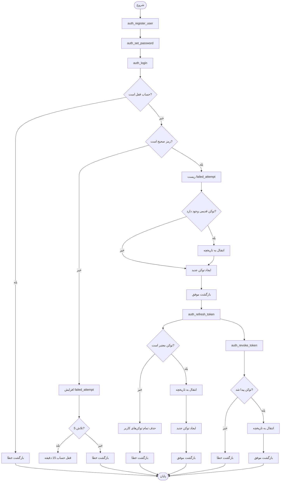

# مستندات پایگاه داده - سیستم احراز هویت

این مستندات شامل توضیحات کامل جداول، توابع و نحوه کار با پایگاه داده سیستم احراز هویت است.

## ساختار فایل‌های دیتابیس

فایل‌های دیتابیس بر اساس کارکرد به فایل‌های جداگانه تقسیم شده‌اند:

### Schema Files (جداول)
- `schema/01_auth_tables.sql` - جداول احراز هویت (users, refresh_tokens, refresh_tokens_history)
- `schema/02_content_tables.sql` - جداول محتوا (selectortype, selector, page)
- `schema/03_comments_tables.sql` - جداول نظرات (comments, comment_likes)
- `schema/04_sequences.sql` - Sequences مشترک

### Functions Files (توابع)
- `functions/01_auth_functions.sql` - توابع احراز هویت
- `functions/02_content_functions.sql` - توابع محتوا
- `functions/03_comments_functions.sql` - توابع نظرات

### Master File
- `master.sql` - فایل master برای اجرای همه فایل‌ها به ترتیب

### نحوه اجرا
```bash
# اجرای فایل master (پیشنهادی)
psql -U htni_admin -d your_database -f core/database/master.sql
```

## فهرست مطالب

1. [ساختار جداول](#ساختار-جداول)
2. [توابع دیتابیس](#توابع-دیتابیس)
3. [Migration و نگهداری](#migration-و-نگهداری)
4. [نکات امنیتی و بهینه‌سازی](#نکات-امنیتی-و-بهینه‌سازی)

---

## ساختار جداول

### نمودار روابط جداول (ERD)


### جدول `auth.users`

جدول اصلی برای ذخیره اطلاعات کاربران سیستم.

#### ساختار فیلدها

| فیلد | نوع داده | محدودیت | توضیحات |
|------|----------|----------|---------|
| `id` | `int4` | PRIMARY KEY, AUTO INCREMENT | شناسه یکتای کاربر |
| `mobile` | `varchar(20)` | UNIQUE, NOT NULL | شماره موبایل کاربر (منحصر به فرد) |
| `userpassword` | `varchar(255)` | NOT NULL | رمز عبور hash شده با bcrypt |
| `firstname` | `varchar(50)` | NULL | نام کاربر |
| `lastname` | `varchar(50)` | NULL | نام خانوادگی کاربر |
| `register_date` | `timestamptz(6)` | DEFAULT now() | تاریخ ثبت‌نام |
| `last_login` | `timestamptz(6)` | NULL | آخرین زمان ورود |
| `failed_attempt` | `int4` | DEFAULT 0 | تعداد تلاش‌های ناموفق برای ورود |
| `is_active` | `bool` | DEFAULT true | وضعیت فعال/غیرفعال بودن حساب |
| `email` | `varchar(100)` | NULL | آدرس ایمیل کاربر |
| `otp_secret` | `varchar(32)` | NULL | کلید مخفی برای OTP (موقت) |
| `password_changed_at` | `timestamptz(6)` | DEFAULT now() | زمان آخرین تغییر رمز عبور |
| `locked_until` | `timestamptz(6)` | NULL | زمان قفل شدن حساب (NULL = قفل نیست) |
| `created_at` | `timestamptz(6)` | DEFAULT now() | زمان ایجاد رکورد |
| `updated_at` | `timestamptz(6)` | DEFAULT now() | زمان آخرین به‌روزرسانی |

#### Indexes

- `idx_users_is_active` - برای جستجوی سریع کاربران فعال
- `idx_users_mobile` (UNIQUE) - برای جستجوی سریع بر اساس شماره موبایل

#### نکات مهم

- رمز عبور با استفاده از `crypt()` و الگوریتم `bf` (bcrypt) hash می‌شود
- مقدار `'hasNoPassword'` برای کاربرانی که هنوز رمز عبور تنظیم نکرده‌اند استفاده می‌شود
- بعد از 5 تلاش ناموفق، حساب به مدت 15 دقیقه قفل می‌شود (`locked_until`)
- فیلد `otp_secret` فقط در فرآیند ثبت‌نام و تایید OTP استفاده می‌شود و بعد از تنظیم رمز عبور null می‌شود

---

### جدول `auth.refresh_tokens`

جدول نگهداری **فقط توکن‌های فعال** (expires_at > NOW() و revoked_at IS NULL).

این جدول برای عملکرد بهتر فقط توکن‌های فعال را نگه می‌دارد و توکن‌های منقضی یا لغو شده به جدول تاریخچه منتقل می‌شوند.

#### ساختار فیلدها

| فیلد | نوع داده | محدودیت | توضیحات |
|------|----------|----------|---------|
| `id` | `int4` | PRIMARY KEY, AUTO INCREMENT | شناسه یکتای توکن |
| `token_hash` | `text` | UNIQUE, NOT NULL | Hash شده توکن با SHA-256 |
| `user_id` | `int4` | FOREIGN KEY → users.id, NOT NULL | شناسه کاربر صاحب توکن |
| `idevice` | `text` | NOT NULL | شناسه یکتای دستگاه (مثل fingerprint مرورگر) |
| `expires_at` | `timestamptz(6)` | NOT NULL | زمان انقضای توکن (معمولاً 7 روز) |
| `created_at` | `timestamptz(6)` | DEFAULT now() | زمان ایجاد توکن |
| `revoked_at` | `timestamptz(6)` | NULL | زمان لغو توکن (NULL = فعال است) |
| `last_used_at` | `timestamptz(6)` | NULL | آخرین زمان استفاده از توکن |
| `last_used_ip` | `inet` | NULL | آخرین IP استفاده شده |

#### Indexes

- `idx_refresh_tokens_expires_at` - برای جستجوی سریع توکن‌های منقضی شده
- `idx_refresh_tokens_token_hash` (UNIQUE) - برای جستجوی سریع بر اساس hash توکن
- `idx_refresh_tokens_user_id` - برای جستجوی توکن‌های یک کاربر
- `idx_refresh_tokens_user_device` (Composite, Partial) - برای جستجوی سریع توکن فعال یک کاربر و دستگاه خاص

#### Foreign Key

- `refresh_tokens_user_id_fkey`: `user_id` → `auth.users.id` (ON DELETE CASCADE)

#### نکات مهم

- این جدول **فقط توکن‌های فعال** را نگه می‌دارد
- توکن‌ها به صورت SHA-256 hash شده ذخیره می‌شوند (نه به صورت plain text)
- هر کاربر می‌تواند چندین توکن فعال برای دستگاه‌های مختلف داشته باشد
- توکن‌های منقضی یا لغو شده به `refresh_tokens_history` منتقل می‌شوند
- Index جزئی `idx_refresh_tokens_user_device` فقط برای توکن‌های فعال است (WHERE expires_at > NOW() AND revoked_at IS NULL)

---

### جدول `auth.refresh_tokens_history`

جدول تاریخچه برای نگهداری تمام توکن‌های منقضی شده یا لغو شده.

این جدول برای audit، امنیت و نگهداری تاریخچه استفاده می‌شود.

#### ساختار فیلدها

| فیلد | نوع داده | محدودیت | توضیحات |
|------|----------|----------|---------|
| `id` | `int4` | PRIMARY KEY | شناسه یکتای توکن (از جدول اصلی) |
| `token_hash` | `text` | NOT NULL | Hash شده توکن |
| `user_id` | `int4` | NOT NULL | شناسه کاربر |
| `idevice` | `text` | NOT NULL | شناسه دستگاه |
| `expires_at` | `timestamptz(6)` | NOT NULL | زمان انقضای توکن |
| `created_at` | `timestamptz(6)` | NOT NULL | زمان ایجاد توکن |
| `revoked_at` | `timestamptz(6)` | NULL | زمان لغو توکن (NULL = منقضی شده) |
| `last_used_at` | `timestamptz(6)` | NULL | آخرین زمان استفاده |
| `last_used_ip` | `inet` | NULL | آخرین IP استفاده شده |
| `archived_at` | `timestamptz(6)` | DEFAULT now() | زمان انتقال به تاریخچه |

#### Indexes

- `idx_refresh_tokens_history_user_id` - برای جستجوی تاریخچه یک کاربر
- `idx_refresh_tokens_history_archived_at` - برای جستجوی بر اساس زمان بایگانی
- `idx_refresh_tokens_history_expires_at` - برای جستجوی بر اساس زمان انقضا

#### نکات مهم

- این جدول برای audit و نگهداری تاریخچه استفاده می‌شود
- تفاوت بین `revoked_at` و `archived_at`:
  - `revoked_at`: زمان لغو توکن توسط کاربر (logout)
  - `archived_at`: زمان انتقال به تاریخچه (می‌تواند منقضی شده یا لغو شده باشد)
- می‌توانید برای پاکسازی قدیمی‌ها، رکوردهای قدیمی‌تر از یک سال را حذف کنید

---

## توابع دیتابیس

تمام توابع در schema `public` تعریف شده‌اند و با `SECURITY DEFINER` اجرا می‌شوند تا دسترسی به جداول `auth` داشته باشند.

### نمودار Flow توابع احراز هویت



---

### تابع `auth_register_user`

ثبت کاربر جدید یا به‌روزرسانی OTP secret برای کاربر موجود.

#### امضا

```sql
auth_register_user(p_mobile varchar, p_otp_secret varchar)
RETURNS json
```

#### پارامترها

| پارامتر | نوع | توضیحات |
|---------|-----|---------|
| `p_mobile` | `varchar` | شماره موبایل کاربر |
| `p_otp_secret` | `varchar` | کلید مخفی OTP برای تایید |

#### منطق کاری

1. بررسی وجود کاربر با شماره موبایل داده شده
2. اگر کاربر وجود دارد:
   - به‌روزرسانی `otp_secret`
   - بازگشت پیام "کاربر قبلاً ثبت شده است"
3. اگر کاربر وجود ندارد:
   - ایجاد کاربر جدید با:
     - `mobile` = شماره موبایل
     - `userpassword` = `'hasNoPassword'`
     - `otp_secret` = کلید OTP
     - `register_date` = زمان فعلی
   - بازگشت پیام موفقیت با `user_id`

#### مثال استفاده

```sql
-- ثبت کاربر جدید
SELECT auth_register_user('09123456789', 'abc123xyz');

-- پاسخ موفق:
-- {
--   "success": true,
--   "title": "User Created",
--   "message": "کاربر با موفقیت ساخته شد.",
--   "user_id": 1
-- }

-- اگر کاربر قبلاً وجود داشته باشد:
-- {
--   "success": true,
--   "title": "User Exists",
--   "message": "کاربر قبلاً ثبت شده است."
-- }
```

#### مقادیر بازگشتی

**موفق (کاربر جدید):**
```json
{
  "success": true,
  "title": "User Created",
  "message": "کاربر با موفقیت ساخته شد.",
  "user_id": 1
}
```

**موفق (کاربر موجود):**
```json
{
  "success": true,
  "title": "User Exists",
  "message": "کاربر قبلاً ثبت شده است."
}
```

**خطا:**
```json
{
  "success": false,
  "title": "Registration Failed",
  "message": "خطا در ثبت کاربر. لطفاً دوباره تلاش کنید."
}
```

---

### تابع `auth_set_password`

تنظیم رمز عبور برای کاربری که OTP را تایید کرده است.

#### امضا

```sql
auth_set_password(p_mobile varchar, p_new_password varchar, p_otp_secret varchar)
RETURNS json
```

#### پارامترها

| پارامتر | نوع | توضیحات |
|---------|-----|---------|
| `p_mobile` | `varchar` | شماره موبایل کاربر |
| `p_new_password` | `varchar` | رمز عبور جدید (plain text) |
| `p_otp_secret` | `varchar` | کلید OTP برای تایید |

#### منطق کاری

1. بررسی وجود کاربر با `mobile` و `otp_secret` داده شده
2. اگر کاربر پیدا نشد، بازگشت خطا
3. Hash کردن رمز عبور با bcrypt (`crypt()`)
4. به‌روزرسانی:
   - `userpassword` = رمز hash شده
   - `otp_secret` = NULL (پاک کردن OTP secret)
   - `password_changed_at` = زمان فعلی

#### مثال استفاده

```sql
-- تنظیم رمز عبور
SELECT auth_set_password('09123456789', 'MySecurePassword123', 'abc123xyz');

-- پاسخ موفق:
-- {
--   "success": true,
--   "title": "Password Updated",
--   "message": "رمز عبور با موفقیت تغییر کرد."
-- }
```

#### مقادیر بازگشتی

**موفق:**
```json
{
  "success": true,
  "title": "Password Updated",
  "message": "رمز عبور با موفقیت تغییر کرد."
}
```

**خطا (کاربر پیدا نشد):**
```json
{
  "success": false,
  "title": "User Not Found",
  "message": "کاربری با این شماره موبایل یافت نشد."
}
```

**خطا (عمومی):**
```json
{
  "success": false,
  "title": "Password Update Failed",
  "message": "خطا در تغییر رمز عبور."
}
```

---

### تابع `auth_login`

ورود کاربر به سیستم و ایجاد refresh token جدید.

#### امضا

```sql
auth_login(p_mobile varchar, p_password varchar, p_idevice text)
RETURNS json
```

#### پارامترها

| پارامتر | نوع | توضیحات |
|---------|-----|---------|
| `p_mobile` | `varchar` | شماره موبایل کاربر |
| `p_password` | `varchar` | رمز عبور (plain text) |
| `p_idevice` | `text` | شناسه یکتای دستگاه |

#### منطق کاری

1. **بررسی قفل بودن حساب:**
   - اگر `locked_until > NOW()` باشد، بازگشت خطا

2. **بررسی اعتبارات:**
   - جستجوی کاربر با `mobile`، `is_active = true` و `userpassword != 'hasNoPassword'`
   - مقایسه رمز عبور با `crypt(p_password, userpassword)`

3. **اگر ورود ناموفق:**
   - افزایش `failed_attempt`
   - اگر `failed_attempt >= 5`، قفل کردن حساب به مدت 15 دقیقه
   - بازگشت خطا

4. **اگر ورود موفق:**
   - ریست `failed_attempt` و `locked_until`
   - به‌روزرسانی `last_login`
   - بررسی وجود توکن قدیمی برای همان `user_id` و `idevice`
   - اگر توکن قدیمی وجود دارد:
     - انتقال به `refresh_tokens_history`
     - حذف از `refresh_tokens`
   - ایجاد refresh token جدید (UUID)
   - Hash کردن توکن با SHA-256
   - ذخیره در `refresh_tokens` با انقضای 7 روز
   - بازگشت اطلاعات کاربر و refresh token

#### مثال استفاده

```sql
-- ورود کاربر
SELECT auth_login('09123456789', 'MySecurePassword123', 'device-fingerprint-123');

-- پاسخ موفق:
-- {
--   "success": true,
--   "title": "Login Successful",
--   "message": "ورود با موفقیت انجام شد.",
--   "user_id": 1,
--   "mobile": "09123456789",
--   "firstname": "علی",
--   "lastname": "احمدی",
--   "refresh_token": "550e8400-e29b-41d4-a716-446655440000"
-- }
```

#### مقادیر بازگشتی

**موفق:**
```json
{
  "success": true,
  "title": "Login Successful",
  "message": "ورود با موفقیت انجام شد.",
  "user_id": 1,
  "mobile": "09123456789",
  "firstname": "علی",
  "lastname": "احمدی",
  "refresh_token": "550e8400-e29b-41d4-a716-446655440000"
}
```

**خطا (حساب قفل):**
```json
{
  "success": false,
  "title": "Account Locked",
  "message": "حساب شما موقتاً قفل شده است. بعداً تلاش کنید."
}
```

**خطا (اعتبارات نامعتبر):**
```json
{
  "success": false,
  "title": "Login Failed",
  "message": "شماره موبایل یا رمز عبور اشتباه است."
}
```

#### نکات امنیتی

- بعد از 5 تلاش ناموفق، حساب به مدت 15 دقیقه قفل می‌شود
- توکن قدیمی برای همان دستگاه به تاریخچه منتقل می‌شود (Token Rotation)
- فقط کاربران فعال (`is_active = true`) می‌توانند وارد شوند

---

### تابع `auth_refresh_token`

تمدید refresh token و ایجاد توکن جدید (Token Rotation).

#### امضا

```sql
auth_refresh_token(p_refresh_token text, p_idevice text, p_ip text DEFAULT NULL)
RETURNS json
```

#### پارامترها

| پارامتر | نوع | توضیحات |
|---------|-----|---------|
| `p_refresh_token` | `text` | Refresh token فعلی (UUID) |
| `p_idevice` | `text` | شناسه یکتای دستگاه |
| `p_ip` | `text` | IP آدرس کاربر (اختیاری، می‌تواند 'unknown' باشد) |

#### منطق کاری

1. **محاسبه hash توکن:**
   - تبدیل توکن به SHA-256 hash

2. **بررسی اعتبار توکن:**
   - جستجوی توکن در `refresh_tokens` با:
     - `token_hash` = hash محاسبه شده
     - `idevice` = شناسه دستگاه
     - `expires_at > NOW()`
     - `revoked_at IS NULL`

3. **اگر توکن نامعتبر:**
   - تشخیص theft احتمالی
   - حذف تمام توکن‌های کاربر (امنیت)
   - بازگشت خطا

4. **اگر توکن معتبر:**
   - تبدیل IP به `inet` (اگر معتبر باشد)
   - انتقال توکن قدیمی به `refresh_tokens_history`:
     - `revoked_at` = NULL (چون rotation است نه revoke)
     - `last_used_at` = زمان فعلی
     - `last_used_ip` = IP کاربر
   - حذف توکن قدیمی از `refresh_tokens`
   - ایجاد توکن جدید (UUID)
   - Hash کردن و ذخیره در `refresh_tokens`
   - بازگشت اطلاعات کاربر و توکن جدید

#### مثال استفاده

```sql
-- تمدید توکن
SELECT auth_refresh_token(
  '550e8400-e29b-41d4-a716-446655440000',
  'device-fingerprint-123',
  '192.168.1.100'
);

-- پاسخ موفق:
-- {
--   "success": true,
--   "title": "Token Refreshed",
--   "message": "توکن با موفقیت تمدید شد.",
--   "refresh_token": "660e8400-e29b-41d4-a716-446655440001",
--   "user_id": 1,
--   "mobile": "09123456789",
--   "firstname": "علی",
--   "lastname": "احمدی"
-- }
```

#### مقادیر بازگشتی

**موفق:**
```json
{
  "success": true,
  "title": "Token Refreshed",
  "message": "توکن با موفقیت تمدید شد.",
  "refresh_token": "660e8400-e29b-41d4-a716-446655440001",
  "user_id": 1,
  "mobile": "09123456789",
  "firstname": "علی",
  "lastname": "احمدی"
}
```

**خطا (توکن نامعتبر):**
```json
{
  "success": false,
  "title": "Invalid Token",
  "message": "توکن نامعتبر یا منقضی شده است. لطفاً دوباره وارد شوید."
}
```

#### نکات امنیتی

- **Token Rotation:** هر بار refresh، توکن قدیمی حذف و جدید ساخته می‌شود
- **Theft Detection:** اگر توکن نامعتبر استفاده شود، تمام توکن‌های کاربر حذف می‌شوند
- **IP Tracking:** IP کاربر در هر refresh ذخیره می‌شود (برای audit)
- اگر `p_ip = 'unknown'` یا نامعتبر باشد، `last_used_ip` به NULL تنظیم می‌شود

---

### تابع `auth_revoke_token`

لغو refresh token یک دستگاه خاص (Logout).

#### امضا

```sql
auth_revoke_token(p_user_id int4, p_idevice text)
RETURNS json
```

#### پارامترها

| پارامتر | نوع | توضیحات |
|---------|-----|---------|
| `p_user_id` | `int4` | شناسه کاربر |
| `p_idevice` | `text` | شناسه یکتای دستگاه |

#### منطق کاری

1. جستجوی refresh token فعال برای `user_id` و `idevice`
2. اگر توکن پیدا نشد، بازگشت خطا
3. انتقال توکن به `refresh_tokens_history`:
   - `revoked_at` = زمان فعلی (مشخص می‌کند که توسط کاربر لغو شده)
   - `archived_at` = زمان فعلی
4. حذف توکن از `refresh_tokens`

#### مثال استفاده

```sql
-- خروج از یک دستگاه
SELECT auth_revoke_token(1, 'device-fingerprint-123');

-- پاسخ موفق:
-- {
--   "success": true,
--   "title": "Token Revoked",
--   "message": "توکن با موفقیت لغو شد."
-- }
```

#### مقادیر بازگشتی

**موفق:**
```json
{
  "success": true,
  "title": "Token Revoked",
  "message": "توکن با موفقیت لغو شد."
}
```

**خطا (توکن پیدا نشد):**
```json
{
  "success": false,
  "title": "Token Not Found",
  "message": "توکن فعالی برای این دستگاه یافت نشد."
}
```

**خطا (عمومی):**
```json
{
  "success": false,
  "title": "Revoke Failed",
  "message": "خطا در لغو توکن. لطفاً دوباره تلاش کنید."
}
```

---

### تابع `auth_revoke_all_tokens`

لغو تمام توکن‌های فعال یک کاربر (Logout از همه دستگاه‌ها).

#### امضا

```sql
auth_revoke_all_tokens(p_mobile varchar)
RETURNS json
```

#### پارامترها

| پارامتر | نوع | توضیحات |
|---------|-----|---------|
| `p_mobile` | `varchar` | شماره موبایل کاربر |

#### منطق کاری

1. پیدا کردن `user_id` بر اساس شماره موبایل
2. اگر کاربر پیدا نشد، بازگشت خطا
3. حذف تمام refresh tokenهای این کاربر از `refresh_tokens`
   - **نکته:** این تابع توکن‌ها را به تاریخچه منتقل نمی‌کند، فقط حذف می‌کند
   - برای audit کامل، می‌توانید این تابع را تغییر دهید تا توکن‌ها را به تاریخچه منتقل کند

#### مثال استفاده

```sql
-- خروج از تمام دستگاه‌ها
SELECT auth_revoke_all_tokens('09123456789');

-- پاسخ موفق:
-- {
--   "success": true,
--   "title": "Logged Out Everywhere",
--   "message": "از تمام دستگاه‌ها با موفقیت خارج شدید."
-- }
```

#### مقادیر بازگشتی

**موفق:**
```json
{
  "success": true,
  "title": "Logged Out Everywhere",
  "message": "از تمام دستگاه‌ها با موفقیت خارج شدید."
}
```

**خطا (کاربر پیدا نشد):**
```json
{
  "success": false,
  "title": "User Not Found",
  "message": "کاربری با این شماره موبایل یافت نشد."
}
```

**خطا (عمومی):**
```json
{
  "success": false,
  "title": "Revoke Failed",
  "message": "خطا در خروج از دستگاه‌ها. لطفاً دوباره تلاش کنید."
}
```

#### نکته

این تابع توکن‌ها را به تاریخچه منتقل نمی‌کند. اگر می‌خواهید audit کامل داشته باشید، می‌توانید تابع را تغییر دهید تا قبل از حذف، توکن‌ها را به `refresh_tokens_history` منتقل کند.

---

### تابع `auth_cleanup_expired_tokens`

انتقال خودکار توکن‌های منقضی شده به تاریخچه (برای اجرای دوره‌ای).

#### امضا

```sql
auth_cleanup_expired_tokens()
RETURNS json
```

#### پارامترها

هیچ پارامتری ندارد.

#### منطق کاری

1. انتقال تمام توکن‌های منقضی شده (`expires_at < NOW()`) به `refresh_tokens_history`
2. حذف توکن‌های منتقل شده از `refresh_tokens`
3. بازگشت تعداد توکن‌های منتقل شده

#### مثال استفاده

```sql
-- پاکسازی توکن‌های منقضی شده
SELECT auth_cleanup_expired_tokens();

-- پاسخ موفق:
-- {
--   "success": true,
--   "title": "Cleanup Completed",
--   "message": "تعداد 15 توکن منقضی شده به تاریخچه منتقل شد.",
--   "moved_count": 15
-- }
```

#### مقادیر بازگشتی

**موفق:**
```json
{
  "success": true,
  "title": "Cleanup Completed",
  "message": "تعداد 15 توکن منقضی شده به تاریخچه منتقل شد.",
  "moved_count": 15
}
```

**خطا:**
```json
{
  "success": false,
  "title": "Cleanup Failed",
  "message": "خطا در پاکسازی توکن‌های منقضی شده."
}
```

#### تنظیم Cron Job

این تابع باید به صورت دوره‌ای اجرا شود. دو روش:

##### روش 1: با pg_cron (PostgreSQL Extension)

```sql
-- نصب pg_cron (اگر نصب نشده)
CREATE EXTENSION IF NOT EXISTS pg_cron;

-- تنظیم cron job برای اجرای هر ساعت
SELECT cron.schedule(
  'cleanup-expired-tokens',
  '0 * * * *', -- هر ساعت در دقیقه 0
  $$SELECT auth_cleanup_expired_tokens();$$
);

-- مشاهده cron jobs
SELECT * FROM cron.job;

-- حذف cron job
SELECT cron.unschedule('cleanup-expired-tokens');
```

##### روش 2: با سیستم cron خارجی

```bash
# در crontab (crontab -e)
# اجرای هر ساعت
0 * * * * psql -U htni_admin -d your_database_name -c "SELECT auth_cleanup_expired_tokens();"

# یا با استفاده از PGPASSWORD
0 * * * * PGPASSWORD=your_password psql -U htni_admin -d your_database_name -c "SELECT auth_cleanup_expired_tokens();"
```

---

## Migration و نگهداری

### اسکریپت Migration

فایل `database_migration.sql` برای انتقال توکن‌های منقضی شده یا لغو شده از جدول فعال به تاریخچه استفاده می‌شود.

#### نحوه اجرا

```bash
# با psql
psql -U htni_admin -d your_database_name -f core/database/migrations/database_migration.sql

# یا در psql
\i core/database/migrations/database_migration.sql
```

#### مراحل Migration

1. **بررسی تعداد توکن‌های منقضی شده:**
   ```sql
   SELECT 
     COUNT(*) as expired_count,
     COUNT(CASE WHEN revoked_at IS NOT NULL THEN 1 END) as revoked_count
   FROM auth.refresh_tokens
   WHERE expires_at < NOW() OR revoked_at IS NOT NULL;
   ```

2. **انتقال به تاریخچه:**
   - تمام توکن‌های منقضی یا لغو شده به `refresh_tokens_history` منتقل می‌شوند
   - `ON CONFLICT DO NOTHING` برای جلوگیری از duplicate در صورت اجرای مجدد

3. **حذف از جدول فعال:**
   - توکن‌های منتقل شده از `refresh_tokens` حذف می‌شوند

4. **بررسی نتیجه:**
   - تعداد توکن‌های فعال
   - تعداد توکن‌های تاریخچه

#### نکات مهم

- **قبل از اجرا:** حتماً backup از دیتابیس بگیرید
- **اجرای مجدد:** اسکریپت idempotent است و می‌توانید چند بار اجرا کنید
- **زمان اجرا:** بهتر است در ساعات کم‌ترافیک اجرا شود

---

## نکات امنیتی و بهینه‌سازی

### امنیت

#### 1. Token Rotation
- هر بار refresh، توکن قدیمی حذف و جدید ساخته می‌شود
- این کار از استفاده مجدد توکن‌های دزدیده شده جلوگیری می‌کند

#### 2. Token Theft Detection
- اگر توکن نامعتبر استفاده شود، تمام توکن‌های کاربر حذف می‌شوند
- کاربر باید دوباره وارد شود

#### 3. IP Tracking
- IP کاربر در هر refresh ذخیره می‌شود
- می‌توانید برای تشخیص فعالیت مشکوک استفاده کنید

#### 4. Account Locking
- بعد از 5 تلاش ناموفق، حساب به مدت 15 دقیقه قفل می‌شود
- از brute force attack جلوگیری می‌کند

#### 5. Password Hashing
- رمز عبور با bcrypt hash می‌شود
- از `crypt()` با الگوریتم `bf` استفاده می‌شود

#### 6. Token Storage
- توکن‌ها به صورت hash شده (SHA-256) ذخیره می‌شوند
- توکن plain text هرگز در دیتابیس ذخیره نمی‌شود

### بهینه‌سازی

#### 1. Indexes
- Indexes برای فیلدهای پرکاربرد ایجاد شده‌اند
- Index جزئی `idx_refresh_tokens_user_device` فقط برای توکن‌های فعال است

#### 2. جدول فعال و تاریخچه
- جدول `refresh_tokens` فقط توکن‌های فعال را نگه می‌دارد
- این کار باعث می‌شود کوئری‌ها سریع‌تر باشند
- توکن‌های قدیمی به تاریخچه منتقل می‌شوند

#### 3. Cleanup دوره‌ای
- اجرای دوره‌ای `auth_cleanup_expired_tokens` برای پاکسازی خودکار
- پیشنهاد: هر ساعت یک بار

#### 4. Foreign Key با CASCADE
- `ON DELETE CASCADE` برای `refresh_tokens.user_id`
- اگر کاربر حذف شود، تمام توکن‌هایش هم حذف می‌شوند

### Best Practices

#### 1. استفاده از توابع
- همیشه از توابع دیتابیس استفاده کنید، نه کوئری‌های مستقیم
- توابع امنیت و منطق کسب‌وکار را مدیریت می‌کنند

#### 2. مدیریت خطا
- تمام توابع خطاها را catch می‌کنند و JSON برمی‌گردانند
- همیشه `success` را چک کنید

#### 3. Logging
- برای audit، می‌توانید از `refresh_tokens_history` استفاده کنید
- تمام فعالیت‌های توکن در تاریخچه ثبت می‌شوند

#### 4. Monitoring
- تعداد توکن‌های فعال را monitor کنید
- اگر تعداد غیرعادی است، بررسی کنید

#### 5. Backup
- قبل از migration یا تغییرات مهم، backup بگیرید
- تاریخچه توکن‌ها را هم backup کنید

---

## مثال‌های عملی

### سناریو 1: ثبت‌نام کاربر جدید

```sql
-- مرحله 1: ثبت کاربر با OTP
SELECT auth_register_user('09123456789', 'otp-secret-123');
-- پاسخ: {"success": true, "user_id": 1, ...}

-- مرحله 2: تایید OTP و تنظیم رمز عبور
SELECT auth_set_password('09123456789', 'MyPassword123', 'otp-secret-123');
-- پاسخ: {"success": true, "message": "رمز عبور با موفقیت تغییر کرد."}

-- مرحله 3: ورود
SELECT auth_login('09123456789', 'MyPassword123', 'device-1');
-- پاسخ: {"success": true, "refresh_token": "...", ...}
```

### سناریو 2: Refresh Token

```sql
-- تمدید توکن
SELECT auth_refresh_token(
  'old-refresh-token-uuid',
  'device-1',
  '192.168.1.100'
);
-- پاسخ: {"success": true, "refresh_token": "new-token-uuid", ...}
```

### سناریو 3: Logout

```sql
-- خروج از یک دستگاه
SELECT auth_revoke_token(1, 'device-1');

-- خروج از تمام دستگاه‌ها
SELECT auth_revoke_all_tokens('09123456789');
```

### سناریو 4: پاکسازی دوره‌ای

```sql
-- اجرای cleanup (معمولاً با cron)
SELECT auth_cleanup_expired_tokens();
```

---

## خلاصه

### جداول

- **`auth.users`**: اطلاعات کاربران
- **`auth.refresh_tokens`**: فقط توکن‌های فعال
- **`auth.refresh_tokens_history`**: تاریخچه توکن‌ها

### توابع

- **`auth_register_user`**: ثبت کاربر جدید
- **`auth_set_password`**: تنظیم رمز عبور
- **`auth_login`**: ورود و ایجاد توکن
- **`auth_refresh_token`**: تمدید توکن
- **`auth_revoke_token`**: لغو توکن یک دستگاه
- **`auth_revoke_all_tokens`**: لغو تمام توکن‌ها
- **`auth_cleanup_expired_tokens`**: پاکسازی خودکار

### نکات کلیدی

1. توکن‌ها به صورت hash شده ذخیره می‌شوند
2. Token Rotation برای امنیت بیشتر
3. جدول فعال فقط توکن‌های فعال را نگه می‌دارد
4. تاریخچه برای audit و امنیت
5. Account locking بعد از 5 تلاش ناموفق

---

**آخرین به‌روزرسانی:** 2024
