# ساختار پوشه App

```mermaid
flowchart TD
    App[app/] --> RootFiles[Root Files]
    App --> LangDir(["lang"])
    App --> ApiDir[api/]
    App --> PDir[p/]
    App --> UIComponentsDir[pelakincorecomponentsui/]
    
    RootFiles --> LayoutTSX((layout.tsx))
    RootFiles --> PageTSX((page.tsx))
    RootFiles --> NotFoundTSX((not-found.tsx))
    RootFiles --> ManifestTS((manifest.ts))
    RootFiles --> SitemapTS((sitemap.ts))
    RootFiles --> RobotsTS((robots.ts))
    RootFiles --> GlobalsCSS((globals.css))
    
    LangDir --> LangPageTSX((page.tsx))
    LangDir --> AdminGroup{"(admin)/"}
    LangDir --> AuthGroup{"(auth)/"}
    LangDir --> PageGroup{"(page)/"}
    LangDir --> DonateDir[donate/]
    LangDir --> PageDir[page/]
    
    AdminGroup --> DashboardDir[dashboard/]
    AdminGroup --> ProfileDir[profile/]
    
    DashboardDir --> DashboardPageTSX((page.tsx))
    DashboardDir --> TicketsDir[tickets/]
    TicketsDir --> TicketsPageTSX((page.tsx))
    TicketsDir --> NewDir[new/]
    NewDir --> NewPageTSX((page.tsx))
    
    ProfileDir --> ProfilePageTSX((page.tsx))
    ProfileDir --> EditDir[edit/]
    EditDir --> EditPageTSX((page.tsx))
    EditDir --> StageDir(["stage"])
    StageDir --> StagePageTSX((page.tsx))
    
    AuthGroup --> AuthLayoutTSX((layout.tsx))
    AuthGroup --> LoginDir[login/]
    AuthGroup --> LogoutAllDir[logout-all/]
    AuthGroup --> VerificationDir[verification/]
    
    LoginDir --> LoginPageTSX((page.tsx))
    LogoutAllDir --> LogoutAllPageTSX((page.tsx))
    VerificationDir --> VerificationPageTSX((page.tsx))
    
    PageGroup --> CategoryDir[category/]
    PageGroup --> PrivacyDir[privacy/]
    PageGroup --> TermsDir[terms/]
    
    CategoryDir --> CategoryPageTSX((page.tsx))
    PrivacyDir --> PrivacyPageTSX((page.tsx))
    TermsDir --> TermsPageTSX((page.tsx))
    
    DonateDir --> DonatePageTSX((page.tsx))
    DonateDir --> ResultsDir[results/]
    ResultsDir --> ResultsPageTSX((page.tsx))
    
    PageDir --> PagePageTSX((page.tsx))
    PageDir --> SlugDir(["slug"])
    SlugDir --> SlugPageTSX((page.tsx))
    
    ApiDir --> AuthApiDir[auth/]
    ApiDir --> CommentsApiDir[comments/]
    ApiDir --> HealthApiDir[health/]
    ApiDir --> LoggerApiDir[logger/]
    ApiDir --> PageApiDir[page/]
    ApiDir --> PaymentApiDir[payment/]
    ApiDir --> SelectorsApiDir[selectors/]
    ApiDir --> UserApiDir[user/]
    
    AuthApiDir --> CheckUserDir[check-user/]
    AuthApiDir --> LoginApiDir[login/]
    AuthApiDir --> LogoutApiDir[logout/]
    AuthApiDir --> LogoutAllApiDir[logout-all/]
    AuthApiDir --> OtpApiDir[otp/]
    AuthApiDir --> RefreshApiDir[refresh/]
    AuthApiDir --> ResetPasswordDir[reset-password/]
    AuthApiDir --> VerificationPasswordDir[verification-password/]
    AuthApiDir --> VerificationRegisterDir[verification-register/]
    AuthApiDir --> VerificationUserDir[verification-user/]
    
    CheckUserDir --> CheckUserRouteTS((route.ts))
    LoginApiDir --> LoginRouteTS((route.ts))
    LogoutApiDir --> LogoutRouteTS((route.ts))
    LogoutAllApiDir --> LogoutAllRouteTS((route.ts))
    OtpApiDir --> OtpRouteTS((route.ts))
    RefreshApiDir --> RefreshRouteTS((route.ts))
    VerificationPasswordDir --> VerificationPasswordRouteTS((route.ts))
    VerificationRegisterDir --> VerificationRegisterRouteTS((route.ts))
    VerificationUserDir --> VerificationUserRouteTS((route.ts))
    
    CommentsApiDir --> CommentsRouteTS((route.ts))
    CommentsApiDir --> LikeDir[like/]
    LikeDir --> LikeRouteTS((route.ts))
    
    HealthApiDir --> HealthRouteTS((route.ts))
    LoggerApiDir --> LoggerRouteTS((route.ts))
    
    PageApiDir --> PageApiRouteTS((route.ts))
    PageApiDir --> PageSlugDir(["slug"])
    PageSlugDir --> PageSlugRouteTS((route.ts))
    
    PaymentApiDir --> ZarinpalDir[zarinpal/]
    ZarinpalDir --> ZarinpalRouteTS((route.ts))
    
    SelectorsApiDir --> SelectorsRouteTS((route.ts))
    
    UserApiDir --> AdditionalInfoDir[additional-info/]
    UserApiDir --> ProfileApiDir[profile/]
    UserApiDir --> TicketApiDir[ticket/]
    
    AdditionalInfoDir --> AdditionalInfoRouteTS((route.ts))
    ProfileApiDir --> ProfileApiRouteTS((route.ts))
    TicketApiDir --> TicketApiRouteTS((route.ts))
    
    PDir --> PIdDir(["id"])
    PIdDir --> PRouteTS((route.ts))
    
    UIComponentsDir --> UIComponentsPageTSX((page.tsx))
    UIComponentsDir --> ButtonDir[button/]
    UIComponentsDir --> ContainerDir[container/]
    UIComponentsDir --> IconDir[icon/]
    UIComponentsDir --> InputDir[input/]
    UIComponentsDir --> InputSecretDir[input-secret/]
    
    ButtonDir --> ButtonPageTSX((page.tsx))
    ContainerDir --> ContainerPageTSX((page.tsx))
    IconDir --> IconPageTSX((page.tsx))
    InputDir --> InputPageTSX((page.tsx))
    InputSecretDir --> InputSecretPageTSX((page.tsx))
```



---

## نسخه متنی برای کپی در Figma

```
app/
├── layout.tsx
├── page.tsx
├── not-found.tsx
├── manifest.ts
├── sitemap.ts
├── robots.ts
├── globals.css
├── [lang]/
│   ├── page.tsx
│   ├── (admin)/
│   │   ├── dashboard/
│   │   │   ├── page.tsx
│   │   │   └── tickets/
│   │   │       ├── page.tsx
│   │   │       └── new/
│   │   │           └── page.tsx
│   │   └── profile/
│   │       ├── page.tsx
│   │       └── edit/
│   │           ├── page.tsx
│   │           └── [stage]/
│   │               └── page.tsx
│   ├── (auth)/
│   │   ├── layout.tsx
│   │   ├── login/
│   │   │   └── page.tsx
│   │   ├── logout-all/
│   │   │   └── page.tsx
│   │   └── verification/
│   │       └── page.tsx
│   ├── (page)/
│   │   ├── category/
│   │   │   └── page.tsx
│   │   ├── privacy/
│   │   │   └── page.tsx
│   │   └── terms/
│   │       └── page.tsx
│   ├── donate/
│   │   ├── page.tsx
│   │   └── results/
│   │       └── page.tsx
│   └── page/
│       ├── page.tsx
│       └── [slug]/
│           └── page.tsx
├── api/
│   ├── auth/
│   │   ├── check-user/
│   │   │   └── route.ts
│   │   ├── login/
│   │   │   └── route.ts
│   │   ├── logout/
│   │   │   └── route.ts
│   │   ├── logout-all/
│   │   │   └── route.ts
│   │   ├── otp/
│   │   │   └── route.ts
│   │   ├── refresh/
│   │   │   └── route.ts
│   │   ├── reset-password/
│   │   ├── verification-password/
│   │   │   └── route.ts
│   │   ├── verification-register/
│   │   │   └── route.ts
│   │   └── verification-user/
│   │       └── route.ts
│   ├── comments/
│   │   ├── route.ts
│   │   └── like/
│   │       └── route.ts
│   ├── health/
│   │   └── route.ts
│   ├── logger/
│   │   └── route.ts
│   ├── page/
│   │   ├── route.ts
│   │   └── [slug]/
│   │       └── route.ts
│   ├── payment/
│   │   └── zarinpal/
│   │       └── route.ts
│   ├── selectors/
│   │   └── route.ts
│   └── user/
│       ├── additional-info/
│       │   └── route.ts
│       ├── profile/
│       │   └── route.ts
│       └── ticket/
│           └── route.ts
├── p/
│   └── [id]/
│       └── route.ts
└── pelakincorecomponentsui/
    ├── page.tsx
    ├── button/
    │   └── page.tsx
    ├── container/
    │   └── page.tsx
    ├── icon/
    │   └── page.tsx
    ├── input/
    │   └── page.tsx
    └── input-secret/
        └── page.tsx
```
