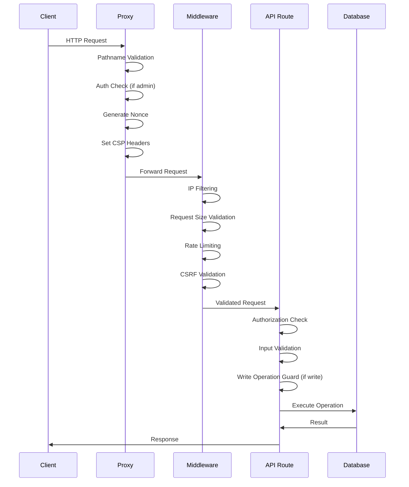

# راهنمای API Next-Pelak

**نسخه**: 1.0.0  
**آخرین به‌روزرسانی**: 2025-01-XX

## فهرست مطالب

- [معرفی](#معرفی)
- [API Structure](#api-structure)
- [Request/Response Format](#requestresponse-format)
- [Authentication](#authentication)
- [Middleware Stack](#middleware-stack)
- [Error Handling](#error-handling)
- [Rate Limiting](#rate-limiting)
- [Endpoints](#endpoints)
- [Best Practices](#best-practices)

---

## معرفی

API Next-Pelak از Next.js API Routes استفاده می‌کند و شامل:

- **RESTful Design**: استفاده از HTTP methods استاندارد
- **JSON Format**: تمام requests و responses به صورت JSON
- **Security First**: CSRF Protection، Rate Limiting، Authorization
- **Error Handling**: Error handling یکپارچه و استاندارد
- **Type Safety**: TypeScript با type definitions کامل

---

## API Structure

### Base URL

```
Production: https://yourdomain.com/api
Development: http://localhost:3131/api
```

### Route Structure

```
/api/{module}/{action}
```

مثال:
- `/api/auth/login`
- `/api/auth/logout`
- `/api/page/[slug]`
- `/api/comments`

---

## Request/Response Format

### Request Format

#### Headers

```http
Content-Type: application/json
Authorization: Bearer {access_token}
x-csrf-token: {csrf_token}
```

#### Body

```json
{
  "field1": "value1",
  "field2": "value2"
}
```

### Response Format

#### Success Response

```json
{
  "success": true,
  "title": "Success Title",
  "message": "Success message",
  "data": {
    // Additional data
  }
}
```

#### Error Response

```json
{
  "success": false,
  "title": "Error Title",
  "message": "Error message"
}
```

### HTTP Status Codes

| Code | Meaning | Usage |
|------|---------|-------|
| 200 | OK | Success |
| 400 | Bad Request | Invalid input |
| 401 | Unauthorized | Authentication required |
| 403 | Forbidden | Access denied |
| 404 | Not Found | Resource not found |
| 413 | Payload Too Large | Request too large |
| 429 | Too Many Requests | Rate limit exceeded |
| 500 | Internal Server Error | Server error |

---

## Authentication

### Access Token

Access Token در header `Authorization` ارسال می‌شود:

```http
Authorization: Bearer {access_token}
```

### CSRF Token

CSRF Token در header `x-csrf-token` ارسال می‌شود:

```http
x-csrf-token: {csrf_token}
```

### Client-Side Example

```typescript
const response = await fetch('/api/endpoint', {
  method: 'POST',
  headers: {
    'Content-Type': 'application/json',
    'Authorization': `Bearer ${accessToken}`,
    'x-csrf-token': csrfToken,
  },
  body: JSON.stringify({ data: '...' }),
})
```

---

## Middleware Stack

### Request Flow



### Middleware Order

1. **Proxy Middleware** (`core/proxy.ts`)
   - Pathname validation
   - Authentication check (admin routes)
   - Nonce generation
   - CSP headers

2. **API Middleware** (`validateAPIRequest`)
   - IP filtering
   - Request size validation
   - Rate limiting
   - CSRF validation

3. **Route Handler**
   - Authorization check
   - Input validation
   - Write operation guard
   - Business logic

---

## Error Handling

### Error Types

#### Validation Error (400)

```typescript
import { validationError } from '@/core/lib/api/response'

return validationError(validationResult)
```

#### Unauthorized Error (401)

```typescript
import { unauthorizedError } from '@/core/lib/api/response'

return unauthorizedError('Authentication required')
```

#### Invalid Input Error (400)

```typescript
import { invalidInputError } from '@/core/lib/api/response'

return invalidInputError('Field is required')
```

#### Server Error (500)

```typescript
import { serverError } from '@/core/lib/api/response'

return serverError('Internal server error')
```

### Error Handler

```typescript
import { withErrorHandlingAndTracking } from '@/core/lib/performance/monitoring'

export const POST = withErrorHandlingAndTracking(POSTHandler, '/api/endpoint')
```

### Error Messages

تمام error messages در `core/lib/api/error-messages.ts` تعریف شده‌اند:

```typescript
import { ERROR_MESSAGES } from '@/core/lib/api/error-messages'

return NextResponse.json(
  {
    success: false,
    title: ERROR_MESSAGES.UNAUTHORIZED.title,
    message: ERROR_MESSAGES.UNAUTHORIZED.message,
  },
  { status: 401 }
)
```

---

## Rate Limiting

### Rate Limit Headers

```http
X-RateLimit-Limit: 150
X-RateLimit-Remaining: 149
X-RateLimit-Reset: 1704067200
Retry-After: 60
```

### Configuration

```typescript
import { RATE_LIMIT } from '@/core/config/security'

const securityCheck = await validateAPIRequest(request, true, {
  maxRequests: RATE_LIMIT.LOGIN.maxRequests,
  windowMs: RATE_LIMIT.LOGIN.windowMs,
})
```

### Rate Limit Types

- **GENERAL**: 5000 requests per minute
- **LOGIN**: 150 requests per 15 minutes
- **OTP**: 100 requests per 10 minutes

---

## Endpoints

### Authentication Endpoints

#### POST /api/auth/login

ورود کاربر.

**Request**:
```json
{
  "mobile": "09123456789",
  "password": "password123",
  "iDevice": "c123..."
}
```

**Response**:
```json
{
  "success": true,
  "title": "Login Successful",
  "access_token": "...",
  "userid": 123
}
```

#### POST /api/auth/refresh

Refresh کردن Access Token.

**Request**:
```json
{
  "iDevice": "c123..."
}
```

**Response**:
```json
{
  "success": true,
  "access_token": "...",
  "expires_in": 1800
}
```

#### POST /api/auth/logout

خروج از حساب کاربری.

**Request**:
```json
{}
```

**Response**:
```json
{
  "success": true,
  "title": "Logout Successful"
}
```

#### POST /api/auth/logout-all

خروج از تمام دستگاه‌ها.

**Request**:
```json
{}
```

**Response**:
```json
{
  "success": true,
  "title": "Logout All Successful"
}
```

#### POST /api/auth/otp

ارسال OTP.

**Request**:
```json
{
  "mobile": "09123456789"
}
```

**Response**:
```json
{
  "success": true,
  "title": "OTP sent",
  "message": "کد تایید ارسال شد"
}
```

### Content Endpoints

#### GET /api/page

لیست صفحات.

**Query Parameters**:
- `lang`: شناسه زبان (required)
- `limit`: تعداد نتایج (default: 12)
- `offset`: offset (default: 0)

**Response**:
```json
{
  "success": true,
  "pages": [...],
  "total": 100
}
```

#### GET /api/page/[slug]

دریافت صفحه بر اساس slug.

**Response**:
```json
{
  "success": true,
  "page": {
    "pageid": 1,
    "title": "...",
    "content": "...",
    ...
  }
}
```

### Comments Endpoints

#### GET /api/comments

لیست نظرات یک صفحه.

**Query Parameters**:
- `pageId`: شناسه صفحه (required)

**Response**:
```json
{
  "success": true,
  "comments": [...]
}
```

#### POST /api/comments

ایجاد نظر جدید.

**Request**:
```json
{
  "pageId": 1,
  "content": "نظر من",
  "parentId": null,
  "iDevice": "c123..."
}
```

**Response**:
```json
{
  "success": true,
  "comment_id": 123
}
```

#### POST /api/comments/like

لایک کردن یک نظر.

**Request**:
```json
{
  "commentId": 123,
  "iDevice": "c123..."
}
```

**Response**:
```json
{
  "success": true,
  "liked": true
}
```

### User Endpoints

#### GET /api/user/profile

دریافت پروفایل کاربر.

**Response**:
```json
{
  "success": true,
  "user": {
    "userid": 123,
    "mobile": "09123456789",
    "firstname": "John",
    ...
  }
}
```

#### POST /api/user/profile

به‌روزرسانی پروفایل کاربر.

**Request**:
```json
{
  "firstname": "John",
  "lastname": "Doe",
  "iDevice": "c123..."
}
```

**Response**:
```json
{
  "success": true,
  "title": "Profile Updated"
}
```

### Selectors Endpoints

#### GET /api/selectors

دریافت selector ها.

**Query Parameters**:
- `type`: نوع selector (required)
- `parentId`: شناسه والد (optional)

**Response**:
```json
{
  "success": true,
  "selectors": [...]
}
```

---

## Best Practices

### 1. همیشه از validateAPIRequest استفاده کنید

```typescript
const securityCheck = await validateAPIRequest(request, true)
if (!securityCheck.valid) {
  return securityCheck.response!
}
```

### 2. استفاده از checkAuthorizationWithRefresh

```typescript
const authResult = await checkAuthorizationWithRefresh(
  request,
  accessToken,
  'user'
)
if (!authResult.allowed) {
  return unauthorizedError(authResult.reason)
}
```

### 3. استفاده از guardWriteOperation برای Write Operations

```typescript
return guardWriteOperation(body, async () => {
  // Write operation
})
```

### 4. استفاده از successResponse و error helpers

```typescript
// ✅ Good
return successResponse({ data: '...' })
return invalidInputError('Field required')

// ❌ Bad
return NextResponse.json({ success: true, data: '...' })
```

### 5. استفاده از withErrorHandlingAndTracking

```typescript
export const POST = withErrorHandlingAndTracking(
  POSTHandler,
  '/api/endpoint'
)
```

### 6. Validation قبل از Processing

```typescript
// ✅ Good
const validation = validateMobile(mobile)
if (!validation.success) {
  return validationError(validation)
}

// ❌ Bad
// No validation
```

---

## منابع بیشتر

- [AUTHENTICATION.md](./AUTHENTICATION.md) - سیستم احراز هویت
- [SECURITY.md](./SECURITY.md) - سیستم‌های امنیتی
- [CORE_LIBRARIES.md](./CORE_LIBRARIES.md) - کتابخانه‌های core
- [docs/api/README.md](./api/README.md) - OpenAPI Documentation

---

**آخرین به‌روزرسانی**: 2025-01-XX  
**نگهدارنده**: Development Team
