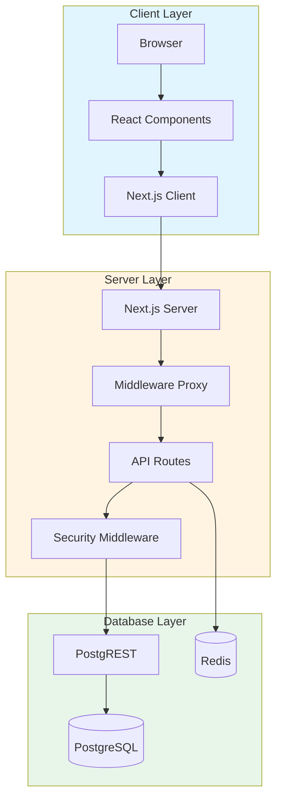
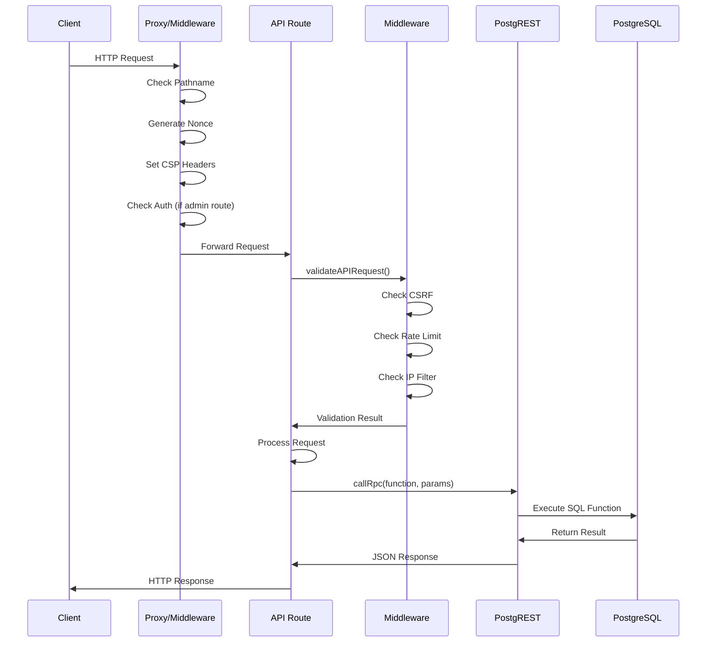
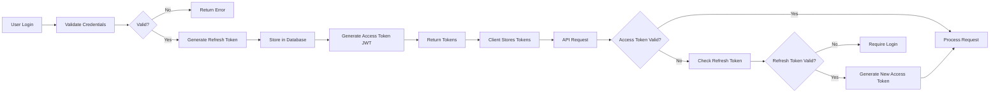
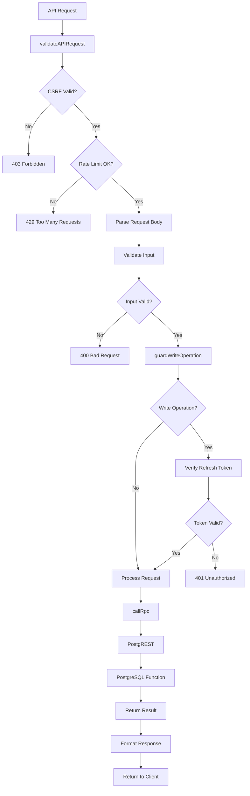
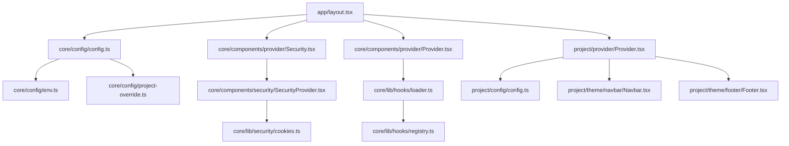
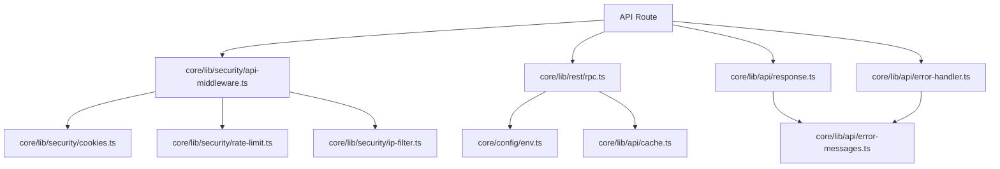
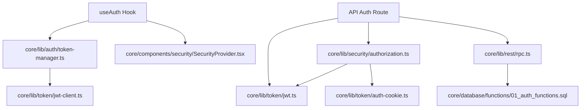

# معماری پروژه Next-Pelak

**نسخه**: 1.0.0  
**آخرین به‌روزرسانی**: 2025-01-XX

## فهرست مطالب

- [معرفی](#معرفی)
- [تکنولوژی‌ها](#تکنولوژی‌ها)
- [ساختار دایرکتوری‌ها](#ساختار-دایرکتوری‌ها)
- [معماری کلی](#معماری-کلی)
- [جریان داده‌ها](#جریان-داده‌ها)
- [Design Patterns](#design-patterns)
- [Dependency Graph](#dependency-graph)

---

## معرفی

Next-Pelak یک سیستم مدیریت محتوا (CMS) مبتنی بر Next.js است که با معماری modular و قابل توسعه طراحی شده است. این پروژه از معماری سه‌لایه (Client-Server-Database) استفاده می‌کند و شامل سیستم‌های پیشرفته احراز هویت، امنیت و مدیریت محتوا است.

### ویژگی‌های کلیدی

- **معماری Modular**: جداسازی core و project-specific code
- **امنیت پیشرفته**: CSRF Protection، Rate Limiting، Authorization، Audit Logging
- **احراز هویت کامل**: JWT Tokens، Refresh Tokens، OTP System
- **پشتیبانی چندزبانه**: RTL/LTR Support، Language Routing
- **Performance Optimization**: Caching، Code Splitting، Image Optimization
- **Type Safety**: TypeScript با strict mode

---

## تکنولوژی‌ها

### Frontend

- **Next.js 16.0.10**: React Framework با App Router
- **React 19.2.1**: UI Library
- **TypeScript 5**: Type Safety
- **Tailwind CSS 4**: Styling
- **Radix UI**: Accessible UI Components

### Backend

- **Next.js API Routes**: Server-side API endpoints
- **PostgreSQL**: Database
- **PostgREST**: REST API برای Database
- **Redis (ioredis)**: Rate Limiting و Caching

### Security & Monitoring

- **JWT**: Access Token Management
- **CSRF Protection**: Token-based CSRF Protection
- **Rate Limiting**: Redis-based Rate Limiting
- **PostHog**: Analytics و Monitoring
- **Google Analytics**: User Tracking

### Development Tools

- **ESLint**: Code Linting
- **Jest**: Testing Framework
- **Docker**: Containerization

---

## ساختار دایرکتوری‌ها

```
Next-Pelak/
├── app/                          # Next.js App Router
│   ├── [lang]/                   # Language-based routing
│   │   ├── (admin)/              # Admin routes (protected)
│   │   │   ├── dashboard/        # Dashboard pages
│   │   │   └── profile/          # Profile pages
│   │   ├── (auth)/               # Authentication routes
│   │   │   ├── login/            # Login page
│   │   │   ├── logout-all/       # Logout all devices
│   │   │   └── verification/     # OTP verification
│   │   ├── (page)/               # Public pages
│   │   │   ├── category/         # Category pages
│   │   │   ├── privacy/          # Privacy policy
│   │   │   └── terms/             # Terms of service
│   │   ├── donate/               # Donation pages
│   │   └── page/                 # Content pages
│   ├── api/                      # API Routes
│   │   ├── auth/                 # Authentication APIs
│   │   ├── comments/             # Comments API
│   │   ├── page/                 # Page API
│   │   ├── payment/              # Payment API
│   │   └── user/                 # User API
│   ├── layout.tsx                # Root layout
│   └── page.tsx                  # Home page
│
├── core/                         # Core Module (Reusable)
│   ├── api/                      # Core API implementations
│   ├── asset/                    # Core assets (fonts, media)
│   ├── components/               # Core React components
│   │   ├── auth/                 # Auth components
│   │   ├── provider/            # Context providers
│   │   ├── security/            # Security components
│   │   └── ui/                   # UI components
│   ├── config/                   # Core configuration
│   │   ├── base.ts              # Base config (env, production)
│   │   ├── config.ts            # Core config interface
│   │   ├── env.ts               # Environment variables
│   │   ├── security.ts          # Security config
│   │   └── lang.ts              # Language config
│   ├── database/                 # Database schema and functions
│   │   ├── schema/              # SQL schema files
│   │   ├── functions/          # RPC functions
│   │   └── migrations/          # Migration scripts
│   ├── hooks/                    # Core React hooks
│   ├── lib/                      # Core libraries
│   │   ├── api/                 # API utilities
│   │   ├── auth/                # Auth utilities
│   │   ├── security/            # Security utilities
│   │   ├── token/               # Token management
│   │   ├── rest/                # REST client (RPC)
│   │   ├── validation/          # Validation functions
│   │   ├── normalize/           # Normalization functions
│   │   └── hooks/               # Hook system
│   ├── proxy.ts                 # Middleware proxy
│   └── styles/                  # Core styles
│
├── project/                      # Project-specific code
│   ├── config/                  # Project config
│   │   ├── config.ts           # Project routes
│   │   ├── environment/        # Project env vars
│   │   ├── language/           # Project languages
│   │   └── site/               # Site config
│   ├── data/                    # Project data
│   ├── provider/                # Project providers
│   ├── styles/                  # Project styles
│   └── theme/                   # Project theme
│       ├── footer/             # Footer component
│       ├── header/             # Header component
│       └── navbar/             # Navbar component
│
├── site/                         # Site-specific components
│   ├── components/             # Site components
│   ├── media/                  # Site media
│   ├── page/                   # Page components
│   └── translations/           # Translation files
│
├── docs/                         # Documentation
├── public/                       # Static assets
└── docker-compose.yml           # Docker configuration
```

### توضیح بخش‌های کلیدی

#### `app/`
مسیرهای Next.js App Router. شامل صفحات، API routes و layout ها.

#### `core/`
ماژول اصلی قابل استفاده مجدد. شامل:
- **API**: پیاده‌سازی‌های API مشترک
- **Components**: کامپوننت‌های React قابل استفاده مجدد
- **Config**: تنظیمات core
- **Database**: Schema و RPC Functions
- **Lib**: کتابخانه‌های utility

#### `project/`
کدهای خاص پروژه که می‌توانند core را override کنند:
- **Config**: تنظیمات پروژه (routes، languages، site)
- **Theme**: کامپوننت‌های theme (header، footer، navbar)
- **Provider**: Context providers پروژه

#### `site/`
کامپوننت‌ها و صفحات خاص سایت:
- **Page**: کامپوننت‌های صفحه (Home، PageDetail، Comments)
- **Translations**: فایل‌های ترجمه

---

## معماری کلی

### معماری سه‌لایه



### Request Flow



---

## جریان داده‌ها

### Authentication Flow



### Data Flow در API Routes



---

## Design Patterns

### 1. Modular Architecture Pattern

پروژه از معماری modular استفاده می‌کند که core و project-specific code را جدا می‌کند:

```typescript
// core/ - Reusable code
export function validateMobile(mobile: string): ValidationResult { ... }

// project/ - Project-specific overrides
export const ROUTES = { ADMIN_ROUTE_PATTERN: /^\/[^\/]+\/(dashboard|profile)/ }
```

**مزایا**:
- قابلیت استفاده مجدد
- جداسازی concerns
- آسان‌تر کردن maintenance

### 2. Middleware Pattern

استفاده از middleware chain برای پردازش requests:

```typescript
// Proxy middleware
export default async function proxy(request: NextRequest) {
  // 1. Pathname validation
  // 2. Authentication check
  // 3. Nonce generation
  // 4. CSP headers
  // 5. Cookie management
}

// API middleware
export async function validateAPIRequest(request: NextRequest) {
  // 1. IP filtering
  // 2. Request size validation
  // 3. Rate limiting
  // 4. CSRF validation
}
```

### 3. Repository Pattern (RPC)

استفاده از RPC functions به عنوان abstraction layer:

```typescript
// Instead of direct SQL queries
const result = await callRpc("pelak_auth_login", {
  p_mobile: mobile,
  p_password: password,
  p_idevice: iDevice,
});
```

**مزایا**:
- جداسازی business logic از database
- امنیت بیشتر (SQL injection prevention)
- قابلیت تست بهتر

### 4. Hook Pattern

سیستم hook برای extensibility:

```typescript
// Register hook
registerHook('auth:after_login', async (user) => {
  // Custom logic
});

// Execute hook
await executeHook('auth:after_login', user);
```

### 5. Provider Pattern

استفاده از React Context Providers:

```typescript
<Security>
  <Providers>
    <ProjectProvider>
      <App />
    </ProjectProvider>
  </Providers>
</Security>
```

### 6. Strategy Pattern

استفاده از strategy pattern برای validation و normalization:

```typescript
// Validation strategies
validateMobile(mobile)
validatePassword(password)
validateNationalCode(code)

// Normalization strategies
normalize('mobile', value)
normalize('text', value)
normalize('number', value)
```

---

## Dependency Graph

### Core Dependencies



### API Route Dependencies



### Authentication Dependencies



---

## نکات مهم معماری

### 1. Separation of Concerns

- **Core**: کدهای قابل استفاده مجدد
- **Project**: کدهای خاص پروژه
- **Site**: کامپوننت‌های خاص سایت

### 2. Security First

- تمام API routes از middleware امنیتی استفاده می‌کنند
- Write operations نیاز به دو مرحله verification دارند
- تمام sensitive operations لاگ می‌شوند

### 3. Type Safety

- استفاده از TypeScript با strict mode
- Type definitions برای تمام API responses
- Type guards برای runtime validation

### 4. Performance

- Caching در RPC calls
- Code splitting در Next.js
- Image optimization
- Lazy loading برای components

### 5. Extensibility

- Hook system برای custom logic
- Project override برای configuration
- Modular components

---

## منابع بیشتر

- [AUTHENTICATION.md](./AUTHENTICATION.md) - سیستم احراز هویت
- [SECURITY.md](./SECURITY.md) - سیستم‌های امنیتی
- [DATABASE.md](./DATABASE.md) - ساختار دیتابیس
- [API.md](./API.md) - راهنمای API
- [CORE_LIBRARIES.md](./CORE_LIBRARIES.md) - کتابخانه‌های core
- [CONFIGURATION.md](./CONFIGURATION.md) - راهنمای Configuration

---

**آخرین به‌روزرسانی**: 2025-01-XX  
**نگهدارنده**: Development Team
