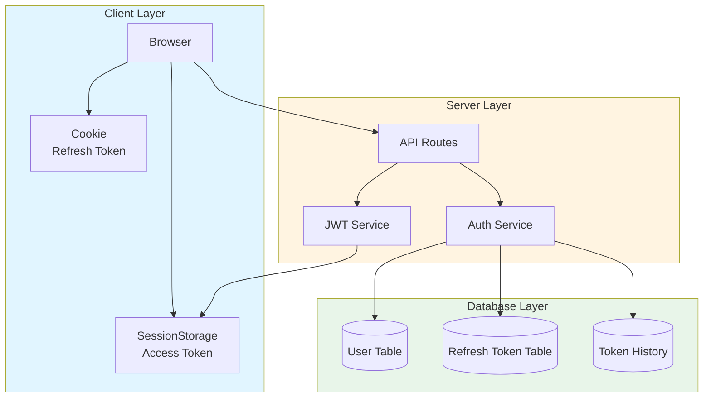
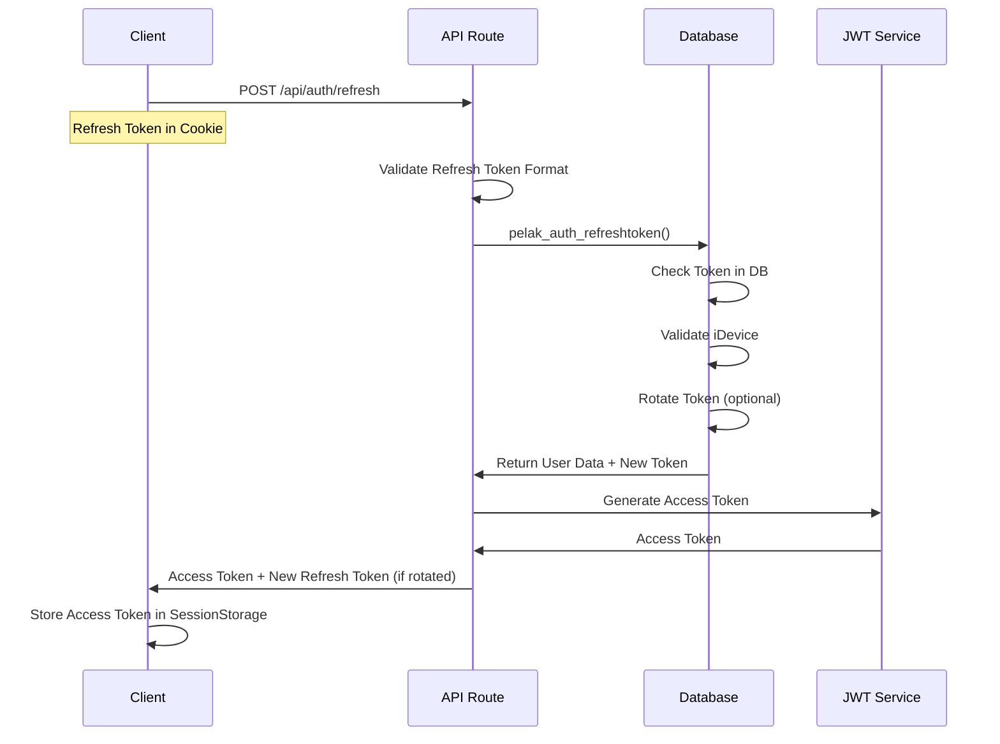
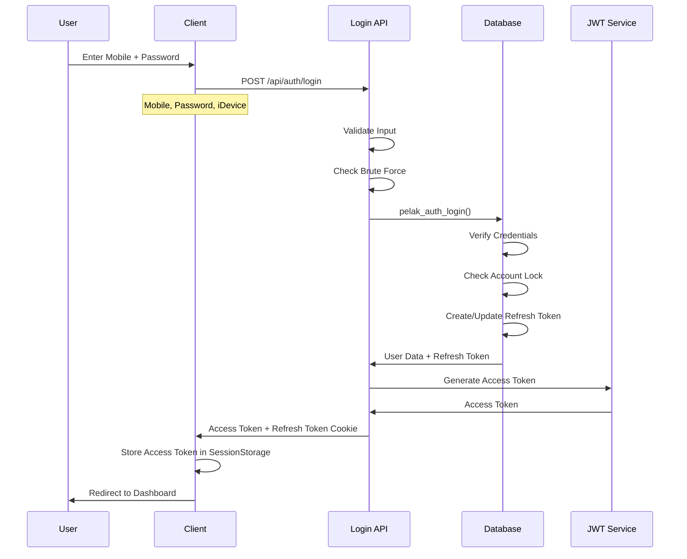
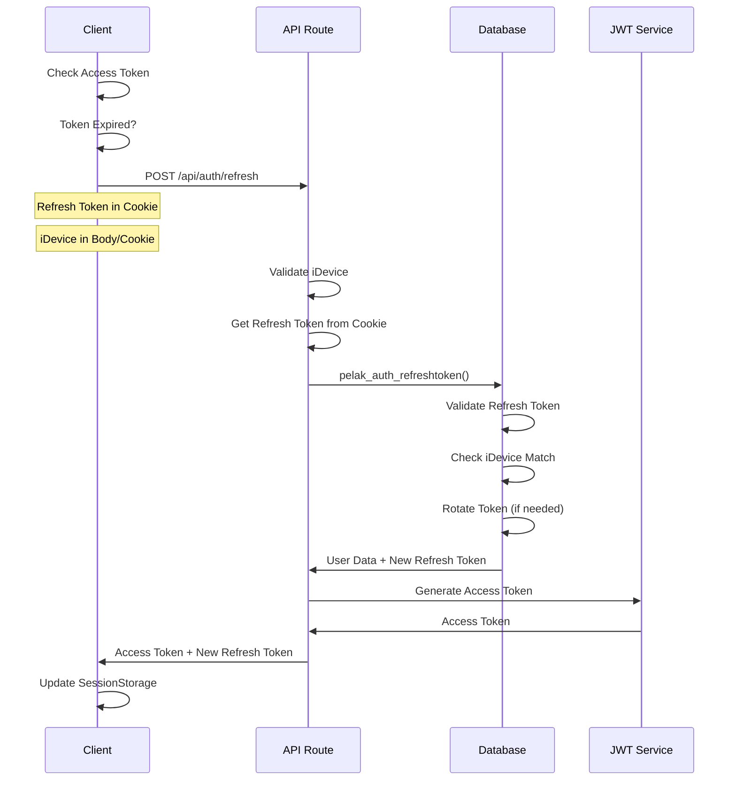
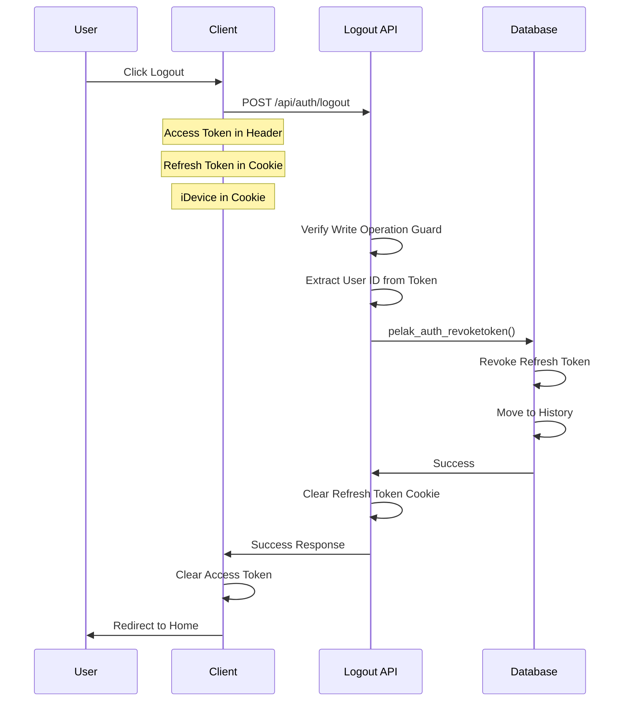
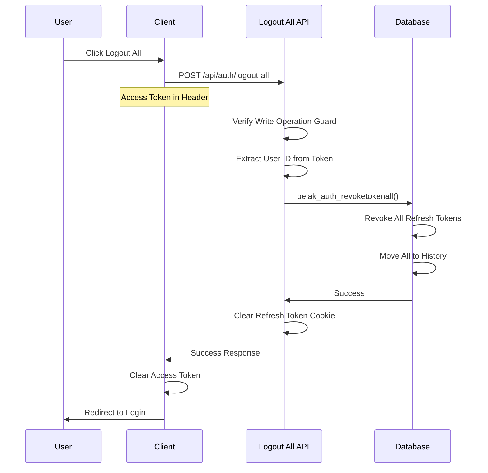
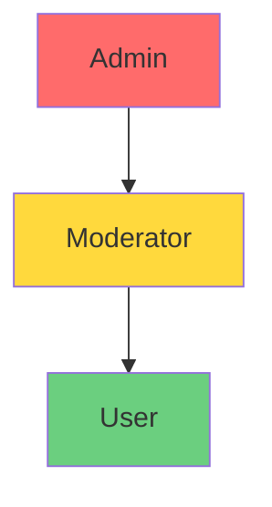
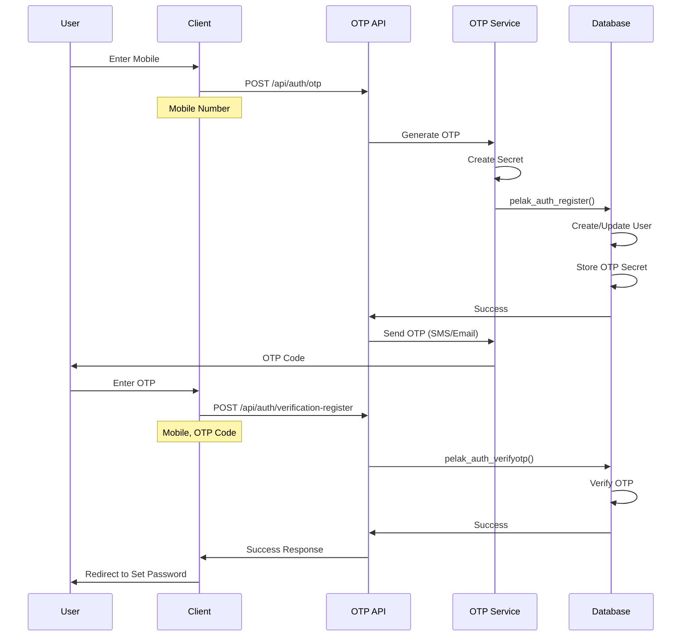

# سیستم احراز هویت Next-Pelak

**نسخه**: 1.0.0  
**آخرین به‌روزرسانی**: 2025-01-XX

## فهرست مطالب

- [معرفی](#معرفی)
- [معماری احراز هویت](#معماری-احراز-هویت)
- [Token System](#token-system)
- [Authentication Flow](#authentication-flow)
- [Authorization و RBAC](#authorization-و-rbac)
- [Device Management](#device-management)
- [OTP System](#otp-system)
- [مثال‌های استفاده](#مثال‌های-استفاده)
- [Troubleshooting](#troubleshooting)

---

## معرفی

سیستم احراز هویت Next-Pelak از معماری مبتنی بر Token استفاده می‌کند که شامل:

- **Access Tokens (JWT)**: توکن‌های کوتاه‌مدت (30 دقیقه) برای دسترسی به API
- **Refresh Tokens**: توکن‌های بلندمدت (7 روز) ذخیره شده در دیتابیس
- **Device Management**: مدیریت دستگاه‌ها با iDevice tokens
- **OTP System**: سیستم تأیید دو مرحله‌ای با OTP
- **Role-Based Access Control (RBAC)**: کنترل دسترسی مبتنی بر نقش

---

## معماری احراز هویت

### Overview



### Token Storage

| Token Type | Storage Location | Lifetime | HttpOnly | Secure |
|------------|------------------|----------|----------|--------|
| Access Token | SessionStorage | 30 minutes | No | N/A |
| Refresh Token | Cookie | 7 days | Yes | Production only |
| iDevice Token | Cookie | 1 year | Yes | Production only |
| CSRF Token | Cookie | 7 days | Yes | Production only |

---

## Token System

### Access Token (JWT)

Access Token یک JWT token است که برای دسترسی به API استفاده می‌شود.

#### Structure

```typescript
interface AccessTokenPayload {
  userid: number;           // User ID
  mobile: string;           // Mobile number
  firstname: string | null; // First name
  lastname: string | null;  // Last name
  email: string | null;      // Email
  profileimage: string | null; // Profile image ID
  profileurl: string | null;   // Profile URL
  role: string;            // User role (default: "user")
  iat: number;             // Issued at (timestamp)
  exp: number;             // Expiration (timestamp)
}
```

#### Generation

```typescript
import { generateAccessToken } from '@/core/lib/token/jwt'

const accessToken = generateAccessToken({
  id: user.id,
  mobile: user.mobile,
  firstname: user.firstname,
  lastname: user.lastname,
  email: user.email,
  profileimage: user.profileimage,
  profileurl: user.profileurl,
})
```

#### Verification

```typescript
import { verifyAccessToken } from '@/core/lib/token/jwt'

const payload = verifyAccessToken(token)
if (!payload) {
  // Token invalid or expired
}
```

#### Client-Side Management

```typescript
import { 
  getAccessToken, 
  setAccessToken, 
  clearAccessToken,
  isTokenExpired 
} from '@/core/lib/auth/token-manager'

// Get token
const token = getAccessToken()

// Set token
setAccessToken(token)

// Clear token
clearAccessToken()

// Check expiration
if (isTokenExpired(token)) {
  // Token expired
}
```

### Refresh Token

Refresh Token برای دریافت Access Token جدید استفاده می‌شود.

#### Characteristics

- **Storage**: HttpOnly Cookie
- **Lifetime**: 7 days
- **Format**: Random string (32-512 characters)
- **Database**: Stored in `pelak.refreshtoken` table

#### Refresh Token Flow



#### Refresh Token Functions

```typescript
// Server-side
import { 
  getRefreshTokenCookie,
  setRefreshTokenCookie,
  clearRefreshTokenCookie,
  validateRefreshTokenFormat 
} from '@/core/lib/token/auth-cookie'

// Get refresh token
const refreshToken = await getRefreshTokenCookie()

// Set refresh token
await setRefreshTokenCookie(token)

// Clear refresh token
const response = clearRefreshTokenCookie(response)

// Validate format
if (!validateRefreshTokenFormat(token)) {
  // Invalid format
}
```

### iDevice Token

iDevice Token یک شناسه یکتا برای هر دستگاه است.

#### Characteristics

- **Format**: 40 characters (starts with 'c')
- **Storage**: HttpOnly Cookie
- **Lifetime**: 1 year
- **Purpose**: Device identification and token management

#### Generation

```typescript
import { generateIDeviceToken } from '@/core/lib/token/idevice'

const iDevice = generateIDeviceToken(userAgent)
// Example: "c1234567890abcdef..."
```

#### Usage

iDevice برای:
- مدیریت Refresh Tokens برای هر دستگاه
- جلوگیری از استفاده مجدد توکن‌ها
- Logout از تمام دستگاه‌ها

---

## Authentication Flow

### Login Flow



#### Login Implementation

```typescript
// Client-side
const response = await fetch('/api/auth/login', {
  method: 'POST',
  headers: {
    'Content-Type': 'application/json',
    'x-csrf-token': csrfToken,
  },
  body: JSON.stringify({
    mobile: '09123456789',
    password: 'password123',
    iDevice: iDeviceToken,
  }),
})

const data = await response.json()
if (data.success) {
  // Access token in response
  setAccessToken(data.access_token)
  // Refresh token in cookie (httpOnly)
}
```

### Refresh Flow



#### Refresh Implementation

```typescript
// Client-side hook
import { useAuth } from '@/core/lib/auth/use-auth'

const { refreshAccessToken, getValidAccessToken } = useAuth(iDevice)

// Manual refresh
const success = await refreshAccessToken()

// Get valid token (auto-refresh if needed)
const token = await getValidAccessToken()
```

### Logout Flow



#### Logout Implementation

```typescript
// Client-side
import { useAuth } from '@/core/lib/auth/use-auth'

const { logout } = useAuth(iDevice)

// Logout
await logout()
// Automatically clears tokens and redirects
```

### Logout All Devices Flow



---

## Authorization و RBAC

### Role Hierarchy



### Role Levels

| Role | Level | Description |
|------|-------|-------------|
| Admin | 3 | Full system access |
| Moderator | 2 | Content moderation |
| User | 1 | Standard user access |

### Authorization Functions

```typescript
import { 
  checkAuthorization,
  checkAuthorizationWithRefresh,
  hasRole,
  isAdmin,
  isModeratorOrAdmin 
} from '@/core/lib/security/authorization'

// Check authorization (simple)
const result = checkAuthorization(accessToken, 'user')
if (!result.allowed) {
  // Unauthorized
}

// Check authorization with refresh (auto-refresh if expired)
const result = await checkAuthorizationWithRefresh(request, accessToken, 'user')
if (!result.allowed) {
  // Unauthorized
} else if (result.newAccessToken) {
  // Token was refreshed
}

// Check role
if (hasRole(userRole, 'admin')) {
  // User has admin role
}

// Convenience functions
if (isAdmin(accessToken)) {
  // User is admin
}

if (isModeratorOrAdmin(accessToken)) {
  // User is moderator or admin
}
```

### Protected Routes

```typescript
// In proxy.ts or middleware
const isAdminRoute = ROUTES.ADMIN_ROUTE_PATTERN.test(pathname)

if (isAdminRoute) {
  const authResult = checkAuthorization(accessToken, 'user')
  if (!authResult.allowed) {
    // Redirect to login
  }
}
```

---

## Device Management

### iDevice Token

iDevice Token یک شناسه یکتا برای هر دستگاه است که برای مدیریت Refresh Tokens استفاده می‌شود.

#### Characteristics

- **Length**: Exactly 40 characters
- **Format**: Starts with 'c', contains encoded timestamp and device info
- **Storage**: HttpOnly Cookie (1 year)
- **Purpose**: 
  - Device identification
  - Refresh token management per device
  - Logout from specific devices

#### Generation

```typescript
import { generateIDeviceToken } from '@/core/lib/token/idevice'

const iDevice = generateIDeviceToken(userAgent)
```

#### Validation

```typescript
import { validateDeviceId } from '@/core/lib/validation'

const result = validateDeviceId(iDevice)
if (!result.success) {
  // Invalid device ID
}
```

### Device Token Management

هر کاربر می‌تواند چندین Refresh Token برای دستگاه‌های مختلف داشته باشد:

```sql
-- Refresh tokens per device
SELECT * FROM pelak.refreshtoken 
WHERE userid = 123 
AND revokedat IS NULL
```

### Logout from Specific Device

```typescript
// Revoke token for specific device
await callRpc("pelak_auth_revoketoken", {
  p_userid: userId,
  p_idevice: iDevice,
})
```

### Logout from All Devices

```typescript
// Revoke all tokens for user
await callRpc("pelak_auth_revoketokenall", {
  p_userid: userId,
})
```

---

## OTP System

### OTP Flow



### OTP Functions

```typescript
import { generateOTP, verifyOTP } from '@/core/lib/otp/service'

// Generate OTP
const { secret, code } = generateOTP()
// secret: stored in database
// code: sent to user

// Verify OTP
const isValid = verifyOTP(code, secret)
```

### OTP API Endpoints

#### Send OTP

```typescript
POST /api/auth/otp
{
  "mobile": "09123456789"
}

Response:
{
  "success": true,
  "title": "OTP Sent",
  "message": "کد تأیید ارسال شد"
}
```

#### Verify OTP (Registration)

```typescript
POST /api/auth/verification-register
{
  "mobile": "09123456789",
  "otp": "1234"
}

Response:
{
  "success": true,
  "title": "OTP Verified",
  "message": "کد تأیید معتبر است"
}
```

#### Set Password

```typescript
POST /api/auth/verification-password
{
  "mobile": "09123456789",
  "otp": "1234",
  "password": "newpassword123"
}

Response:
{
  "success": true,
  "title": "Password Set",
  "message": "رمز عبور تنظیم شد"
}
```

---

## مثال‌های استفاده

### استفاده از useAuth Hook

```typescript
'use client'

import { useAuth } from '@/core/lib/auth/use-auth'
import { getIDeviceToken } from '@/core/lib/token/idevice'

export function MyComponent() {
  const iDevice = getIDeviceToken()
  const { 
    authState, 
    error, 
    refreshAccessToken, 
    getValidAccessToken,
    logout 
  } = useAuth(iDevice)

  if (authState === 'loading') {
    return <div>Loading...</div>
  }

  if (authState === 'unauthenticated') {
    return <div>Please login</div>
  }

  const handleApiCall = async () => {
    const token = await getValidAccessToken()
    if (!token) {
      // Not authenticated
      return
    }

    const response = await fetch('/api/user/profile', {
      headers: {
        'Authorization': `Bearer ${token}`,
      },
    })
    // ...
  }

  return (
    <div>
      <button onClick={handleApiCall}>Call API</button>
      <button onClick={logout}>Logout</button>
    </div>
  )
}
```

### استفاده در API Route

```typescript
import { NextRequest, NextResponse } from 'next/server'
import { checkAuthorizationWithRefresh } from '@/core/lib/security/authorization'

export async function GET(request: NextRequest) {
  const authHeader = request.headers.get('authorization')
  const accessToken = authHeader?.startsWith('Bearer ') 
    ? authHeader.substring(7) 
    : null

  const authResult = await checkAuthorizationWithRefresh(
    request, 
    accessToken, 
    'user'
  )

  if (!authResult.allowed) {
    return NextResponse.json(
      { success: false, message: authResult.reason },
      { status: 401 }
    )
  }

  // Use new access token if refreshed
  const tokenToUse = authResult.newAccessToken || accessToken

  // Process request...
  return NextResponse.json({ success: true })
}
```

### استفاده در Server Component

```typescript
import { verifyAccessToken } from '@/core/lib/token/jwt'
import { headers } from 'next/headers'

export default async function ProtectedPage() {
  const headersList = await headers()
  const authHeader = headersList.get('authorization')
  const accessToken = authHeader?.startsWith('Bearer ') 
    ? authHeader.substring(7) 
    : null

  const payload = verifyAccessToken(accessToken)
  if (!payload) {
    redirect('/login')
  }

  return <div>Protected Content</div>
}
```

---

## Troubleshooting

### مشکل: Access Token Expired

**علت**: Access Token منقضی شده است.

**راه‌حل**:
```typescript
// استفاده از getValidAccessToken که خودش refresh می‌کند
const token = await getValidAccessToken()
```

### مشکل: Refresh Token Not Found

**علت**: Refresh Token در دیتابیس وجود ندارد یا منقضی شده است.

**راه‌حل**:
- کاربر باید دوباره login کند
- بررسی کنید که Refresh Token در cookie وجود دارد
- بررسی کنید که iDevice معتبر است

### مشکل: Invalid Device ID

**علت**: iDevice format نامعتبر است.

**راه‌حل**:
```typescript
import { validateDeviceId } from '@/core/lib/validation'

const result = validateDeviceId(iDevice)
if (!result.success) {
  // Generate new iDevice token
}
```

### مشکل: Token Refresh Fails

**علت**: ممکن است چند دلیل داشته باشد:
- Refresh Token منقضی شده
- iDevice match نمی‌کند
- Token در دیتابیس revoked شده

**راه‌حل**:
- بررسی لاگ‌های سرور
- بررسی Refresh Token در دیتابیس
- بررسی iDevice match

### مشکل: CORS یا Cookie Issues

**علت**: Cookie settings یا CORS configuration مشکل دارد.

**راه‌حل**:
- بررسی Cookie settings در `core/config/security.ts`
- بررسی CORS headers
- بررسی SameSite settings

---

## Best Practices

### 1. همیشه از getValidAccessToken استفاده کنید

```typescript
// ✅ Good
const token = await getValidAccessToken()

// ❌ Bad
const token = getAccessToken()
if (isTokenExpired(token)) {
  await refreshAccessToken()
}
```

### 2. Handle Token Refresh Errors

```typescript
const token = await getValidAccessToken()
if (!token) {
  // Redirect to login
  router.push('/login')
  return
}
```

### 3. استفاده از checkAuthorizationWithRefresh در API Routes

```typescript
// ✅ Good - auto-refreshes if needed
const authResult = await checkAuthorizationWithRefresh(request, accessToken, 'user')

// ❌ Bad - doesn't refresh
const authResult = checkAuthorization(accessToken, 'user')
```

### 4. Clear Tokens on Logout

```typescript
// ✅ Good - clears both tokens
await logout()

// ❌ Bad - only clears access token
clearAccessToken()
```

### 5. Validate iDevice

```typescript
// ✅ Good
const deviceValidation = validateDeviceId(iDevice)
if (!deviceValidation.success) {
  return invalidInputError(deviceValidation.message)
}

// ❌ Bad
// No validation
```

---

## منابع بیشتر

- [SECURITY.md](./SECURITY.md) - سیستم‌های امنیتی
- [API.md](./API.md) - راهنمای API
- [CORE_LIBRARIES.md](./CORE_LIBRARIES.md) - کتابخانه‌های core
- [DATABASE.md](./DATABASE.md) - ساختار دیتابیس

---

**آخرین به‌روزرسانی**: 2025-01-XX  
**نگهدارنده**: Development Team
