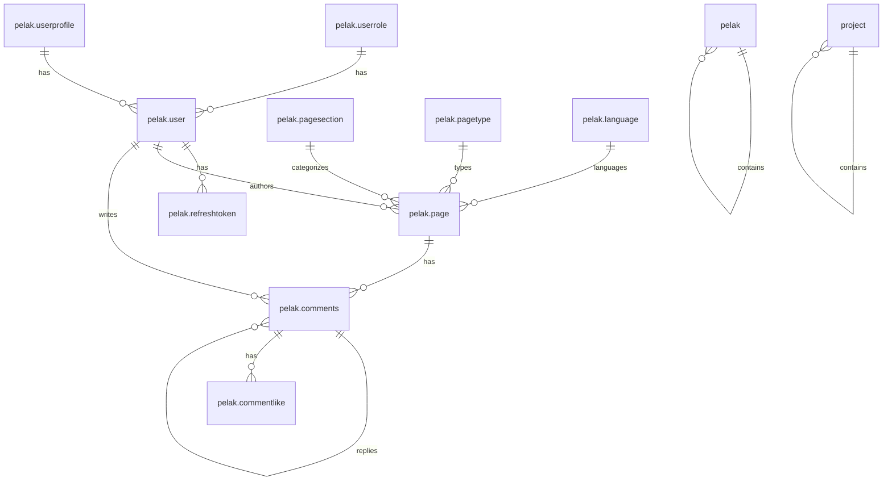
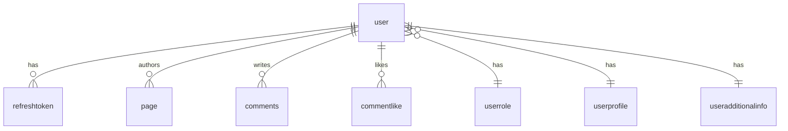
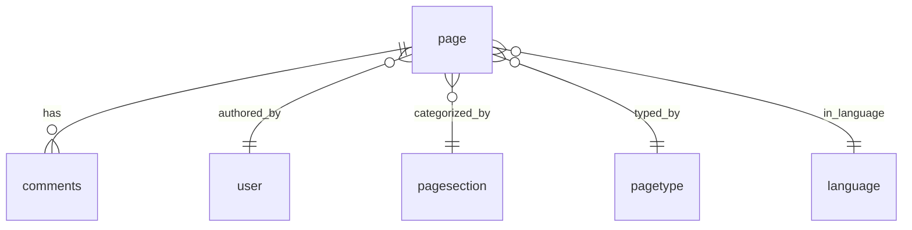
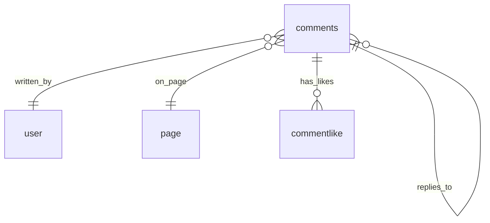

# ساختار دیتابیس Next-Pelak

**نسخه**: 1.0.0  
**آخرین به‌روزرسانی**: 2025-01-XX

## فهرست مطالب

- [معرفی](#معرفی)
- [Database Schemas](#database-schemas)
- [Schema: pelak](#schema-pelak)
- [Schema: project](#schema-project)
- [RPC Functions](#rpc-functions)
- [Relationships](#relationships)
- [Indexes و Performance](#indexes-و-performance)
- [Migrations](#migrations)

---

## معرفی

دیتابیس Next-Pelak از PostgreSQL استفاده می‌کند و شامل دو schema اصلی است:

- **pelak**: Schema اصلی برای core functionality
- **project**: Schema برای project-specific data

### Database Architecture



---

## Database Schemas

### Schema: pelak

Schema اصلی برای core functionality شامل:

- **Authentication**: user، refreshtoken، refreshtokenhistory
- **Content**: page، pagesection، pagetype، language
- **Comments**: comments، commentlike
- **Base**: userrole، userprofile

### Schema: project

Schema برای project-specific data شامل:

- **Selectors**: selector، selectortype
- **User Additional Info**: useradditionalinfo

---

## Schema: pelak

### Table: user

جدول اصلی کاربران سیستم.

#### Columns

| Column | Type | Description |
|--------|------|-------------|
| `userid` | int4 | Primary Key، Auto Increment |
| `mobile` | varchar(20) | شماره موبایل (Unique، Not Null) |
| `userpassword` | varchar(255) | رمز عبور hash شده با bcrypt |
| `firstname` | varchar(50) | نام |
| `lastname` | varchar(50) | نام خانوادگی |
| `email` | varchar(100) | ایمیل |
| `register` | timestamptz | تاریخ ثبت‌نام |
| `lastlogin` | timestamptz | آخرین ورود |
| `failedattempt` | int4 | تعداد تلاش‌های ناموفق (Default: 0) |
| `active` | bool | وضعیت فعال/غیرفعال (Default: true) |
| `otpsecret` | varchar(32) | OTP secret (موقت) |
| `passwordchanged` | timestamptz | تاریخ تغییر رمز عبور |
| `lockeduntil` | timestamptz | تاریخ قفل شدن حساب |
| `profileimageid` | int4 | شناسه تصویر پروفایل |
| `profileimageurl` | text | URL تصویر پروفایل |
| `roleid` | int4 | شناسه نقش کاربر (Default: 2) |

#### Indexes

- `idx_user_active`: جستجوی کاربران فعال
- `idx_user_mobile`: جستجوی سریع با شماره موبایل (Unique)
- `idx_user_profileimageid`: جستجوی با تصویر پروفایل
- `idx_user_roleid`: جستجوی با نقش کاربر

### Table: refreshtoken

جدول Refresh Tokens فعال.

#### Columns

| Column | Type | Description |
|--------|------|-------------|
| `refreshtokenid` | int4 | Primary Key |
| `tokenhash` | text | Hash شده token (SHA-256، Unique) |
| `userid` | int4 | شناسه کاربر (Foreign Key) |
| `idevice` | text | شناسه دستگاه (40 کاراکتر) |
| `expiresat` | timestamptz | تاریخ انقضا |
| `created` | timestamptz | تاریخ ایجاد |
| `revokedat` | timestamptz | تاریخ لغو (NULL = فعال) |
| `lastusedat` | timestamptz | آخرین استفاده |
| `lastusedip` | inet | آخرین IP استفاده شده |

#### Indexes

- `idx_refreshtoken_expiresat`: جستجوی توکن‌های منقضی شده
- `idx_refreshtoken_tokenhash`: جستجوی با hash token
- `idx_refreshtoken_userid`: جستجوی توکن‌های یک کاربر

### Table: refreshtokenhistory

جدول تاریخچه توکن‌های منقضی یا لغو شده.

#### Columns

همان columns جدول `refreshtoken` به اضافه:
- `archivedat`: تاریخ آرشیو شدن

### Table: page

جدول صفحات سایت.

#### Columns

| Column | Type | Description |
|--------|------|-------------|
| `pageid` | int4 | Primary Key |
| `title` | varchar(200) | عنوان صفحه |
| `description` | varchar(300) | توضیحات کوتاه |
| `keywords` | varchar(100) | کلمات کلیدی SEO |
| `content` | text | محتوای کامل (HTML/Markdown) |
| `media` | text | لینک‌های رسانه (JSON) |
| `url` | text | URL یکتا (Unique) |
| `publishedtime` | date | تاریخ انتشار |
| `modifiedtime` | date | تاریخ آخرین تغییر |
| `authors` | int4 | شناسه نویسنده |
| `sectionid` | int4 | شناسه بخش |
| `typeid` | int4 | شناسه نوع صفحه |
| `tags` | varchar(300) | تگ‌ها |
| `status` | int2 | وضعیت (0=draft، 1=published، 2=archived) |
| `lang` | int2 | شناسه زبان |

### Table: comments

جدول نظرات با ساختار درختی.

#### Columns

| Column | Type | Description |
|--------|------|-------------|
| `commentid` | int4 | Primary Key |
| `userid` | int4 | شناسه کاربر (Foreign Key) |
| `pageid` | int4 | شناسه صفحه (Foreign Key) |
| `parentid` | int4 | شناسه نظر والد (NULL = root) |
| `content` | text | محتوای نظر |
| `approved` | bool | وضعیت تأیید (Default: false) |
| `deleted` | bool | وضعیت حذف (Default: false) |
| `importance` | int4 | سطح اهمیت (0-100) |
| `created` | timestamptz | تاریخ ایجاد |
| `updated` | timestamptz | تاریخ آخرین تغییر |

#### Indexes

- `idx_comments_pageid`: نظرات یک صفحه
- `idx_comments_userid`: نظرات یک کاربر
- `idx_comments_parentid`: پاسخ‌های یک نظر
- `idx_comments_approved`: نظرات تأیید شده
- `idx_pelak_comment_deleted`: نظرات غیرحذف شده
- `idx_comments_importance`: مرتب‌سازی بر اساس اهمیت

### Table: commentlike

جدول لایک‌های نظرات.

#### Columns

| Column | Type | Description |
|--------|------|-------------|
| `commentlikeid` | int4 | Primary Key |
| `userid` | int4 | شناسه کاربر |
| `commentid` | int4 | شناسه نظر |
| `created` | timestamptz | تاریخ لایک |

#### Constraints

- Unique constraint: هر کاربر فقط یک بار می‌تواند یک نظر را لایک کند

---

## Schema: project

### Table: selector

جدول selector ها برای داده‌های سلسله‌مراتبی (مثل استان، شهر).

#### Columns

| Column | Type | Description |
|--------|------|-------------|
| `selectorid` | int4 | Primary Key |
| `title` | varchar(200) | عنوان |
| `type` | int4 | نوع selector |
| `parentselectorid` | int4 | شناسه والد (NULL = root) |
| `txt` | text | متن اضافی |
| `order` | int4 | ترتیب نمایش |

### Table: useradditionalinfo

جدول اطلاعات اضافی کاربران.

#### Columns

| Column | Type | Description |
|--------|------|-------------|
| `userid` | int4 | Primary Key (Foreign Key) |
| `nationalcode` | char(10) | کد ملی |
| `birthday` | varchar(10) | تاریخ تولد |
| `married` | bool | وضعیت تأهل |
| `gender` | bool | جنسیت |
| `countryid` | int4 | شناسه کشور |
| `provinceid` | int4 | شناسه استان |
| `cityid` | int4 | شناسه شهر |
| `address` | text | آدرس |
| `job` | text | شغل |
| `skills` | text | مهارت‌ها |
| `political` | text | گرایش سیاسی |
| `motivation` | text | انگیزه |
| `howknown` | varchar(150) | نحوه آشنایی |
| `collaboration` | varchar(100) | نوع همکاری |
| `degreeid` | int4 | شناسه مدرک تحصیلی |
| `studyplaceid` | int4 | شناسه محل تحصیل |
| `studyplacetypeid` | int4 | شناسه نوع محل تحصیل |
| `fieldofstudyid` | int4 | شناسه رشته تحصیلی |

---

## RPC Functions

### Authentication Functions

#### pelak_auth_login

ورود کاربر و ایجاد Refresh Token.

**Parameters**:
- `p_mobile`: شماره موبایل
- `p_password`: رمز عبور (plain text)
- `p_idevice`: شناسه دستگاه

**Returns**:
```json
{
  "success": true,
  "title": "Login Successful",
  "userid": 123,
  "mobile": "09123456789",
  "firstname": "John",
  "lastname": "Doe",
  "refreshtoken": "..."
}
```

**Logic**:
1. بررسی قفل بودن حساب
2. بررسی اعتبار credentials
3. در صورت ناموفق: افزایش failedattempt و قفل بعد از 5 تلاش
4. در صورت موفق: ایجاد/به‌روزرسانی Refresh Token

#### pelak_auth_refreshtoken

Refresh کردن Access Token.

**Parameters**:
- `p_refreshtoken`: Refresh Token
- `p_idevice`: شناسه دستگاه
- `p_ip`: IP address

**Returns**:
```json
{
  "success": true,
  "userid": 123,
  "mobile": "09123456789",
  "refreshtoken": "..." // اگر rotate شده باشد
}
```

#### pelak_auth_revoketoken

لغو Refresh Token برای یک دستگاه.

**Parameters**:
- `p_userid`: شناسه کاربر
- `p_idevice`: شناسه دستگاه

#### pelak_auth_revoketokenall

لغو تمام Refresh Token های یک کاربر.

**Parameters**:
- `p_userid`: شناسه کاربر

#### pelak_auth_checkrefreshtoken

بررسی وجود Refresh Token برای iDevice.

**Parameters**:
- `p_idevice`: شناسه دستگاه

**Returns**:
```json
{
  "success": true,
  "valid": true,
  "title": "Token Valid"
}
```

### Content Functions

#### pelak_page_geturl

دریافت صفحه بر اساس URL.

**Parameters**:
- `p_url`: URL صفحه

**Returns**:
```json
{
  "success": true,
  "page": {
    "pageid": 1,
    "title": "...",
    "content": "...",
    ...
  }
}
```

#### pelak_page_list

لیست صفحات با pagination.

**Parameters**:
- `p_limit`: تعداد نتایج
- `p_offset`: offset
- `p_lang`: شناسه زبان

### Comments Functions

#### pelak_comment_create

ایجاد نظر جدید.

**Parameters**:
- `p_userid`: شناسه کاربر
- `p_pageid`: شناسه صفحه
- `p_content`: محتوای نظر
- `p_parentid`: شناسه نظر والد (اختیاری)

**Returns**:
```json
{
  "success": true,
  "comment_id": 123,
  "title": "Comment Created"
}
```

#### pelak_comment_list

لیست نظرات یک صفحه.

**Parameters**:
- `p_pageid`: شناسه صفحه

**Returns**:
```json
{
  "success": true,
  "comments": [...]
}
```

### Project Functions

#### project_selector_gettree

دریافت selector ها به صورت درختی.

**Parameters**:
- `p_typeidentifier`: شناسه نوع selector

**Returns**:
```json
{
  "success": true,
  "selectors": [
    {
      "id": 1,
      "title": "...",
      "children": [...]
    }
  ]
}
```

---

## Relationships

### User Relationships



### Page Relationships



### Comments Relationships



---

## Indexes و Performance

### Index Types

1. **B-Tree Indexes**: برای جستجوهای معمولی
2. **Unique Indexes**: برای constraints
3. **Composite Indexes**: برای جستجوهای ترکیبی

### Performance Tips

1. **استفاده از Indexes**: تمام foreign keys و fields پرکاربرد index شده‌اند
2. **Pagination**: همیشه از LIMIT و OFFSET استفاده کنید
3. **Query Optimization**: از EXPLAIN ANALYZE برای بهینه‌سازی استفاده کنید

---

## Migrations

### Migration Files

- `core/database/migrations/database_migration.sql`: Migration اصلی
- `core/database/migrations/test.sql`: Migration تست

### Schema Files

- `00_create_schema.sql`: ایجاد schemas
- `01_sequences.sql`: ایجاد sequences
- `02_base_tables.sql`: جداول پایه
- `03_auth_tables.sql`: جداول احراز هویت
- `04_content_tables.sql`: جداول محتوا
- `05_comments_tables.sql`: جداول نظرات
- `06_project_tables.sql`: جداول project

### Function Files

- `01_auth_functions.sql`: توابع احراز هویت
- `02_content_functions.sql`: توابع محتوا
- `03_comments_functions.sql`: توابع نظرات
- `04_user_functions.sql`: توابع کاربر

---

## مثال‌های Query

### دریافت کاربر با Refresh Token

```sql
SELECT * FROM pelak.user u
INNER JOIN pelak.refreshtoken rt ON u.userid = rt.userid
WHERE rt.idevice = 'c123...'
AND rt.expiresat > NOW()
AND rt.revokedat IS NULL;
```

### دریافت نظرات یک صفحه

```sql
SELECT * FROM pelak.comments
WHERE pageid = 1
AND approved = true
AND deleted = false
ORDER BY importance DESC, created DESC;
```

### دریافت صفحات منتشر شده

```sql
SELECT * FROM pelak.page
WHERE status = 1
AND lang = 310
ORDER BY publishedtime DESC
LIMIT 12 OFFSET 0;
```

---

## Best Practices

### 1. همیشه از RPC Functions استفاده کنید

```typescript
// ✅ Good
const result = await callRpc("pelak_auth_login", {
  p_mobile: mobile,
  p_password: password,
  p_idevice: iDevice,
})

// ❌ Bad
// Direct SQL queries
```

### 2. استفاده از Transactions برای عملیات چندگانه

```sql
BEGIN;
-- Multiple operations
COMMIT;
```

### 3. استفاده از Soft Delete

```sql
-- ✅ Good - Soft delete
UPDATE pelak.comments SET deleted = true WHERE commentid = 1;

-- ❌ Bad - Hard delete
DELETE FROM pelak.comments WHERE commentid = 1;
```

### 4. Index Optimization

- فقط fields پرکاربرد را index کنید
- از composite indexes برای جستجوهای ترکیبی استفاده کنید
- به صورت منظم indexes را analyze کنید

---

## منابع بیشتر

- [AUTHENTICATION.md](./AUTHENTICATION.md) - سیستم احراز هویت
- [API.md](./API.md) - راهنمای API
- [CORE_LIBRARIES.md](./CORE_LIBRARIES.md) - کتابخانه RPC

---

**آخرین به‌روزرسانی**: 2025-01-XX  
**نگهدارنده**: Development Team
