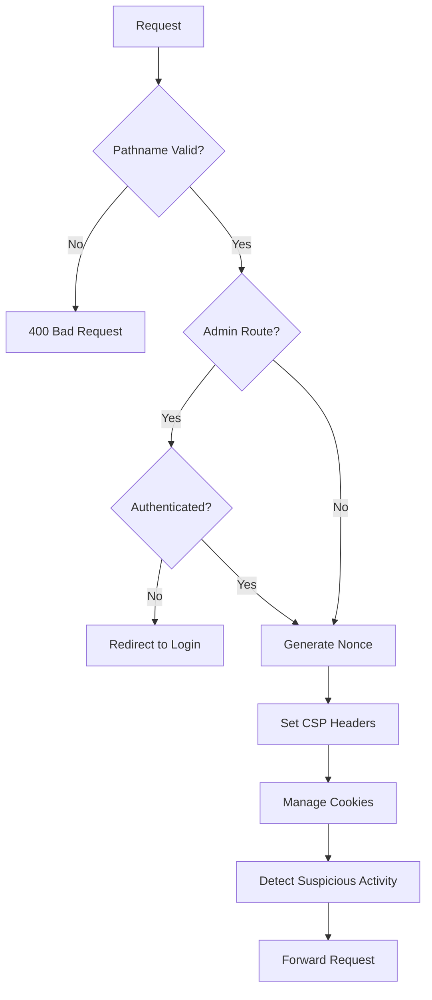

# Proxy و Middleware Next-Pelak

**نسخه**: 1.0.0  
**آخرین به‌روزرسانی**: 2025-01-XX

## فهرست مطالب

- [Proxy System](#proxy-system)
- [Request Flow](#request-flow)
- [CSP Configuration](#csp-configuration)
- [Security Headers](#security-headers)
- [Cookie Management](#cookie-management)

---

## Proxy System

### Overview

Proxy middleware در `core/proxy.ts` تمام requests را قبل از رسیدن به API routes پردازش می‌کند.

### Responsibilities

1. **Pathname Validation**: بررسی pathname معتبر
2. **Authentication Check**: بررسی احراز هویت برای admin routes
3. **Nonce Generation**: تولید nonce برای CSP
4. **CSP Headers**: تنظیم Content Security Policy
5. **Cookie Management**: مدیریت CSRF و iDevice cookies
6. **Suspicious Activity Detection**: شناسایی فعالیت‌های مشکوک

---

## Request Flow



---

## CSP Configuration

### CSP Directives

```typescript
const cspHeader = [
  "default-src 'self'",
  `script-src 'self' 'nonce-${nonce}' ...`,
  `style-src 'self' 'nonce-${nonce}' 'unsafe-inline' ...`,
  "img-src 'self' data: https:",
  "font-src 'self'",
  "connect-src 'self' https://www.googletagmanager.com ...",
  "media-src 'self' https://htni-box.s3.ir-thr-at1.arvanstorage.ir",
  "object-src 'none'",
  "frame-src 'self' https://www.aparat.com ...",
  "base-uri 'self'",
  "form-action 'self'",
  "frame-ancestors 'none'",
  "upgrade-insecure-requests",
  "manifest-src 'self'"
].join('; ')
```

### Nonce Usage

```typescript
const nonce = generateNonce()
response.headers.set('X-CSP-Nonce', nonce)
```

---

## Security Headers

### Headers Set in Proxy

- `X-CSP-Nonce`: Nonce برای CSP
- `Content-Security-Policy`: CSP header

### Headers Set in next.config.ts

- `Strict-Transport-Security`
- `X-Frame-Options`
- `X-Content-Type-Options`
- `Referrer-Policy`
- `Permissions-Policy`
- و سایر headers

---

## Cookie Management

### CSRF Token Cookie

```typescript
if (!existingToken) {
  const newToken = generateCSRFToken()
  response.cookies.set(ENV.CSRF_TOKEN_NAME, newToken, {
    ...COOKIE.CSRF,
  })
}
```

### iDevice Token Cookie

```typescript
const existingIDevice = request.cookies.get(ENV.IDEVICE_TOKEN_NAME)?.value
const iDevice = existingIDevice || generateIDeviceToken(userAgent)
if (!existingIDevice || existingIDevice.length !== 40) {
  response.cookies.set(ENV.IDEVICE_TOKEN_NAME, iDevice, {
    ...COOKIE.IDEVICE,
  })
}
```

---

## منابع بیشتر

- [SECURITY.md](./SECURITY.md) - Security Headers
- [AUTHENTICATION.md](./AUTHENTICATION.md) - Authentication Flow

---

**آخرین به‌روزرسانی**: 2025-01-XX  
**نگهدارنده**: Development Team
