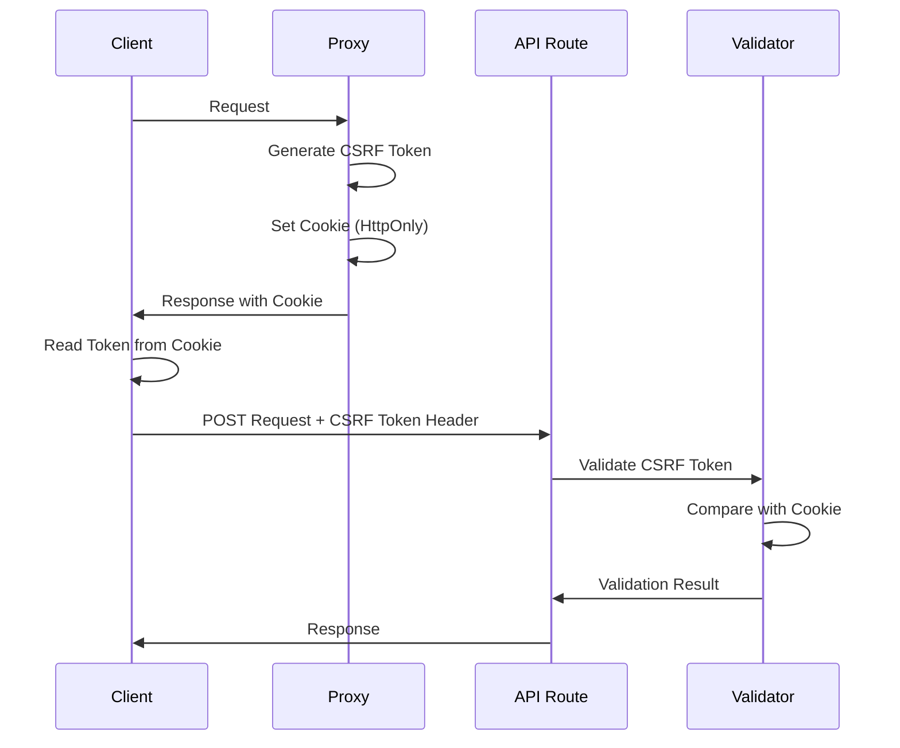
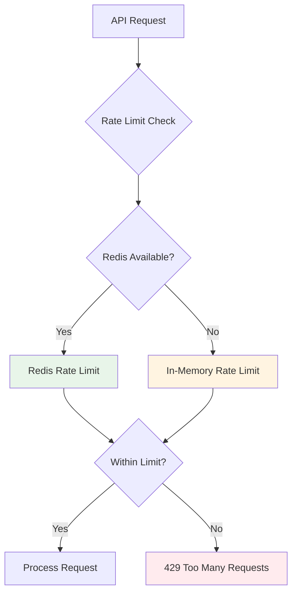
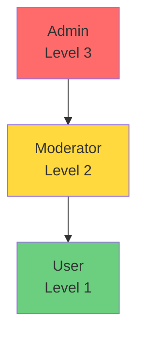
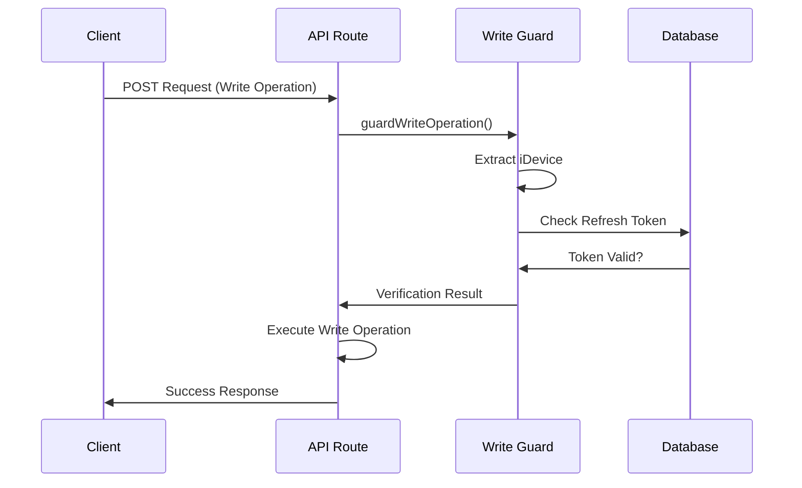
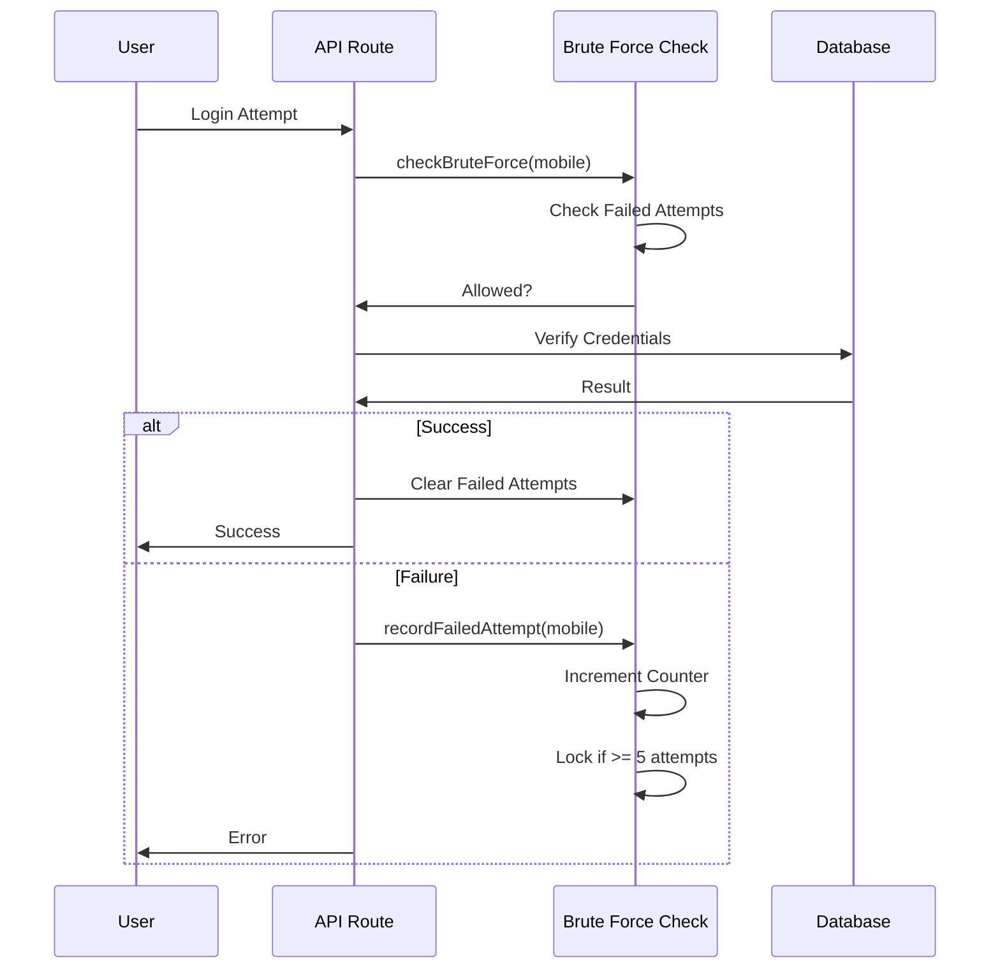

# سیستم‌های امنیتی Next-Pelak

**نسخه**: 1.0.0  
**آخرین به‌روزرسانی**: 2025-01-XX

## فهرست مطالب

- [معرفی](#معرفی)
- [CSRF Protection](#csrf-protection)
- [Rate Limiting](#rate-limiting)
- [IP Filtering](#ip-filtering)
- [Authorization System](#authorization-system)
- [Write Operation Guard](#write-operation-guard)
- [Brute Force Protection](#brute-force-protection)
- [Audit Logging](#audit-logging)
- [Security Headers](#security-headers)
- [SSRF Protection](#ssrf-protection)
- [Suspicious Activity Detection](#suspicious-activity-detection)
- [مثال‌های استفاده](#مثال‌های-استفاده)

---

## معرفی

سیستم امنیتی Next-Pelak شامل چندین لایه حفاظتی است که در کنار هم امنیت کامل را فراهم می‌کنند:

- **CSRF Protection**: محافظت در برابر حملات Cross-Site Request Forgery
- **Rate Limiting**: محدودیت تعداد درخواست‌ها
- **IP Filtering**: فیلتر IP addresses (Whitelist/Blacklist)
- **Authorization**: کنترل دسترسی مبتنی بر نقش
- **Write Operation Guard**: محافظت دو مرحله‌ای برای عملیات نوشتن
- **Brute Force Protection**: محافظت در برابر حملات brute force
- **Audit Logging**: ثبت تمام رویدادهای امنیتی
- **Security Headers**: هدرهای امنیتی HTTP
- **SSRF Protection**: محافظت در برابر Server-Side Request Forgery

---

## CSRF Protection

### Overview

CSRF Protection از طریق Token-based validation انجام می‌شود. هر درخواست state-changing (POST, PUT, DELETE, PATCH) باید یک CSRF token معتبر داشته باشد.

### Flow



### Implementation

#### Server-Side

```typescript
import { validateCSRFToken } from '@/core/lib/security/cookies'

// در API route
const csrfToken = request.headers.get('x-csrf-token')
const isValid = await validateCSRFToken(csrfToken)

if (!isValid) {
  return NextResponse.json(
    { success: false, message: 'CSRF token invalid' },
    { status: 403 }
  )
}
```

#### Client-Side

```typescript
import { useSecurity } from '@/core/components/security/SecurityProvider'

function MyComponent() {
  const { csrfToken } = useSecurity()
  
  const handleSubmit = async () => {
    await fetch('/api/endpoint', {
      method: 'POST',
      headers: {
        'Content-Type': 'application/json',
        'x-csrf-token': csrfToken,
      },
      body: JSON.stringify({ data: '...' }),
    })
  }
}
```

### Configuration

```typescript
// core/config/security.ts
export const COOKIE = {
  CSRF: {
    maxAge: TIME.WEEK, // 7 days
    httpOnly: true,
    secure: IS_PRODUCTION,
    sameSite: 'strict' as const,
    path: '/',
  },
}

export const TOKEN = {
  CSRF_LENGTH: 32,
}
```

### Best Practices

1. **همیشه CSRF token را در header ارسال کنید**
   ```typescript
   // ✅ Good
   headers: { 'x-csrf-token': csrfToken }
   
   // ❌ Bad
   body: { csrfToken }
   ```

2. **از timing-safe comparison استفاده کنید**
   - سیستم به صورت خودکار از `crypto.timingSafeEqual` استفاده می‌کند

3. **CSRF token را فقط برای state-changing methods بررسی کنید**
   ```typescript
   if (['POST', 'PUT', 'DELETE', 'PATCH'].includes(request.method)) {
     // Validate CSRF
   }
   ```

---

## Rate Limiting

### Overview

Rate Limiting از Redis برای distributed rate limiting استفاده می‌کند و در صورت عدم دسترسی به Redis، به in-memory rate limiting fallback می‌کند.

### Architecture



### Configuration

```typescript
// core/config/security.ts
export const RATE_LIMIT = {
  GENERAL: {
    maxRequests: 5000,
    windowMs: TIME.MINUTE * 1000, // 1 minute
  },
  LOGIN: {
    maxRequests: 150,
    windowMs: 15 * TIME.MINUTE * 1000, // 15 minutes
  },
  OTP: {
    maxRequests: 100,
    windowMs: 10 * TIME.MINUTE * 1000, // 10 minutes
  },
}
```

### Usage

```typescript
import { validateAPIRequest } from '@/core/lib/security/api-middleware'
import { RATE_LIMIT } from '@/core/config/security'

async function POSTHandler(request: NextRequest) {
  const securityCheck = await validateAPIRequest(request, true, {
    maxRequests: RATE_LIMIT.LOGIN.maxRequests,
    windowMs: RATE_LIMIT.LOGIN.windowMs,
  })
  
  if (!securityCheck.valid) {
    return securityCheck.response!
  }
  
  // Process request...
}
```

### Response Headers

Rate limit information در response headers برگردانده می‌شود:

```http
X-RateLimit-Limit: 150
X-RateLimit-Remaining: 149
X-RateLimit-Reset: 1704067200
Retry-After: 60
```

### Identifier Types

#### Client Identifier (IP-based)

```typescript
import { getClientIdentifier } from '@/core/lib/security/rate-limit'

const identifier = getClientIdentifier(request)
// Returns: "192.168.1.1"
```

#### Auth Identifier (IP + Mobile)

```typescript
import { getAuthIdentifier } from '@/core/lib/security/rate-limit'

const identifier = getAuthIdentifier(request, mobile)
// Returns: "192.168.1.1:09123456789"
```

### Redis Fallback

اگر Redis در دسترس نباشد، سیستم به صورت خودکار به in-memory rate limiting fallback می‌کند:

```typescript
// Automatic fallback
const rateLimit = await checkRateLimit(identifier, maxRequests, windowMs)
// Uses Redis if available, otherwise in-memory
```

---

## IP Filtering

### Overview

IP Filtering از Whitelist و Blacklist برای کنترل دسترسی استفاده می‌کند.

### Configuration

```typescript
// core/config/security.ts
export const IP_FILTER = {
  ENABLE_WHITELIST: false,
  WHITELIST: [
    '192.168.1.1',
    '192.168.1.0/24',
    '10.0.0.0-10.0.0.255',
  ],
  BLACKLIST: [
    '1.2.3.4',
    '192.168.1.0/24',
  ],
}
```

### Supported Formats

1. **Single IP**: `192.168.1.1`
2. **CIDR Notation**: `192.168.1.0/24`
3. **IP Range**: `10.0.0.0-10.0.0.255`

### Usage

```typescript
import { checkIPFilter } from '@/core/lib/security/ip-filter'

const ipCheck = checkIPFilter(request)
if (!ipCheck.allowed) {
  return NextResponse.json(
    { success: false, message: ipCheck.reason },
    { status: 403 }
  )
}
```

### Priority

1. **Blacklist** (highest priority)
2. **Whitelist** (if enabled)
3. **Allow** (default)

### Caching

IP filter results برای 5 دقیقه cache می‌شوند تا performance بهبود یابد.

---

## Authorization System

### Overview

Authorization System از Role-Based Access Control (RBAC) استفاده می‌کند.

### Role Hierarchy



### Functions

#### checkAuthorization

بررسی ساده authorization بدون refresh:

```typescript
import { checkAuthorization } from '@/core/lib/security/authorization'

const result = checkAuthorization(accessToken, 'user')
if (!result.allowed) {
  // Unauthorized: result.reason
}
```

#### checkAuthorizationWithRefresh

بررسی authorization با auto-refresh:

```typescript
import { checkAuthorizationWithRefresh } from '@/core/lib/security/authorization'

const result = await checkAuthorizationWithRefresh(
  request,
  accessToken,
  'user'
)

if (!result.allowed) {
  // Unauthorized
} else if (result.newAccessToken) {
  // Token was refreshed
}
```

#### Convenience Functions

```typescript
import { 
  isAdmin,
  isModeratorOrAdmin,
  hasRole 
} from '@/core/lib/security/authorization'

if (isAdmin(accessToken)) {
  // User is admin
}

if (isModeratorOrAdmin(accessToken)) {
  // User is moderator or admin
}

if (hasRole(userRole, 'admin')) {
  // User has admin role
}
```

### Usage in API Routes

```typescript
import { checkAuthorizationWithRefresh } from '@/core/lib/security/authorization'

export async function GET(request: NextRequest) {
  const authHeader = request.headers.get('authorization')
  const accessToken = authHeader?.startsWith('Bearer ') 
    ? authHeader.substring(7) 
    : null

  const authResult = await checkAuthorizationWithRefresh(
    request,
    accessToken,
    'user' // Required role
  )

  if (!authResult.allowed) {
    return NextResponse.json(
      { success: false, message: authResult.reason },
      { status: 401 }
    )
  }

  // Process request...
}
```

---

## Write Operation Guard

### Overview

Write Operation Guard یک سیستم دو مرحله‌ای برای محافظت از عملیات نوشتن است:

1. **Step 1**: بررسی اینکه iDevice دارای Refresh Token معتبر است
2. **Step 2**: اجرای عملیات نوشتن

### Flow



### Usage

```typescript
import { guardWriteOperation } from '@/core/lib/security/write-operation-guard'

async function POSTHandler(request: NextRequest) {
  const body = await request.json()
  
  return guardWriteOperation(body, async () => {
    // Step 2: Execute write operation
    const result = await callRpc("pelak_comment_create", {
      p_userid: userId,
      p_pageid: pageId,
      p_content: content,
    })
    
    return successResponse({ comment_id: result.comment_id })
  })
}
```

### Manual Usage

```typescript
import { 
  extractIDevice,
  verifyIDeviceRefreshToken 
} from '@/core/lib/security/write-operation-guard'

const idevice = await extractIDevice(body)
if (!idevice) {
  return invalidInputError('شناسه دستگاه الزامی است.')
}

const verification = await verifyIDeviceRefreshToken(idevice)
if (!verification.valid) {
  return verification.response!
}

// Execute write operation...
```

### چه API هایی باید استفاده کنند؟

✅ **باید استفاده کنند**:
- تمام API های نوشتن (INSERT, UPDATE, DELETE)
- به جز API های احراز هویت (`/api/auth/*`)

❌ **نباید استفاده کنند**:
- API های احراز هویت
- API های خواندن (GET)

---

## Brute Force Protection

### Overview

Brute Force Protection از Rate Limiting برای محافظت در برابر حملات brute force استفاده می‌کند.

### Configuration

```typescript
// core/config/security.ts
export const BRUTE_FORCE = {
  MAX_ATTEMPTS: 5,
  WINDOW_MS: 15 * TIME.MINUTE * 1000, // 15 minutes
  ENABLE_PROGRESSIVE_DELAY: true,
  BASE_DELAY_MS: 1000, // 1 second
}
```

### Flow



### Usage

```typescript
import { 
  checkBruteForce,
  recordFailedAttempt 
} from '@/core/lib/security/brute-force'

// Before login attempt
const bruteForceCheck = await checkBruteForce(mobile)
if (!bruteForceCheck.allowed) {
  return NextResponse.json(
    {
      success: false,
      message: bruteForceCheck.reason,
    },
    { status: 429 }
  )
}

// After failed login
if (!result.success) {
  await recordFailedAttempt(mobile)
  return NextResponse.json(result, { status: 401 })
}
```

### Account Lockout

بعد از 5 تلاش ناموفق، حساب کاربری برای 15 دقیقه قفل می‌شود:

```typescript
{
  allowed: false,
  remainingAttempts: 0,
  lockoutTime: 1704067200000,
  reason: "Account temporarily locked..."
}
```

---

## Audit Logging

### Overview

Audit Logging تمام رویدادهای امنیتی مهم را ثبت می‌کند.

### Event Types

```typescript
type AuditEventType =
  | 'login_attempt'
  | 'login_success'
  | 'login_failure'
  | 'logout'
  | 'csrf_violation'
  | 'rate_limit_violation'
  | 'ip_blocked'
  | 'suspicious_activity'
  | 'unauthorized_access'
  | 'password_change'
  | 'token_refresh'
  | 'account_locked'
```

### Usage

#### Generic Logging

```typescript
import { logAuditEvent } from '@/core/lib/security/audit-log'

await logAuditEvent({
  eventType: 'suspicious_activity',
  ip: '192.168.1.1',
  userAgent: 'Mozilla/5.0...',
  userId: 123,
  path: '/api/endpoint',
  method: 'POST',
  reason: 'Suspicious pattern detected',
  metadata: { custom: 'data' },
})
```

#### Helper Functions

```typescript
import {
  logLoginAttempt,
  logCSRFViolation,
  logRateLimitViolation,
  logIPBlock,
  logSuspiciousActivity,
  logUnauthorizedAccess,
} from '@/core/lib/security/audit-log'

// Login attempt
await logLoginAttempt(request, mobile, true, userId)

// CSRF violation
await logCSRFViolation(request, 'Invalid token')

// Rate limit violation
await logRateLimitViolation(request, identifier, maxRequests)

// IP block
await logIPBlock(request, 'IP blacklisted')

// Suspicious activity
await logSuspiciousActivity(request, 'Pattern detected', { metadata })

// Unauthorized access
await logUnauthorizedAccess(request, 'Insufficient permissions', userId)
```

### Log Structure

```typescript
{
  timestamp: "2025-01-XXT12:00:00.000Z",
  eventType: "login_failure",
  ip: "192.168.1.1",
  userAgent: "Mozilla/5.0...",
  userId: "123",
  mobile: "09123456789",
  path: "/api/auth/login",
  method: "POST",
  reason: "Invalid credentials",
  metadata: "{}"
}
```

---

## Security Headers

### Overview

Security Headers در `next.config.ts` و `proxy.ts` تنظیم می‌شوند.

### Headers Set

| Header | Value | Purpose |
|--------|-------|---------|
| `Strict-Transport-Security` | `max-age=31536000; includeSubDomains; preload` | HSTS |
| `X-Frame-Options` | `DENY` | Prevent clickjacking |
| `X-Content-Type-Options` | `nosniff` | Prevent MIME sniffing |
| `Referrer-Policy` | `strict-origin-when-cross-origin` | Control referrer |
| `Permissions-Policy` | `camera=(), microphone=(), geolocation=()` | Feature restrictions |
| `X-DNS-Prefetch-Control` | `off` | Disable DNS prefetch |
| `X-XSS-Protection` | `1; mode=block` | XSS protection |
| `Cross-Origin-Opener-Policy` | `same-origin` | COOP |
| `Cross-Origin-Resource-Policy` | `same-origin` | CORP |
| `X-Permitted-Cross-Domain-Policies` | `none` | Prevent Flash |
| `Expect-CT` | `max-age=86400, enforce` | Certificate Transparency |
| `Content-Security-Policy` | Dynamic | CSP (see below) |

### Content Security Policy (CSP)

CSP در `proxy.ts` به صورت dynamic تنظیم می‌شود:

```typescript
const cspHeader = [
  "default-src 'self'",
  `script-src 'self' 'nonce-${nonce}' ...`,
  `style-src 'self' 'nonce-${nonce}' 'unsafe-inline' ...`,
  "img-src 'self' data: https:",
  "font-src 'self'",
  "connect-src 'self' https://www.googletagmanager.com ...",
  "media-src 'self' https://htni-box.s3.ir-thr-at1.arvanstorage.ir",
  "object-src 'none'",
  "frame-src 'self' https://www.aparat.com ...",
  "base-uri 'self'",
  "form-action 'self'",
  "frame-ancestors 'none'",
  "upgrade-insecure-requests",
  "manifest-src 'self'"
].join('; ')
```

### Nonce Generation

Nonce برای هر request تولید می‌شود:

```typescript
import { generateNonce } from '@/core/lib/security/cookies'

const nonce = generateNonce()
// Used in CSP: 'nonce-${nonce}'
```

---

## SSRF Protection

### Overview

SSRF Protection از URL validation و whitelist استفاده می‌کند.

### Implementation

```typescript
import { validateURL } from '@/core/lib/security/ssrf-protection'

const url = request.body.url
const isValid = validateURL(url, {
  allowedProtocols: ['https'],
  allowedHosts: ['example.com'],
})

if (!isValid) {
  return NextResponse.json(
    { success: false, message: 'Invalid URL' },
    { status: 400 }
  )
}
```

---

## Suspicious Activity Detection

### Overview

Suspicious Activity Detection الگوهای مشکوک در requests را شناسایی می‌کند.

### Patterns Detected

- Security scanning tools (sqlmap, nmap, nikto, etc.)
- SQL injection patterns
- XSS patterns
- Path traversal patterns
- Suspicious user agents

### Usage

```typescript
import { detectSuspiciousActivity } from '@/core/lib/security/monitoring'

const { check, ip, userAgent, referer, url } = detectSuspiciousActivity(request)

if (check) {
  // Log suspicious activity
  await logSuspiciousActivity(request, 'Pattern detected', {
    userAgent,
    referer,
    url,
  })
}
```

### Static Path Whitelist

برخی paths هرگز به عنوان suspicious flag نمی‌شوند:

- `/manifest.webmanifest`
- `/favicon.ico`
- `/robots.txt`
- `/sitemap.xml`
- `/_next/static/`
- `/_next/image/`

---

## مثال‌های استفاده

### Complete API Route with Security

```typescript
import { NextRequest, NextResponse } from 'next/server'
import { validateAPIRequest } from '@/core/lib/security/api-middleware'
import { checkAuthorizationWithRefresh } from '@/core/lib/security/authorization'
import { guardWriteOperation } from '@/core/lib/security/write-operation-guard'
import { RATE_LIMIT } from '@/core/config/security'
import { callRpc } from '@/core/lib/rest/rpc'
import { successResponse } from '@/core/lib/api/response'

export async function POST(request: NextRequest) {
  // 1. Security validation (CSRF, Rate Limit, IP Filter)
  const securityCheck = await validateAPIRequest(request, true, {
    maxRequests: RATE_LIMIT.GENERAL.maxRequests,
    windowMs: RATE_LIMIT.GENERAL.windowMs,
  })
  
  if (!securityCheck.valid) {
    return securityCheck.response!
  }

  // 2. Authorization check
  const authHeader = request.headers.get('authorization')
  const accessToken = authHeader?.startsWith('Bearer ') 
    ? authHeader.substring(7) 
    : null

  const authResult = await checkAuthorizationWithRefresh(
    request,
    accessToken,
    'user'
  )

  if (!authResult.allowed) {
    return NextResponse.json(
      { success: false, message: authResult.reason },
      { status: 401 }
    )
  }

  // 3. Parse and validate input
  const body = await request.json()
  const { data } = body

  if (!data) {
    return NextResponse.json(
      { success: false, message: 'Data is required' },
      { status: 400 }
    )
  }

  // 4. Write operation guard
  return guardWriteOperation(body, async () => {
    const result = await callRpc("your_write_function", {
      p_data: data,
    })

    if (!result.success) {
      return NextResponse.json(
        { success: false, message: result.message },
        { status: 500 }
      )
    }

    return successResponse({ id: result.id })
  })
}
```

---

## Best Practices

### 1. همیشه از validateAPIRequest استفاده کنید

```typescript
// ✅ Good
const securityCheck = await validateAPIRequest(request, true)
if (!securityCheck.valid) {
  return securityCheck.response!
}

// ❌ Bad
// No security validation
```

### 2. استفاده از guardWriteOperation برای Write Operations

```typescript
// ✅ Good
return guardWriteOperation(body, async () => {
  // Write operation
})

// ❌ Bad
// Direct write operation without guard
```

### 3. Log تمام Security Events

```typescript
// ✅ Good
await logCSRFViolation(request, 'Invalid token')

// ❌ Bad
// No logging
```

### 4. استفاده از checkAuthorizationWithRefresh

```typescript
// ✅ Good - auto-refreshes if needed
const authResult = await checkAuthorizationWithRefresh(request, accessToken, 'user')

// ❌ Bad - doesn't refresh
const authResult = checkAuthorization(accessToken, 'user')
```

---

## منابع بیشتر

- [AUTHENTICATION.md](./AUTHENTICATION.md) - سیستم احراز هویت
- [API.md](./API.md) - راهنمای API
- [PROXY_MIDDLEWARE.md](./PROXY_MIDDLEWARE.md) - Proxy و Middleware
- [WRITE_OPERATION_GUARD.md](./WRITE_OPERATION_GUARD.md) - مستندات کامل Write Operation Guard

---

**آخرین به‌روزرسانی**: 2025-01-XX  
**نگهدارنده**: Development Team
