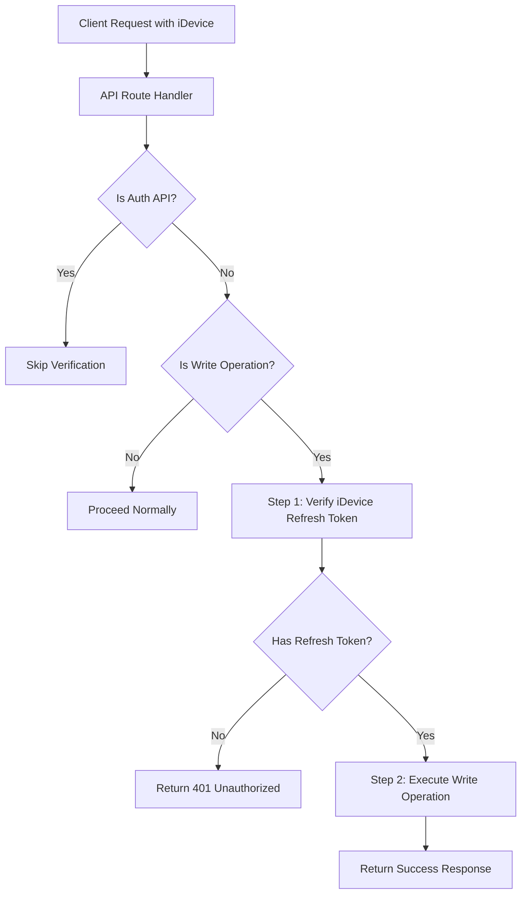

# سیستم دو مرحله‌ای برای عملیات نوشتن در دیتابیس

## خلاصه

سیستم دو مرحله‌ای برای امنیت عملیات نوشتن در دیتابیس (INSERT, UPDATE, DELETE) که قبل از اجرای هر عملیات نوشتن، ابتدا بررسی می‌کند که `idevice` درخواست‌دهنده دارای `refresh token` معتبر است یا خیر.

## چرا این سیستم؟

این سیستم یک لایه امنیتی اضافی برای عملیات نوشتن در دیتابیس فراهم می‌کند:

1. **حفاظت در برابر حملات**: حتی اگر کسی به access token دسترسی پیدا کند، بدون refresh token نمی‌تواند عملیات نوشتن انجام دهد
2. **تایید هویت دستگاه**: اطمینان از اینکه درخواست از یک دستگاه معتبر و احراز هویت شده می‌آید
3. **کنترل دسترسی بهتر**: امکان کنترل دقیق‌تر دسترسی به عملیات حساس

## معماری



## اجزای سیستم

### 1. تابع دیتابیس: `pelak_auth_checkrefreshtoken`

**مسیر**: `core/database/functions/database_functions.sql`

این تابع بررسی می‌کند که آیا یک `idevice` دارای `refresh token` معتبر است:

```sql
CREATE OR REPLACE FUNCTION "public"."pelak_auth_checkrefreshtoken"("p_idevice" text)
  RETURNS "pg_catalog"."json"
```

**پارامترها**:
- `p_idevice`: شناسه دستگاه (40 کاراکتر)

**خروجی**:
```json
{
  "success": true,
  "valid": true,
  "title": "Token Valid",
  "message": "توکن معتبر است."
}
```

یا در صورت نامعتبر بودن:
```json
{
  "success": false,
  "valid": false,
  "title": "Token Not Found",
  "message": "توکن معتبری برای این دستگاه یافت نشد."
}
```

**شرایط بررسی**:
- `idevice` در جدول `refreshtokens` وجود دارد
- `expires_at > NOW()` (توکن منقضی نشده)
- `revoked_at IS NULL` (توکن لغو نشده)

### 2. Middleware: `write-operation-guard.ts`

**مسیر**: `core/lib/security/write-operation-guard.ts`

این فایل شامل سه تابع اصلی است:

#### `verifyIDeviceRefreshToken(idevice: string)`

بررسی وجود refresh token برای idevice:

```typescript
const verification = await verifyIDeviceRefreshToken(idevice)
if (!verification.valid) {
  return verification.response! // 401 Unauthorized
}
```

#### `extractIDevice(body?: Record<string, unknown>)`

استخراج idevice از request body یا cookie:

```typescript
const idevice = await extractIDevice(body)
// اول از body می‌خواند، اگر نبود از cookie
```

#### `guardWriteOperation(body, operation)`

تابع اصلی که عملیات نوشتن را محافظت می‌کند:

```typescript
return guardWriteOperation(body, async () => {
  // عملیات نوشتن شما اینجا
})
```

## نحوه استفاده

### مثال 1: استفاده در API Route ساده

```typescript
import { NextRequest, NextResponse } from "next/server"
import { guardWriteOperation } from "@/core/lib/security/write-operation-guard"
import { callRpc } from "@/core/lib/rest/rpc"
import { successResponse, invalidInputError } from "@/core/lib/api/response"

async function POSTHandler(request: NextRequest) {
  // Parse request body
  let body
  try {
    body = await request.json()
  } catch {
    return invalidInputError("بدنه درخواست نامعتبر است.")
  }

  const { data } = body

  // اعمال بررسی دو مرحله‌ای
  return guardWriteOperation(body, async () => {
    // Step 2: اجرای عملیات نوشتن
    const result = await callRpc("your_write_function", {
      p_data: data,
    })

    if (!result.success) {
      return serverError(result.message)
    }

    return successResponse({
      id: result.id,
      title: result.title,
    }, result.message)
  })
}

export const POST = POSTHandler
```

### مثال 2: استفاده در Comments API (پیاده‌سازی فعلی)

```typescript
// core/app/api/comments/route.ts
async function POSTHandler(request: NextRequest) {
  // ... validation و security checks ...

  // Parse request body
  const body = await request.json()
  const { pageId, content, parentId } = body

  // ... سایر validation ها ...

  // Two-step verification
  return guardWriteOperation(body, async () => {
    // Step 2: Execute write operation
    const result = await callRpc("pelak_comment_create", {
      p_userid: userId,
      p_pageid: pageId,
      p_content: content.trim(),
      p_parentid: parentId || null,
    })

    if (!result.success) {
      return serverError(result.message)
    }

    return successResponse({
      comment_id: result.comment_id,
      title: result.title,
    }, result.message)
  })
}
```

### مثال 3: استفاده با استخراج دستی idevice

اگر نیاز به کنترل بیشتر دارید:

```typescript
import { extractIDevice, verifyIDeviceRefreshToken } from "@/core/lib/security/write-operation-guard"

async function POSTHandler(request: NextRequest) {
  const body = await request.json()
  
  // استخراج دستی idevice
  const idevice = await extractIDevice(body)
  if (!idevice) {
    return invalidInputError('شناسه دستگاه الزامی است.')
  }

  // بررسی دستی
  const verification = await verifyIDeviceRefreshToken(idevice)
  if (!verification.valid) {
    return verification.response!
  }

  // اجرای عملیات
  const result = await callRpc("your_function", {...})
  return successResponse({...})
}
```

## چه API هایی باید از این سیستم استفاده کنند؟

### ✅ باید استفاده کنند:
- تمام API های نوشتن (INSERT, UPDATE, DELETE) به جز:
  - API های احراز هویت (`/api/auth/*`)
  - API های خواندن (GET)

### ❌ نباید استفاده کنند:
- API های احراز هویت:
  - `/api/auth/login`
  - `/api/auth/register`
  - `/api/auth/refresh`
  - `/api/auth/logout`
  - `/api/auth/otp`
  - و سایر API های احراز هویت
- API های خواندن (GET):
  - `/api/comments` (GET)
  - `/api/pages` (GET)
  - و سایر API های فقط خواندن

## نحوه استخراج iDevice

سیستم به ترتیب زیر idevice را پیدا می‌کند:

1. **از Request Body**: اگر در body فیلد `iDevice` وجود داشته باشد
2. **از Cookie**: اگر در body نبود، از cookie خوانده می‌شود

```typescript
// مثال: ارسال idevice در body
POST /api/comments
{
  "pageId": 1,
  "content": "نظر من",
  "iDevice": "c1234567890..." // اختیاری - اگر نباشد از cookie خوانده می‌شود
}
```

## خطاها

### 400 Bad Request
اگر idevice موجود نباشد یا نامعتبر باشد:
```json
{
  "success": false,
  "title": "Invalid Input",
  "message": "شناسه دستگاه الزامی است."
}
```

### 401 Unauthorized
اگر idevice فاقد refresh token معتبر باشد:
```json
{
  "success": false,
  "title": "Authentication Required",
  "message": "برای انجام این عملیات نیاز به احراز هویت دارید."
}
```

## Best Practices

### 1. همیشه از `guardWriteOperation` استفاده کنید

```typescript
// ✅ خوب
return guardWriteOperation(body, async () => {
  const result = await callRpc("write_function", {...})
  return successResponse({...})
})

// ❌ بد - بدون بررسی
const result = await callRpc("write_function", {...})
return successResponse({...})
```

### 2. Parse کردن body قبل از استفاده

```typescript
// ✅ خوب
const body = await request.json()
return guardWriteOperation(body, async () => {
  // استفاده از body
})

// ❌ بد - parse نکردن body
return guardWriteOperation(undefined, async () => {
  // idevice از cookie خوانده می‌شود اما بهتر است از body باشد
})
```

### 3. قرار دادن guard بعد از validation های اولیه

```typescript
async function POSTHandler(request: NextRequest) {
  // 1. Security validation
  const securityCheck = await validateAPIRequest(request, true)
  if (!securityCheck.valid) {
    return securityCheck.response!
  }

  // 2. Authentication check
  const authCheck = checkAuthorization(accessToken, 'user')
  if (!authCheck.allowed) {
    return unauthorizedError(...)
  }

  // 3. Parse و validate input
  const body = await request.json()
  const { data } = body
  if (!data) {
    return invalidInputError("data الزامی است.")
  }

  // 4. Two-step verification برای write operation
  return guardWriteOperation(body, async () => {
    // عملیات نوشتن
  })
}
```

## تست

### تست موفقیت‌آمیز

```bash
# 1. Login و دریافت refresh token
POST /api/auth/login
{
  "mobile": "09123456789",
  "password": "password123",
  "iDevice": "c1234567890..."
}

# 2. استفاده از write operation
POST /api/comments
Authorization: Bearer <access_token>
{
  "pageId": 1,
  "content": "نظر من",
  "iDevice": "c1234567890..." # همان idevice که login کردید
}
# ✅ باید موفق شود
```

### تست عدم وجود refresh token

```bash
# استفاده از idevice بدون refresh token
POST /api/comments
Authorization: Bearer <access_token>
{
  "pageId": 1,
  "content": "نظر من",
  "iDevice": "c9999999999..." # idevice بدون refresh token
}
# ❌ باید 401 برگرداند
```

## سوالات متداول

### Q: آیا می‌توانم این سیستم را برای API های خواندن هم استفاده کنم؟

**A**: خیر، این سیستم فقط برای عملیات نوشتن طراحی شده است. API های خواندن نیازی به این بررسی ندارند.

### Q: اگر idevice در body نباشد چه می‌شود؟

**A**: سیستم به صورت خودکار از cookie می‌خواند. اما بهتر است همیشه idevice را در body ارسال کنید.

### Q: آیا می‌توانم این بررسی را برای API های احراز هویت هم فعال کنم؟

**A**: خیر، API های احراز هویت باید بدون این بررسی کار کنند چون خودشان refresh token ایجاد می‌کنند.

### Q: چگونه می‌توانم idevice را در کلاینت دریافت کنم؟

**A**: idevice به صورت خودکار در cookie ذخیره می‌شود. می‌توانید از `getIDeviceToken()` در کلاینت استفاده کنید یا از cookie بخوانید.

## فایل‌های مرتبط

- **Middleware**: `core/lib/security/write-operation-guard.ts`
- **Database Function**: `core/database/functions/database_functions.sql` (تابع `pelak_auth_checkrefreshtoken`)
- **Error Messages**: `core/lib/api/error-messages.ts` (`IDEVICE_REFRESH_TOKEN_REQUIRED`)
- **مثال استفاده**: `core/app/api/comments/route.ts`

## تغییرات آینده

اگر در آینده نیاز به تغییرات زیر بود:

1. **اضافه کردن بررسی اضافی**: می‌توانید در `guardWriteOperation` بررسی‌های بیشتری اضافه کنید
2. **تغییر در نحوه استخراج idevice**: می‌توانید `extractIDevice` را تغییر دهید
3. **اضافه کردن logging**: می‌توانید logging به `verifyIDeviceRefreshToken` اضافه کنید

## پشتیبانی

برای سوالات یا مشکلات، به مستندات اصلی پروژه مراجعه کنید:
- [ARCHITECTURE.md](../ARCHITECTURE.md)
- [DATABASE.md](../DATABASE.md)
- [core/README.md](../core/README.md)

---

**آخرین به‌روزرسانی**: 2025-01-XX  
**نسخه**: 1.0.0

